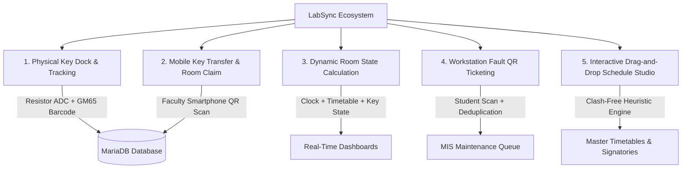
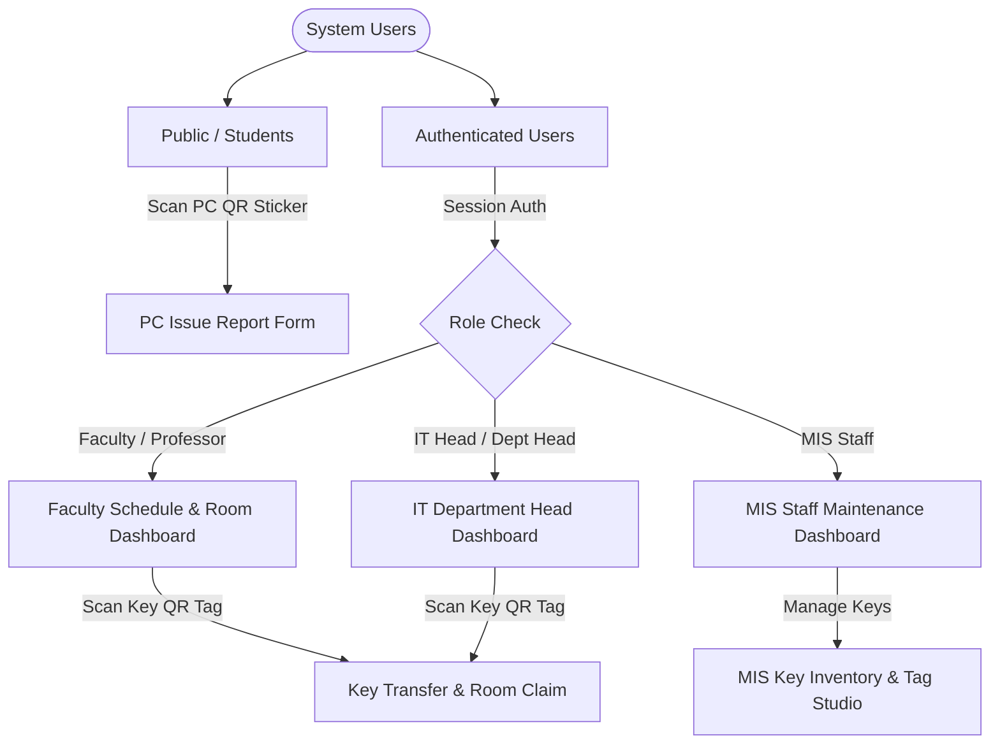
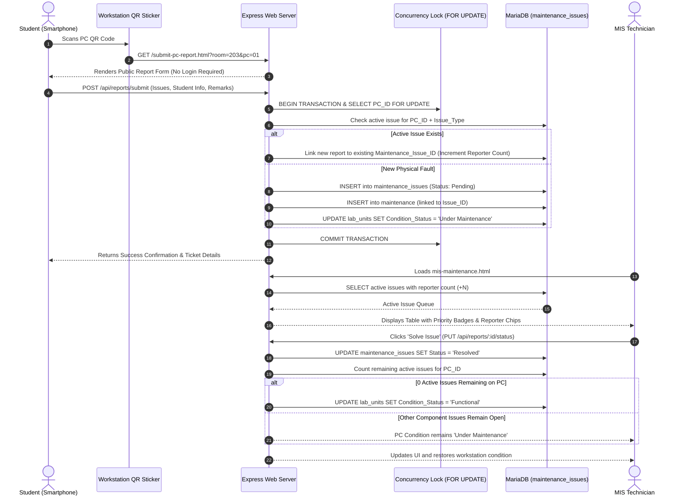
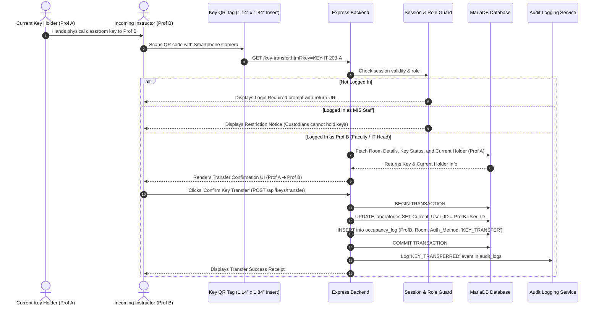
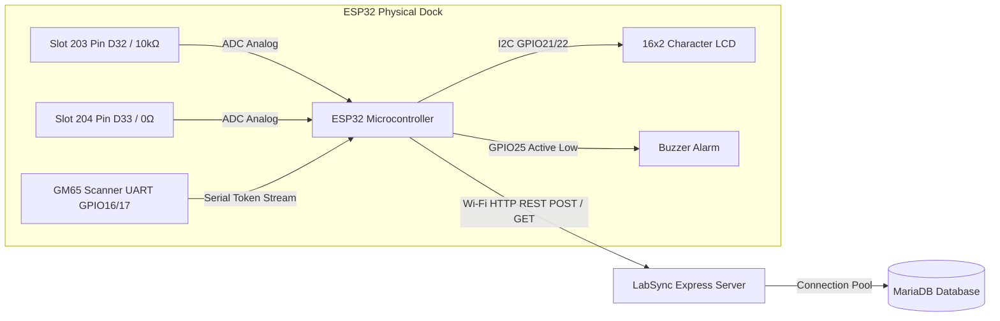
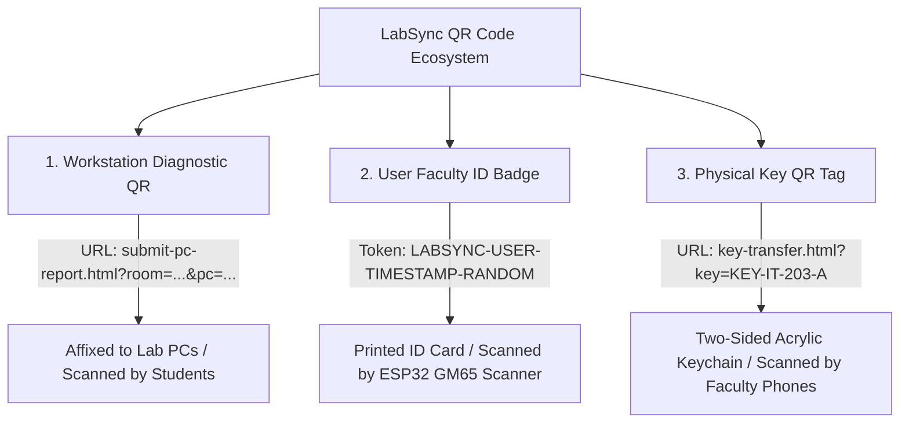
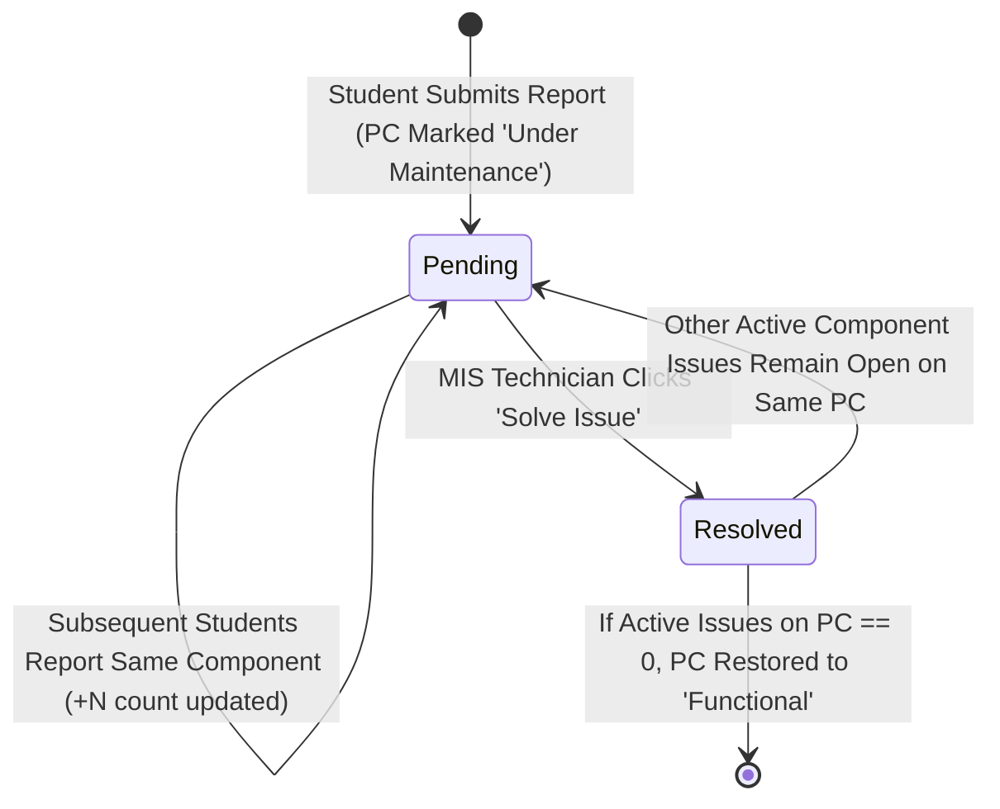
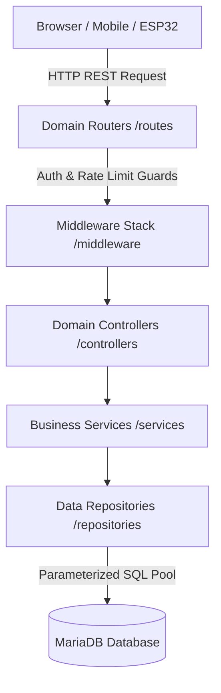
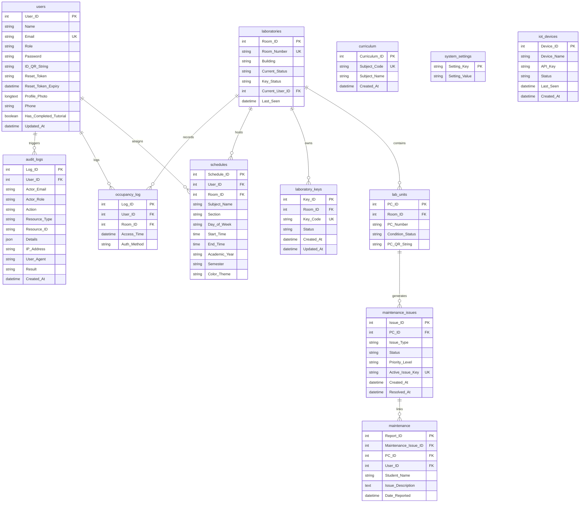

# LabSync — Capstone Manuscript Technical Reference Guide (Chapters 1–5)

> **Document Type:** Primary Technical Reference & Manuscript Alignment Guide  
> **Target Audience:** Capstone Documentation Team / Chapter 1–5 Writers  
> **System Name:** LabSync (Smart Laboratory & Schedule Management System)  
> **Official Capstone Title:** An IoT-Based IT Laboratory Availability and Equipment Monitoring System Using QR Codes  
> **Institution:** Bulacan State University — Sarmiento Campus (BulSU-SC)  
> **Department / Target Environment:** Department of Information Technology / IT Laboratories (e.g., Rooms 203, 204)  
> **Current Software Version:** 1.2.0 (Modular Architecture with Key Transfer & Deduplicated Maintenance Pipeline)  
> **Last Codebase Audit:** September 2026  

---

## 📌 How to Use This Reference Guide

This document is compiled directly from the active **LabSync codebase** as the **authoritative, single source of truth**. It is designed specifically for group members writing **Chapters 1 through 5** of the capstone manuscript who need exact, mathematically and technically verifiable facts about the system.

### Evidence Classification Standard

Throughout this guide, all technical details, formulas, and operational concepts are explicitly marked with one of four evidence classifications:

- `[CODE-CONFIRMED]`: Directly verified against active JavaScript, HTML, CSS, SQL, or Arduino C++ source code in the repository.
- `[CONFIRMED-BY-DOCS]`: Sourced from baseline architectural documentation and handover artifacts.
- `[TEAM-INPUT-REQUIRED]`: Institutional, academic, statistical, or organizational information that cannot be derived from source code and must be supplied by the researchers (e.g., ISO 25010 survey results, hardware financial expenses).
- `[EXTERNAL-RESEARCH-REQUIRED]`: Theoretical concepts, legal frameworks, and academic literature that must be gathered from external scholarly databases (no fake citations or fabricated DOIs are provided).

---

## 📋 Table of Contents

1. [Section 1 — System Identity](#section-1--system-identity)
2. [Section 2 — System Overview](#section-2--system-overview)
3. [Section 3 — Problem Domain & Gap Analysis](#section-3--problem-domain--gap-analysis)
4. [Section 4 — System Objectives (General & Specific)](#section-4--system-objectives-general--specific)
5. [Section 5 — System Scope & Delimitations](#section-5--system-scope--delimitations)
6. [Section 6 — System Users & Role Permissions Matrix](#section-6--system-users--role-permissions-matrix)
7. [Section 7 — Complete Feature Inventory](#section-7--complete-feature-inventory)
8. [Section 8 — Detailed System Workflows & Sequence Diagrams](#section-8--detailed-system-workflows--sequence-diagrams)
9. [Section 9 — IoT Hardware Architecture & Firmware Telemetry](#section-9--iot-hardware-architecture--firmware-telemetry)
10. [Section 10 — QR Code Ecosystem (Three Subsystems)](#section-10--qr-code-ecosystem-three-subsystems)
11. [Section 11 — Physical Key Inventory & Keychain Tag Fabrication](#section-11--physical-key-inventory--keychain-tag-fabrication)
12. [Section 12 — Mobile Key Transfer & Room Claim Protocol](#section-12--mobile-key-transfer--room-claim-protocol)
13. [Section 13 — Workstation Fault Reporting & Deduplication Model](#section-13--workstation-fault-reporting--deduplication-model)
14. [Section 14 — Maintenance Management & Condition Synchronization](#section-14--maintenance-management--condition-synchronization)
15. [Section 15 — Schedule Studio & Conflict Detection Engine](#section-15--schedule-studio--conflict-detection-engine)
16. [Section 16 — Real-Time Polling & Telemetry Synchronization](#section-16--real-time-polling--telemetry-synchronization)
17. [Section 17 — Frontend Architecture & Directory Layout](#section-17--frontend-architecture--directory-layout)
18. [Section 18 — Backend Architecture & Service Layer](#section-18--backend-architecture--service-layer)
19. [Section 19 — Database Schema & Data Dictionary (11 Tables)](#section-19--database-schema--data-dictionary-11-tables)
20. [Section 20 — Authentication, Cryptography & Security Controls](#section-20--authentication-cryptography--security-controls)
21. [Section 21 — Audit Logging System & Accountability](#section-21--audit-logging-system--accountability)
22. [Section 22 — Rate Limiting & Denial-of-Service Defense](#section-22--rate-limiting--denial-of-service-defense)
23. [Section 23 — Responsive & Mobile Design Specifications](#section-23--responsive--mobile-design-specifications)
24. [Section 24 — Design System, Themes & Accessibility](#section-24--design-system-themes--accessibility)
25. [Section 25 — Non-Functional Characteristics & System Limitations](#section-25--non-functional-characteristics--system-limitations)
26. [Section 26 — Chapter 1 Writing Reference (Introduction)](#section-26--chapter-1-writing-reference-introduction)
27. [Section 27 — Chapter 2 Writing Reference (Literature Review)](#section-27--chapter-2-writing-reference-literature-review)
28. [Section 28 — Chapter 3 Writing Reference (Methodology)](#section-28--chapter-3-writing-reference-methodology)
29. [Section 29 — Chapter 4 Writing Reference (Results & Implementation)](#section-29--chapter-4-writing-reference-results--implementation)
30. [Section 30 — Chapter 5 Writing Reference (Summary, Conclusions & Recommendations)](#section-30--chapter-5-writing-reference-summary-conclusions--recommendations)
31. [Section 31 — Manuscript Screenshot Inventory](#section-31--manuscript-screenshot-inventory)
32. [Section 32 — Manuscript Diagram Inventory](#section-32--manuscript-diagram-inventory)
33. [Section 33 — Domain Glossary](#section-33--domain-glossary)
34. [Section 34 — Documentation Gaps (Information Needed From Team)](#section-34--documentation-gaps-information-needed-from-team)
35. [Section 35 — Manuscript Author Writing Notes & Guardrails](#section-35--manuscript-author-writing-notes--guardrails)
36. [Section 36 — Master Technical Reference Matrix](#section-36--master-technical-reference-matrix)
37. [Section 37 — Source Code File Directory Reference](#section-37--source-code-file-directory-reference)

---

## Section 1 — System Identity

- **Full System Title `[CODE-CONFIRMED]`:** *An IoT-Based IT Laboratory Availability and Equipment Monitoring System Using QR Codes*
- **Short System Name `[CODE-CONFIRMED]`:** **LabSync**
- **Academic Institution `[CODE-CONFIRMED]`:** Bulacan State University — Sarmiento Campus (BulSU-SC)
- **Target Department `[CODE-CONFIRMED]`:** Department of Information Technology / Laboratory Management & MIS Custodial Office
- **Target Facilities `[CODE-CONFIRMED]`:** IT Building Computer Laboratories (specifically Rooms 203 and 204 configured in IoT hardware firmware, dynamically extensible to all campus rooms via the MariaDB database).
- **Current Software Version `[CODE-CONFIRMED]`:** 1.2.0
- **Underlying Technology Stack `[CODE-CONFIRMED]`:**
  - **Backend Runtime:** Node.js (v18.x+) with Express v5 (`express@^5.0.1`).
  - **Database Management System:** MySQL / MariaDB via `mysql2/promise` connection pool with transaction support.
  - **IoT Microcontroller Firmware:** ESP32 Dev Module (WROOM-32) compiled via Arduino C++ framework.
  - **Frontend Architecture:** Vanilla HTML5, CSS3 Custom Properties (Design Tokens), Modular ES6 JavaScript (zero heavy framework runtime overhead).
  - **Security & Cryptography:** `bcrypt` (12 salt rounds), `express-session`, `express-rate-limit`, `crypto` random token generation.
  - **Label & QR Rendering:** Node.js `qrcode` library with client HTML5 Canvas rasterization and standard acrylic insert dimensions (1.14" x 1.84").

---

## Section 2 — System Overview

**LabSync** is a unified, full-stack web and Internet of Things (IoT) platform designed to digitize, automate, synchronize, and audit physical computer laboratory operations. It bridges physical hardware management with cloud web services to eliminate paper logbooks, uncoordinated room lockouts, untracked equipment breakdowns, and academic scheduling conflicts.

### How LabSync Works Across Five Core Operational Pillars:



1. **Room Key Sensing & Dock Telemetry:** An ESP32 microcontroller dock equipped with electronic resistor-divider key slots is installed in the IT / MIS department. When an authorized instructor claims a laboratory key, the system verifies their identity (via optical QR faculty badge scanning) and records the transaction. Every 5 seconds, the IoT dock dispatches telemetry heartbeats to the central server.
2. **Mobile Key Transfer & Room Claim:** In fast-paced academic environments, instructors frequently hand off laboratory keys directly to incoming colleagues between class intervals. Rather than forcing professors to return keys to the central office dock, each physical key carries a durable, two-sided acrylic keychain insert (1.14" x 1.84") containing a high-contrast QR code. The incoming instructor scans this tag with their smartphone, confirms custody via [`key-transfer.html`](file:///c:/Users/andre/Downloads/LabSync/key-transfer.html), and automatically becomes the recorded key holder.
3. **Dynamic Availability Engine:** The web dashboard computes laboratory availability dynamically: **Available** (key in dock, no active class), **In Session** (scheduled instructor holds key during class hours), or **Borrowed** (key taken outside of scheduled hours or by special authorization).
4. **Zero-Login Workstation Fault Reporting:** Each desktop computer in the laboratory has a durable QR code sticker affixed to its case. When students encounter hardware defects (e.g., defective monitor, broken keyboard, mouse failure), they scan the sticker with their phone camera. This opens [`submit-pc-report.html`](file:///c:/Users/andre/Downloads/LabSync/submit-pc-report.html) pre-filled with the Room and PC number. A backend deduplication engine prevents duplicate ticket spamming by grouping reports around active physical issues (`maintenance_issues`).
5. **Interactive Timetable & Signatory Management:** The IT Department Head uses a drag-and-drop Schedule Studio featuring client- and server-side conflict detection to prevent double-booking instructors or rooms. Printable timetable templates automatically format official campus headers and configurable signatories (Campus Dean and Program Chair).

---

## Section 3 — Problem Domain & Gap Analysis

| Traditional Laboratory Problem | Codebase Evidence & Validation Status | How LabSync Solves It |
|---|---|---|
| **Physical Key Blindness** | `[CODE-CONFIRMED]` (ESP32 ADC key slots & `occupancy_log` table) | Hardware key dock tracks whether physical keys are present or withdrawn, linking key release to instructor identity. |
| **Inter-Faculty Key Handoff Blindness** | `[CODE-CONFIRMED]` ([`key-transfer.html`](file:///c:/Users/andre/Downloads/LabSync/key-transfer.html) & [`services/keysService.js`](file:///c:/Users/andre/Downloads/LabSync/services/keysService.js)) | Mobile QR Key Transfer allows instructors to legally transfer key responsibility directly in the hallway without returning to the dock. |
| **Unknown Real-Time Room Availability** | `[CODE-CONFIRMED]` ([`services/laboratoryService.js`](file:///c:/Users/andre/Downloads/LabSync/services/laboratoryService.js)) | 3-state availability algorithm dynamically computes `Available`, `In Session`, or `Borrowed` using live clock, schedule records, and key status. |
| **Paper-Based PC Fault Logging** | `[CODE-CONFIRMED]` ([`submit-pc-report.html`](file:///c:/Users/andre/Downloads/LabSync/submit-pc-report.html) & `maintenance` table) | Direct QR scan allows immediate, mobile-first ticket submission with structured component checklists without student authentication barriers. |
| **Duplicate Ticket Spamming & Queue Bloat** | `[CODE-CONFIRMED]` (`maintenance_issues` table & migration `013_create_maintenance_issues.sql`) | Active issue deduplication engine consolidates multiple student submissions for the same broken component into one physical ticket. |
| **Maintenance Pipeline Invisibility** | `[CODE-CONFIRMED]` ([`mis-maintenance.html`](file:///c:/Users/andre/Downloads/LabSync/mis-maintenance.html) & [`services/maintenanceService.js`](file:///c:/Users/andre/Downloads/LabSync/services/maintenanceService.js)) | Centralized MIS triage portal with priority badges, reporter chips (`👤 Name [+N]`), remarks quote cards, and auto-restoration of PC health upon resolution. |
| **Timetable Conflicts & Double Bookings** | `[CODE-CONFIRMED]` ([`js/scheduling/`](file:///c:/Users/andre/Downloads/LabSync/js/scheduling) & [`services/scheduleService.js`](file:///c:/Users/andre/Downloads/LabSync/services/scheduleService.js)) | Schedule Studio with real-time overlap collision checks, curriculum autocompletion, and ghost professor overlays. |
| **Administrative Signatory Overhead** | `[CODE-CONFIRMED]` ([`print-schedule.html`](file:///c:/Users/andre/Downloads/LabSync/print-schedule.html), `system_settings` table) | Automated timetable generation formatted with Dean and Chair signatories from `system_settings`. |
| **Lack of Accountability & Security Audit Trail** | `[CODE-CONFIRMED]` (`audit_logs` table & [`services/auditService.js`](file:///c:/Users/andre/Downloads/LabSync/services/auditService.js)) | Non-blocking security audit logger recording authentication events, password updates, key handoffs, and maintenance resolutions. |

---

## Section 4 — System Objectives (General & Specific)

### General Objective
To design, develop, and implement **LabSync: An IoT-Based IT Laboratory Availability and Equipment Monitoring System Using QR Codes** for Bulacan State University – Sarmiento Campus that integrates physical key tracking, dynamic room availability calculation, mobile QR key custody transfers, deduplicated workstation fault ticketing, MIS maintenance tracking, conflict-free academic scheduling, and enterprise security auditing.

### Specific Objectives `[CODE-CONFIRMED]`
1. **IoT Hardware Integration:** Develop an ESP32-based key monitoring dock utilizing resistor-divider ADC sensing, an I2C 16x2 character LCD, an optical GM65 barcode/QR reader, an active buzzer alarm, and 5-second HTTP heartbeat telemetry.
2. **Dynamic Laboratory State Calculation:** Implement a backend algorithm that evaluates real-time key dock state, timetable slots, and instructor identities to derive laboratory availability (`Available`, `In Session`, `Borrowed`).
3. **Mobile Key Transfer & Room Claim Protocol:** Deploy an authenticated mobile QR key transfer system utilizing standardized two-sided keychain inserts (1.14" x 1.84") allowing faculty to seamlessly transfer key custody and room responsibility.
4. **QR-Based Workstation Issue Reporting:** Deploy a mobile-optimized public web reporting interface accessible via QR code scans without student authentication barriers.
5. **Deduplicated Maintenance Lifecycle Workflow:** Create a centralized technical maintenance portal for MIS staff featuring component-level issue deduplication (`maintenance_issues`), multi-reporter indicators (`👤 Name [+N]`), and automated workstation health restoration (`Functional` / `Under Maintenance`).
6. **Interactive Schedule Studio:** Construct a drag-and-drop timetable management module featuring client and server conflict validation, curriculum code auto-completion, and signatory export templates.
7. **Role-Based Access Control, Cryptography & Auditing:** Establish secure session-based authentication with Bcrypt password hashing (12 salt rounds), rate limiting defense, strict role permissions across three authenticated roles (IT Head, MIS Staff, Faculty), and an immutable security audit trail (`audit_logs`).

---

## Section 5 — System Scope & Delimitations

### In-Scope Items `[CODE-CONFIRMED]`
- **Target Facilities:** IT Building Computer Laboratories (specifically Rooms 203 and 204 configured in hardware firmware, scalable to all campus rooms via database).
- **Physical Key Monitoring:** Electronic detection of key insertion, key removal, wrong-slot insertion alarms, and periodic device heartbeat.
- **Physical Key Inventory Management:** MIS registration of physical keys (`KEY-IT-203-A`), status toggling (`ACTIVE`, `MISSING`), and two-sided keychain insert printing (1.14" x 1.84").
- **Key Transfer Protocol:** Authenticated mobile handoff allowing Faculty and Department Heads to scan a key QR tag and claim custody.
- **Workstation Equipment Tracking:** Individual PC unit tracking, batch QR code generation, condition status monitoring (`Functional`, `Under Maintenance`), and component deduplication.
- **Course Scheduling:** Academic year, semester, day of week, time interval, subject code, section, and instructor timetable mapping.
- **Administrative Utilities:** Faculty CRUD, leadership transfer, curriculum CSV/batch import, custom signatory settings, dark mode, high contrast accessibility themes, and transactional email dispatch.
- **Security & Integrity:** Bcrypt password hashing (12 rounds), session management, RFC-compliant rate limiters, and non-blocking security audit logging.

### Delimitations & Out-of-Scope Items `[CODE-CONFIRMED]`
- **True Physical Occupancy Detection:** The system monitors **physical key presence**, **not human body count or motion sensors (PIR/cameras)**. "Occupied" is inferred from key withdrawal and active schedule slots.
- **Student Dashboard / Accounts:** There is **no student portal, login, or student profile**. Students interact strictly via the public workstation QR scan URL.
- **Automated Hardware Diagnostics:** The system does not run agent software inside PC operating systems (e.g., background RAM/CPU daemons). All reports originate from human user input.
- **Automated Inventory Procurement:** The system tracks maintenance repair status, not spare-parts purchase orders or accounting budgets.
- **GPS / Indoor Triangulation:** Physical keys are tracked through dock state and explicit QR transfer scans; they do not contain active GPS or UWB tracking chips.
- **Key Transfer Role Restriction:** MIS staff are key inventory custodians and cannot hold or claim classroom keys. Students cannot claim keys.

---

## Section 6 — System Users & Role Permissions Matrix



### Role Summary:
1. **Public / Student `[CODE-CONFIRMED]`:**
   - **Authentication:** None required (Public access via URL parameter).
   - **Accessible Page:** [`submit-pc-report.html`](file:///c:/Users/andre/Downloads/LabSync/submit-pc-report.html).
   - **Function:** Scans PC QR sticker, selects failing hardware/software components, enters student name and section, submits repair ticket.
2. **Faculty / Professor `[CODE-CONFIRMED]`:**
   - **Authentication:** Email and password login via [`login.html`](file:///c:/Users/andre/Downloads/LabSync/login.html).
   - **Accessible Pages:** [`index.html`](file:///c:/Users/andre/Downloads/LabSync/index.html), [`room-status.html`](file:///c:/Users/andre/Downloads/LabSync/room-status.html), [`my-schedule.html`](file:///c:/Users/andre/Downloads/LabSync/my-schedule.html), [`faculty-pc-reports.html`](file:///c:/Users/andre/Downloads/LabSync/faculty-pc-reports.html), [`key-transfer.html`](file:///c:/Users/andre/Downloads/LabSync/key-transfer.html).
   - **Function:** Checks live lab availability, views personal teaching timetable, monitors workstation health in assigned teaching rooms, claims room keys via QR handoff, updates profile/password.
3. **IT Department Head `[CODE-CONFIRMED]`:**
   - **Authentication:** High-privilege role (`IT Dept. Head`, `IT Head`, `Department Head`).
   - **Accessible Pages:** All faculty pages plus [`it-head-dashboard.html`](file:///c:/Users/andre/Downloads/LabSync/it-head-dashboard.html), [`master-schedule.html`](file:///c:/Users/andre/Downloads/LabSync/master-schedule.html), [`room-schedule-editor.html`](file:///c:/Users/andre/Downloads/LabSync/room-schedule-editor.html), [`faculty-management.html`](file:///c:/Users/andre/Downloads/LabSync/faculty-management.html), [`print-schedule.html`](file:///c:/Users/andre/Downloads/LabSync/print-schedule.html), [`print-all-schedules.html`](file:///c:/Users/andre/Downloads/LabSync/print-all-schedules.html), [`key-transfer.html`](file:///c:/Users/andre/Downloads/LabSync/key-transfer.html).
   - **Function:** Master schedule builder, curriculum management, faculty user CRUD, role modification, leadership delegation, signatory configuration, room key claim.
4. **MIS Staff `[CODE-CONFIRMED]`:**
   - **Authentication:** Custodial role (`MIS Staff`).
   - **Accessible Pages:** [`mis-staff-dashboard.html`](file:///c:/Users/andre/Downloads/LabSync/mis-staff-dashboard.html), [`mis-maintenance.html`](file:///c:/Users/andre/Downloads/LabSync/mis-maintenance.html), [`mis-qr-generator.html`](file:///c:/Users/andre/Downloads/LabSync/mis-qr-generator.html), [`mis-keys.html`](file:///c:/Users/andre/Downloads/LabSync/mis-keys.html), [`master-schedule.html`](file:///c:/Users/andre/Downloads/LabSync/master-schedule.html).
   - **Function:** Triage repair tickets, update maintenance status (`Resolved`), manage physical key inventory (`ACTIVE` / `MISSING`), generate printable keychain inserts (1.14" x 1.84"), generate PC QR labels, view master room timetables.

### Comprehensive Role Permissions Matrix `[CODE-CONFIRMED]`

| System Module & Functional Operation | Public Student | Faculty / Professor | MIS Staff | IT Department Head |
|---|:---:|:---:|:---:|:---:|
| **Submit PC Diagnostic QR Report** | ✅ | ✅ | ✅ | ✅ |
| **View Dynamic Room Availability** | ❌ | ✅ | ✅ | ✅ |
| **View Personal Teaching Timetable** | ❌ | ✅ | ❌ | ✅ |
| **View Master Cross-Room Timetable** | ❌ | ❌ | ✅ | ✅ |
| **Create/Edit Room Schedules (Schedule Studio)** | ❌ | ❌ | ❌ | ✅ |
| **Manage Faculty Accounts & CRUD** | ❌ | ❌ | ❌ | ✅ |
| **Delegate Leadership / Role Edit** | ❌ | ❌ | ❌ | ✅ |
| **Configure Timetable Signatories** | ❌ | ❌ | ❌ | ✅ |
| **Triage & Resolve Maintenance Tickets** | ❌ | ❌ | ✅ | ❌ |
| **Generate Workstation PC QR Labels** | ❌ | ❌ | ✅ | ✅ |
| **Manage Physical Key Inventory (`mis-keys.html`)** | ❌ | ❌ | ✅ | ❌ |
| **Print 2-Sided Keychain QR Tags (1.14" x 1.84")** | ❌ | ❌ | ✅ | ❌ |
| **Transfer & Claim Room Key (`key-transfer.html`)** | ❌ | ✅ | ❌ | ✅ |
| **Change Own Password (Bcrypt)** | ❌ | ✅ | ✅ | ✅ |
| **View Security Audit Trail Logs** | ❌ | ❌ | ❌ | ✅ |

---

## Section 7 — Complete Feature Inventory

| Module / Feature | Canonical Page(s) | Primary Role | Implementation Summary & Evidence |
|---|---|---|---|
| **Authentication & Anti-Flash** | [`login.html`](file:///c:/Users/andre/Downloads/LabSync/login.html), [`reset-password.html`](file:///c:/Users/andre/Downloads/LabSync/reset-password.html) | All Users | Express-session cookies, token-based password reset via Nodemailer, synchronous client anti-flash script in [`js/auth-check.js`](file:///c:/Users/andre/Downloads/LabSync/js/auth-check.js). |
| **Real-Time Room Status** | [`room-status.html`](file:///c:/Users/andre/Downloads/LabSync/room-status.html), [`it-head-room-status.html`](file:///c:/Users/andre/Downloads/LabSync/it-head-room-status.html) | Faculty, IT Head | Dynamic status calculation (`Available`, `In Session`, `Borrowed`), hardware online pill, PC issue count, 3s auto-poll. |
| **Schedule Studio** | [`room-schedule-editor.html`](file:///c:/Users/andre/Downloads/LabSync/room-schedule-editor.html) | IT Head | Drag-and-drop timetable grid, resize handles, same-room collision checks, cross-room instructor conflict detection. |
| **Master Schedule Grid** | [`master-schedule.html`](file:///c:/Users/andre/Downloads/LabSync/master-schedule.html) | IT Head, MIS Staff | Global matrix view across all laboratory rooms, term filtering (AY/Semester), curriculum subject autocomplete. |
| **Workstation QR Reporting** | [`submit-pc-report.html`](file:///c:/Users/andre/Downloads/LabSync/submit-pc-report.html) | Student / Public | Mobile-first public issue form, multi-component checkbox selector, automated priority calculation, 200 char remarks cap. |
| **Maintenance Tracker** | [`mis-maintenance.html`](file:///c:/Users/andre/Downloads/LabSync/mis-maintenance.html) | MIS Staff | Kanban-style ticket triage, status transitions, modal issue inspector, automated PC condition synchronization (`lab_units`). |
| **PC & QR Label Studio** | [`mis-qr-generator.html`](file:///c:/Users/andre/Downloads/LabSync/mis-qr-generator.html) | MIS Staff, IT Head | Batch PC generator, dynamic QR canvas rendering (Node QRCode library), printable sheet generation. |
| **Physical Key Management** | [`mis-keys.html`](file:///c:/Users/andre/Downloads/LabSync/mis-keys.html) | MIS Staff | Registered key registry, key status toggling (`ACTIVE` / `MISSING`), room key linking, keychain insert generator. |
| **Keychain Tag Studio** | [`mis-keys.html`](file:///c:/Users/andre/Downloads/LabSync/mis-keys.html) | MIS Staff | Generates calibrated 1.14" x 1.84" two-sided acrylic insert prints containing room branding and transfer QR code. |
| **Key Transfer & Room Claim** | [`key-transfer.html`](file:///c:/Users/andre/Downloads/LabSync/key-transfer.html) | Faculty, IT Head | Mobile QR handoff scanner, party avatar comparison, custody transition, occupancy log generation, audit event recording. |
| **Faculty Management** | [`faculty-management.html`](file:///c:/Users/andre/Downloads/LabSync/faculty-management.html) | IT Head | Faculty directory CRUD, role editor, transfer leadership workflow, onboarding welcome emails. |
| **Signatory Print Exports** | [`print-schedule.html`](file:///c:/Users/andre/Downloads/LabSync/print-schedule.html), [`print-all-schedules.html`](file:///c:/Users/andre/Downloads/LabSync/print-all-schedules.html) | IT Head | Clean print stylesheets, official BulSU header, configurable Campus Dean and Program Chair signatories. |
| **IoT Key Dock & Telemetry** | ESP32 Hardware + [`routes/iot.routes.js`](file:///c:/Users/andre/Downloads/LabSync/routes/iot.routes.js) | Hardware / System | Resistor-divider ADC key sensing, GM65 optical scanning, wrong-slot alarm, 5-second heartbeat telemetry. |
| **Security Audit Logger** | [`services/auditService.js`](file:///c:/Users/andre/Downloads/LabSync/services/auditService.js) | Backend Engine | Centralized non-blocking audit logging (`audit_logs` table) with recursive sensitive-field masking. |
| **Rate Limiter Suite** | [`middleware/rateLimiter.js`](file:///c:/Users/andre/Downloads/LabSync/middleware/rateLimiter.js) | Backend Engine | RFC-compliant rate limiters across login, password recovery, token validation, and public issue reports. |

---

## Section 8 — Detailed System Workflows & Sequence Diagrams

### Workflow 1: Workstation Fault Reporting & Deduplicated Ticket Pipeline `[CODE-CONFIRMED]`



### Workflow 2: Mobile Key Transfer & Room Claim Protocol `[CODE-CONFIRMED]`



---

## Section 9 — IoT Hardware Architecture & Firmware Telemetry

### Hardware Component Inventory `[CODE-CONFIRMED]`

- **Microcontroller:** ESP32 Dev Module (WROOM-32, 240MHz dual-core Xtensa LX6).
- **Key Sensing Mechanism:** Dual-slot analog voltage divider with unique resistor values.
  - **Slot 203 (Pin D32):** Configured with a **10kΩ resistor key** (Target ADC range: `1000 - 2600`).
  - **Slot 204 (Pin D33):** Configured with a **0Ω direct wire key** (Target ADC range: `0 - 500`).
  - **Empty Slot State:** Internal / External pull-up reading `> 3000` ADC counts.
- **Wrong Slot Alarm:** If Key 204 is inserted into Slot 203, the ESP32 firmware triggers an 80ms pulsing buzzer alarm loop and displays `WRONG KEY SLOT!` on the LCD until rectified.
- **Optical Barcode/QR Scanner:** GM65 1D/2D Barcode/QR Reader connected via Hardware UART (`Serial2` on GPIO16 TX, GPIO17 RX, 9600 baud, 8N1).
- **Alphanumeric Display:** 16x2 HD44780 Character LCD with I2C PCF8574 backpack (Auto-scans address `0x27` or `0x3F` on SDA GPIO21, SCL GPIO22).
- **Auditory Feedback:** Active Buzzer connected to GPIO25 (Low-level trigger via NPN transistor / driver).
- **Telemetry Heartbeat:** Sends JSON payload `{"deviceId":"ESP32-KeyBox","rooms":["203","204"]}` every 5000ms (`HEARTBEAT_INTERVAL`) to `/api/occupancy/heartbeat`. If the server receives no heartbeat for >15 seconds, the room card transitions to an **Offline** badge.



---

## Section 10 — QR Code Ecosystem (Three Subsystems)

LabSync implements **three distinct QR code subsystems**, each serving a specialized operational requirement:



### 1. Workstation Diagnostic QR Codes `[CODE-CONFIRMED]`
- **Generated By:** MIS Staff in [`mis-qr-generator.html`](file:///c:/Users/andre/Downloads/LabSync/mis-qr-generator.html).
- **Payload Format:** HTTP/HTTPS URL: `http://<SERVER_HOST>:<PORT>/submit-pc-report.html?room=203&pc=01`
- **Physical Placement:** Printed on durable vinyl stickers affixed directly to PC monitors or computer cases.
- **Consumer:** Public smartphone camera app (any student or faculty member).

### 2. User Faculty ID Badges `[CODE-CONFIRMED]`
- **Generated By:** User Profile / Management Module.
- **Payload Format:** Alphanumeric security token: `LABSYNC-USER-<TIMESTAMP>-<RANDOM>`
- **Physical Placement:** Printed on institutional faculty ID cards.
- **Consumer:** Scanned by the GM65 optical scanner on the ESP32 key dock to claim or return room keys at the office.

### 3. Physical Key QR Tags `[CODE-CONFIRMED]`
- **Generated By:** MIS Staff Key Inventory Module ([`mis-keys.html`](file:///c:/Users/andre/Downloads/LabSync/mis-keys.html)).
- **Payload Format:** HTTP/HTTPS URL: `http://<SERVER_HOST>:<PORT>/key-transfer.html?key=KEY-IT-203-A`
- **Physical Placement:** Encased inside transparent acrylic key fobs (1.14" x 1.84" two-sided insert).
- **Consumer:** Authenticated Faculty / IT Head smartphones for peer-to-peer key transfers and room claims.

---

## Section 11 — Physical Key Inventory & Keychain Tag Fabrication

### Key Inventory Model `[CODE-CONFIRMED]`
Physical keys are tracked as first-class database entities in the `laboratory_keys` table:
- **Key Code Nomenclature:** Structured as `KEY-IT-[RoomNumber]-[Suffix]` (e.g., `KEY-IT-203-A`).
- **Key Status Lifecycle:** 
  - `ACTIVE`: Key is registered, operational, and circulating.
  - `MISSING`: Key has been reported lost or misplaced; transfers and dock checkouts are locked.
- **Custody Association:** Linked to `laboratories.Room_ID` and tracked in tandem with `laboratories.Key_Status` (`Present` in dock or `Absent`).

### Standardized Keychain Tag Fabrication Specifications `[CODE-CONFIRMED]`

To ensure physical durability and rapid camera scanning, the system incorporates a browser-based print engine calibrated for standard commercial acrylic photo keychains:

| Dimension / Spec | Measurement | Purpose / Engineering Rationale |
|---|---|---|
| **Tag Width** | 1.14 inches (28.96 mm) | Fits standard rectangular acrylic keychain blank inserts. |
| **Tag Height** | 1.84 inches (46.74 mm) | Fits standard rectangular acrylic keychain blank inserts. |
| **Total Card Wrapper** | 1.14 in x 2.19 in | Includes top ring clearance and cut-guide margin. |
| **Front Side Layout** | BulSU IT Logo, Room Number Badge, Key Code, Status Badge | Instant human-readable identification of key origin. |
| **Back Side Layout** | High-Contrast Cyan QR Code (`#0EA5C9`), Scan Instructions | Optimal optical readability for mobile camera focus. |
| **Print Output Format** | Front-and-Back Pair Grid with Cut Marks (`@media print`) | Allows simultaneous printing on standard Letter/A4 cardstock. |

---

## Section 12 — Mobile Key Transfer & Room Claim Protocol

### The Academic Operational Challenge:
In academic practice, instructors teach consecutive classes in the same computer laboratory. Requiring an outgoing instructor to return the physical key to the MIS office dock on another floor—only for the incoming instructor to immediately check it out—creates significant class start delays.

### The LabSync Mobile Handoff Solution:
1. **Peer-to-Peer Scanning:** The incoming instructor scans the physical key fob's QR code.
2. **Access Control Verification:** The system verifies the user via session cookie. If the user is unauthenticated, they are redirected to [`login.html?redirect=...`](file:///c:/Users/andre/Downloads/LabSync/login.html).
3. **Role & Eligibility Enforcement:**
   - **Faculty & IT Dept Head:** Permitted to accept and transfer keys (`KEY_TRANSFER_ROLES`).
   - **MIS Staff:** Strictly prohibited from holding classroom keys (MIS are custodial administrators).
   - **Self-Transfer Guard:** Prevents a faculty member from transferring a key to themselves.
4. **Atomic Transfer Transaction:**
   ```sql
   UPDATE laboratories SET Current_User_ID = ? WHERE Room_ID = ?;
   INSERT INTO occupancy_log (User_ID, Room_ID, Access_Time, Auth_Method) 
   VALUES (?, ?, NOW(), 'KEY_TRANSFER');
   ```
5. **Audit Logging:** An audit entry (`KEY_TRANSFERRED`) is recorded with the previous holder, new holder, room number, and client IP.

---

## Section 13 — Workstation Fault Reporting & Deduplication Model

### Concurrency-Safe Deduplication Engine `[CODE-CONFIRMED]`
Traditional ticket systems suffer from "ticket storms" when multiple students in consecutive periods report the same broken mouse or blank monitor. LabSync solves this via a relational deduplication architecture:

1. **Transaction Isolation:** Upon submission to `POST /api/reports/submit`, the backend executes `SELECT PC_ID FROM lab_units WHERE PC_ID = ? FOR UPDATE`.
2. **Component Granularity:** Issues are categorized into 6 hardware/software components:
   - `Monitor`
   - `Keyboard`
   - `Mouse`
   - `System Unit`
   - `PC/Laptop`
   - `Other`
3. **Relational Linkage (`maintenance_issues` table):**
   - The system utilizes a stored virtual generated column:
     `Active_Issue_Key = IF(Status != 'Resolved', CONCAT(PC_ID, ':', Issue_Type), NULL)`
   - Protected by a unique key: `UNIQUE KEY uq_active_pc_issue (Active_Issue_Key)`.
   - If an active issue already exists for that component on that PC, the incoming student report is linked to the existing `Maintenance_Issue_ID`.
   - The MIS tracker displays **one consolidated ticket**, but accurately reflects the reporter count (e.g., `👤 John [+2] ›`).
4. **Validation Rules:**
   - Student Remarks: Hard-capped at **200 characters** to prevent buffer abuse.
   - Student Section: Automatically trimmed and normalized to **uppercase** (e.g., `BSIT 3-A`).

---

## Section 14 — Maintenance Management & Condition Synchronization



### Main Maintenance Tracker Interface (`mis-maintenance.html`) `[CODE-CONFIRMED]`
- **Table Column Structure:**
  `TICKET ID` │ `DATE & TIME` │ `LAB ROOM` │ `PC UNIT` │ `REPORTED BY` │ `ISSUE DETAILS & REMARKS` │ `ACTIONS`
- **Interactive Reporter Chip (`.reporter-chip`):**
  - **Single Reporter:** Displays a pill badge with person icon (`👤 Michael Vince`).
  - **Multiple Reporters:** Displays an interactive pill with count badge (`👤 james james [+1] ›`). Clicking the chip opens the **Ticket Details Modal** detailing every individual student timestamp and remarks.
- **Two-State Lifecycle:** Tickets operate strictly between **Pending** and **Resolved** (no redundant *In Progress* state).
- **Workstation Condition Synchronization (`lab_units`):**
  - When a ticket is marked `Resolved`, the system queries `countActiveIssuesByPC(PC_ID)`.
  - If **0 active issues** remain, `lab_units.Condition_Status` is restored to `Functional`.
  - If another component issue remains unresolved on the same workstation, the PC condition remains `Under Maintenance`.

---

## Section 15 — Schedule Studio & Conflict Detection Engine

### Technical Specifications `[CODE-CONFIRMED]`
- **Academic Term Configuration:** Academic Year (e.g., `2025-2026`) and Semester (`1st Semester`, `2nd Semester`, `Summer`).
- **Time Grid Layout:** 7:00 AM to 9:00 PM partitioned into 30-minute blocks.
- **Mathematical Collision Formula (`checkProfessorConflict`):**
  Given two time intervals $(S_1, E_1)$ and $(S_2, E_2)$ on the same day:
  $$\text{Overlap} \iff \max(S_1, S_2) < \min(E_1, E_2)$$
  The system checks for:
  1. **Room Collisions:** Multiple classes scheduled in the same laboratory at the same time.
  2. **Faculty Collisions:** A professor scheduled to teach two different sections across different rooms at the same time.
- **Visual "Ghost Overlays":** The Schedule Studio projects translucent gray ghost cards onto the grid representing the professor's commitments in other campus rooms.
- **Signatory PDF / Print Template:** Formatted to official BulSU institutional standards featuring the University Logo, ISO document code, Campus Dean signature line, and IT Program Chair signature line.

---

## Section 16 — Real-Time Polling & Telemetry Synchronization

> [!IMPORTANT]
> **Manuscript Clarification:** LabSync implements **Short Polling with Stale-While-Revalidate (SWR)** and **Hardware Telemetry Heartbeats**, **not WebSockets or Server-Sent Events (SSE)**. Manuscript writers must accurately cite HTTP short polling.

- **Laboratory Room Status Polling:** 3000ms active interval via `setInterval()` in [`js/services/laboratory.service.js`](file:///c:/Users/andre/Downloads/LabSync/js/services/laboratory.service.js).
- **IoT Dock Telemetry Heartbeat:** 5000ms interval dispatched by the ESP32 to `/api/occupancy/heartbeat`.
- **Offline Invalidation Threshold:** 15,000ms (3 missed heartbeats). If the last received timestamp exceeds 15 seconds, the dashboard room card automatically shows an **Offline** badge.
- **Ticket Queue Polling:** 5000ms to 10,000ms interval on the MIS Maintenance dashboard.

---

## Section 17 — Frontend Architecture & Directory Layout

The frontend is constructed using a **Vanilla Modular MVC Pattern** leveraging native ES6 JavaScript modules:

```
LabSync/
├── assets/                         # System logos, icons, institutional seals
├── css/                            # Componentized design system
│   ├── components/                 # Isolated UI component stylesheets
│   │   ├── badges.css              # Status and role badge chips
│   │   ├── modals.css              # Accessible dialog modals
│   │   ├── report-cards.css        # Maintenance cards & remarks boxes
│   │   ├── schedule-cards.css      # Schedule grid cards & ghost overlays
│   │   └── tables.css              # Data tables and reporter chips
│   ├── responsive.css              # Global breakpoint media queries
│   ├── style.css                   # Base typography and utility classes
│   └── variables.css               # Design system color tokens
├── js/                             # Client logic scripts
│   ├── auth-check.js               # Synchronous head anti-flash & role guard
│   ├── components/                 # Reusable UI component modules
│   │   ├── activity-feed.js        # Live notification drawer
│   │   ├── custom-select.js        # Accessible custom dropdown replacement
│   │   ├── profile-menu.js         # Avatar settings & password change dialog
│   │   ├── sidebar-nav.js          # Responsive sidebar controller
│   │   └── toast.js                # Non-blocking alert notifications
│   ├── pages/                      # Page-specific controller scripts
│   │   ├── key-transfer.js         # Mobile Key Transfer & Room Claim controller
│   │   ├── mis-keys.js             # MIS Key Inventory & Keychain Tag controller
│   │   ├── mis-maintenance.js      # Maintenance queue controller
│   │   ├── mis-qr-generator.js     # PC QR generator controller
│   │   └── submit-pc-report.js     # Public student fault reporting controller
│   ├── scheduling/                 # Schedule Studio drag-and-drop engine
│   └── services/                   # Client-side HTTP fetch service adapters
│       ├── keys.service.js         # Key inventory & transfer API adapter
│       ├── laboratory.service.js   # Room status API adapter
│       ├── report.service.js       # Maintenance ticket API adapter
│       ├── schedule.service.js     # Timetable API adapter
│       └── user.service.js         # User profile API adapter
```

---

## Section 18 — Backend Architecture & Service Layer

The backend implements an enterprise-grade **Layered Architecture (Routes ➔ Controllers ➔ Services ➔ Repositories ➔ Database)**:



- **Routers (`routes/`):** Define URL endpoints and bind middleware (`auth.js`, `rateLimiter.js`).
- **Controllers (`controllers/`):** Validate incoming HTTP body/query formats, delegate execution to services, and send standard JSON response envelopes (`{ message, data, error }`).
- **Services (`services/`):** Contain all core business rules, collision detection mathematics, cryptographic operations, deduplication logic, and audit trail dispatch.
- **Repositories (`repositories/`):** Pure data-access layer executing parameterized SQL prepared statements against the `mysql2` connection pool.

---

## Section 19 — Database Schema & Data Dictionary (11 Tables)

### Complete Entity-Relationship Diagram `[CODE-CONFIRMED]`



### Relational Data Dictionary Summary `[CODE-CONFIRMED]`

| Table Name | Primary Key | Foreign Keys | Key Functional Role |
|---|---|---|---|
| `users` | `User_ID` | None | User accounts, credentials, hashed passwords, roles, ID QR codes. |
| `laboratories` | `Room_ID` | `Current_User_ID ➔ users` | Physical rooms, key presence status, current assigned instructor. |
| `laboratory_keys` | `Key_ID` | `Room_ID ➔ laboratories` | Physical key inventory, unique key codes (`KEY-IT-203-A`), status (`ACTIVE`, `MISSING`). |
| `lab_units` | `PC_ID` | `Room_ID ➔ laboratories` | Workstations, condition status (`Functional`, `Under Maintenance`), QR codes. |
| `maintenance_issues` | `Issue_ID` | `PC_ID ➔ lab_units` | Hardware issue deduplication entity with unique generated key `Active_Issue_Key`. |
| `maintenance` | `Report_ID` | `Maintenance_Issue_ID ➔ maintenance_issues` | Individual student ticket submissions, timestamps, remarks, student names. |
| `schedules` | `Schedule_ID` | `User_ID ➔ users`, `Room_ID ➔ laboratories` | Course timetables, academic year, semester, day, start/end times. |
| `curriculum` | `Curriculum_ID` | None | Master subject codes and descriptive titles for autocomplete. |
| `system_settings` | `Setting_Key` | None | Key-value institutional metadata (Campus Dean, Program Chair signatories). |
| `occupancy_log` | `Log_ID` | `User_ID ➔ users`, `Room_ID ➔ laboratories` | Audit trail of key withdrawals, returns, and mobile peer-to-peer transfers. |
| `audit_logs` | `Log_ID` | `User_ID ➔ users` | Immutable security audit log tracking high-value administrative and auth events. |
| `iot_devices` | `Device_ID` | None | Registry of authorized ESP32 hardware docks and API authentication tokens. |

---

## Section 20 — Authentication, Cryptography & Security Controls

- **Bcrypt Cryptographic Password Storage `[CODE-CONFIRMED]`:** All user passwords are encrypted using `bcrypt` with **12 salt rounds** (`BCRYPT_SALT_ROUNDS = 12`). Plaintext passwords are not stored in production schemas.
- **Server-Side Session Management `[CODE-CONFIRMED]`:** Sessions are handled via `express-session` with `httpOnly: true`, `sameSite: 'lax'`, and 24-hour cookie longevity (`SESSION_MAX_AGE = 86400000`).
- **Synchronous Client Anti-Flash Script (`auth-check.js`) `[CODE-CONFIRMED]`:** Embedded in the `<head>` of all protected pages. It immediately sets `document.documentElement.style.visibility = 'hidden'` until session authenticity and role permissions are verified, completely eliminating UI flickering.
- **Password Reset Security `[CODE-CONFIRMED]`:** Utilizes a cryptographically secure 32-byte pseudo-random hex string (`crypto.randomBytes(32).toString('hex')`) valid for 1 hour. Tokens are invalidated immediately upon use.
- **Email Change Verification `[CODE-CONFIRMED]`:** Updating an account email dispatches a verification token to the new email address before updating the active credential.
- **SQL Injection Defense `[CODE-CONFIRMED]`:** 100% of database interactions across all repositories use parameterized queries (`?` placeholders) executed via `mysql2/promise`.

---

## Section 21 — Audit Logging System & Accountability

LabSync incorporates a non-blocking enterprise security audit service ([`services/auditService.js`](file:///c:/Users/andre/Downloads/LabSync/services/auditService.js)) recording events into `audit_logs`:

### Monitored Security Actions:
- `LOGIN` & `LOGIN_FAILED`
- `PASSWORD_CHANGE` & `PASSWORD_RESET`
- `KEY_CREATED`, `KEY_MARKED_MISSING`, `KEY_REACTIVATED`
- `KEY_TAG_GENERATED`
- `KEY_TRANSFERRED` (Mobile peer-to-peer handoff)
- `FACULTY_ROLE_UPDATE` & `LEADERSHIP_TRANSFERRED`
- `TICKET_RESOLVED`

### Sensitive Data Exclusion Standard:
The audit logger recursively sanitizes input payloads against a strict blacklist of forbidden keys (`password`, `newPassword`, `reset_token`, `email_verify_token`, `authorization`, `token`), guaranteeing that plaintext credentials never leak into audit records.

---

## Section 22 — Rate Limiting & Denial-of-Service Defense

To safeguard public and authenticated endpoints against automated brute-force and denial-of-service (DoS) attacks, LabSync implements multi-tier rate limiting ([`middleware/rateLimiter.js`](file:///c:/Users/andre/Downloads/LabSync/middleware/rateLimiter.js)):

| Rate Limiter Name | Protected Endpoint(s) | Limit & Window | Defense Objective |
|---|---|---|---|
| **loginLimiter** | `POST /api/login` | 10 attempts / 15 mins per IP | Brute-force credential guessing defense. |
| **passwordRecoveryLimiter** | `POST /api/user/forgot-password` | 5 requests / 15 mins per IP | SMTP server exhaustion & spam defense. |
| **passwordResetLimiter** | `POST /api/user/reset-password` | 10 requests / 15 mins per IP | Reset token guessing defense. |
| **validateResetTokenLimiter**| `GET /api/user/validate-reset-token` | 20 requests / 15 mins per IP | Automated token enumeration defense. |
| **publicPCReportLimiter** | `POST /api/reports/submit` | 5 reports / 10 mins per IP | Public student report flooding defense. |
| **pcDuplicateReportLimiter** | `POST /api/reports/submit` | 1 report / 1 min per IP + PC | Rapid duplicate clicking on single workstation. |

---

## Section 23 — Responsive & Mobile Design Specifications

LabSync provides a unified, adaptive responsive layout without requiring separate mobile applications:
- **Desktop View ( $\ge$ 1024px):** Persistent sidebar navigation, multi-pane Schedule Studio with drag handles, full tabular maintenance queue with multi-reporter chips.
- **Tablet View (768px – 1023px):** Off-canvas collapsible sidebar drawer, 2-column card layouts, horizontally scrollable timetable canvas.
- **Mobile Smartphone View (< 768px):** Bottom navigation drawer, single-column responsive room cards, mobile-first touch-optimized QR fault submission interface, and streamlined Key Transfer confirmation screen.

---

## Section 24 — Design System, Themes & Accessibility

- **Color Palette & Design Tokens (`css/variables.css`):**
  - **Primary Cyan:** `#1EBBD7` (Brand identity, active badges, highlights).
  - **Deep Slate / Dark Base:** `#0F172A` / `#0E1726` (Sidebar, dark cards, typography).
  - **Light Background:** `#F8FAFC` (Clean academic canvas).
  - **Status Available / Functional:** `#10B981` (Emerald Green).
  - **Status In Session:** `#6366F1` (Indigo).
  - **Status Borrowed:** `#F59E0B` (Amber Orange).
  - **Status Under Maintenance / Missing:** `#EF4444` (Rose Red).
- **Typography:** Google Fonts: *Plus Jakarta Sans* (clean modern UI body) and *Poppins* (bold display headings).
- **Accessibility Modes:** 
  - Native **Dark Mode** toggle (`.dark-mode`).
  - Native **High Contrast Mode** toggle (`.high-contrast`) stored in `localStorage` for visual accessibility compliance.

---

## Section 25 — Non-Functional Characteristics & System Limitations

### Non-Functional Characteristics `[CODE-CONFIRMED]`
- **Usability:** Zero-login mobile public reporting interface reduces student fault submission time to under 30 seconds.
- **Maintainability:** Full separation of concerns across layered MVC architecture (Repositories completely isolated from Express HTTP request/response objects).
- **Data Integrity:** Database mutations utilize SQL transactions (`withTransaction` utility) guaranteeing atomic rollbacks upon failure.
- **Process Resilience:** Process safety handlers (`unhandledRejection`, `uncaughtException`) in [`server.js`](file:///c:/Users/andre/Downloads/LabSync/server.js) ensure the Node server recovers gracefully without crashing.

### System Limitations `[CODE-CONFIRMED]`
1. **Physical Key Proxy Limitation:** The system detects **physical key withdrawal and custody**, not human bodily presence. If a key is checked out but the room is left empty, the system marks the room as `Borrowed` or `In Session`.
2. **Wi-Fi Connectivity Dependency:** If the ESP32 dock loses local Wi-Fi connectivity, the web dashboard flags the room as **Offline** after 15 seconds while safely retaining database schedule and maintenance records.
3. **Web-App Architecture:** LabSync is an adaptive Progressive-style Web Application; it is accessed via web browser and is not distributed as an APK or iOS App Store binary.

---

## Section 26 — Chapter 1 Writing Reference (Introduction)

### Content Guidelines for Manuscript Writers:
1. **Background of the Study:** Focus on higher education institutions (HEIs) transitioning from manual paper logbooks to automated IoT smart campus architectures. Introduce BulSU Sarmiento Campus and the challenges of managing computer laboratories (Rooms 203, 204).
2. **Statement of the Problem:** Articulate the three core problems:
   - Untracked physical keys and uncoordinated inter-faculty key handoffs.
   - Delayed reporting of broken laboratory hardware leading to class disruption.
   - Timetable conflicts, room double-booking, and manual signatory overhead.
3. **Objectives:** Transcribe the exact General Objective and 7 Specific Objectives documented in [Section 4](#section-4--system-objectives-general--specific).
4. **Significance of the Study:**
   - *IT Department Head:* Clash-free schedule management, faculty account control, and audit compliance.
   - *MIS Staff:* Centralized key custody tracking, printable 1.14" x 1.84" keychain inserts, and deduplicated maintenance queues.
   - *Faculty:* Real-time lab availability, zero-wait hallway key handoffs via mobile QR claim.
   - *Students:* Seamless 30-second workstation repair ticketing without account friction.
5. **Scope and Delimitations:** Mirror [Section 5](#section-5--system-scope--delimitations).
6. **Definition of Terms:** Use definitions from [Section 33](#section-33--domain-glossary).

---

## Section 27 — Chapter 2 Writing Reference (Literature Review)

### Six Thematic Literature Areas to Research `[EXTERNAL-RESEARCH-REQUIRED]`

1. **Smart Campus & Computer Laboratory Management Systems:** Academic research on computerized facility scheduling and equipment monitoring in universities.
2. **Internet of Things (IoT) in Asset & Key Tracking:** Studies on ESP32 microcontrollers, ADC resistor divider sensor circuits, and electronic key docks.
3. **Quick Response (QR) Codes in Educational Facility Maintenance:** Literature evaluating paper logbooks vs. smartphone-assisted mobile fault reporting.
4. **Maintenance Deduplication & Equipment Lifecycle Systems:** Theory on grouping user defect reports to prevent ticket queue inflation.
5. **Academic Timetabling & Conflict Resolution Heuristics:** Research on algorithmic scheduling, time-interval collision algorithms, and multi-room constraint satisfaction.
6. **Cryptographic Security & Audit Logging in University Information Portals:** Literature on session security, Bcrypt password hashing, and immutable audit trails in academic web applications.

> [!CAUTION]
> *Do not fabricate authors, DOIs, or publication years. The documentation writer must search Google Scholar, IEEE Xplore, ScienceDirect, or the BulSU Library for peer-reviewed citations.*

---

## Section 28 — Chapter 3 Writing Reference (Methodology)

### Recommended Methodology Structure:
1. **Software Development Life Cycle (SDLC):** Adopt the **Modified Agile / Prototyping Model**. Describe iterative development across hardware breadboarding, backend REST API creation, and frontend modular refactoring.
2. **Hardware Engineering Architecture:**
   - Schematic of ESP32 Dev Module.
   - Voltage divider formula for key sensing: $V_{out} = V_{in} \times \frac{R_2}{R_1 + R_2}$.
   - GM65 UART communication (9600 baud, 8N1).
   - I2C character LCD (PCF8574 backpack).
3. **Keychain Insert Engineering:** Dimensional specifications of the two-sided 1.14" x 1.84" tag.
4. **Relational Database Design & Normalization:**
   - Walk through 1NF, 2NF, and 3NF normalization.
   - Detail the 11 database tables, composite keys, and generated stored column `Active_Issue_Key`.
5. **Mathematical Collision Detection:** Detail the time overlap formula $\max(S_1, S_2) < \min(E_1, E_2)$.
6. **Software Quality Testing Methodology:** Reference ISO/IEC 25010 software evaluation criteria across Functional Suitability, Performance Efficiency, Usability, Reliability, and Security.

---

## Section 29 — Chapter 4 Writing Reference (Results & Implementation)

### Implementation Artifacts to Showcase in Chapter 4:
1. **Physical Key Management & Keychain Tag Studio:**
   - Screenshots of [`mis-keys.html`](file:///c:/Users/andre/Downloads/LabSync/mis-keys.html) displaying the key inventory table and status toggles.
   - Printed samples of the calibrated 1.14" x 1.84" two-sided acrylic keychain inserts.
2. **Mobile Key Transfer & Room Claim Flow:**
   - Smartphone screenshots of [`key-transfer.html`](file:///c:/Users/andre/Downloads/LabSync/key-transfer.html) showing Current Holder vs. Receiving Faculty and transfer receipt.
3. **Dynamic Room Availability Dashboard:**
   - Real-time room cards showing `Available`, `In Session`, `Borrowed`, and `Offline` badges.
4. **Schedule Studio & Collision Visualizer:**
   - Interactive timetable grid with drag handles, ghost schedule overlays, and collision warnings.
5. **Public Workstation QR Ticketing & Deduplication:**
   - Mobile view of [`submit-pc-report.html`](file:///c:/Users/andre/Downloads/LabSync/submit-pc-report.html).
   - MIS Maintenance Tracker table ([`mis-maintenance.html`](file:///c:/Users/andre/Downloads/LabSync/mis-maintenance.html)) displaying consolidated tickets with multi-reporter chips (`👤 Name [+N]`).
6. **IoT Hardware Deployment:**
   - Photos of the physical ESP32 key dock, acrylic chassis, LCD readouts, and optical GM65 scanner.

---

## Section 30 — Chapter 5 Writing Reference (Summary, Conclusions & Recommendations)

### Summary of Achievements:
LabSync successfully engineered and integrated an IoT key dock, mobile QR key handoff system, dynamic availability engine, zero-login workstation fault reporting portal, deduplicated MIS maintenance queue, and clash-free timetable builder for BulSU Sarmiento Campus.

### Concrete Conclusions:
- The dual-slot resistor-divider ADC mechanism provides a cost-effective, durable method for detecting physical key states without expensive RFID locks.
- Mobile QR key transfers solve hallway handoff friction while maintaining complete institutional accountability.
- Zero-login QR reporting combined with backend issue deduplication eliminates student barriers while preventing maintenance queue spam.
- Real-time heuristic conflict checking ensures 100% clash-free timetable generation.

### Future Recommendations `[CODE-CONFIRMED GAPS]`:
- **Active Human Headcount Sensors:** Integration of overhead PIR motion arrays or computer vision cameras to differentiate between an empty room with an active key vs. true classroom occupancy.
- **WebSocket Streaming:** Upgrading from HTTP 3s short polling to WebSocket / SSE streams for zero-latency bidirectional events at campus-wide scale.
- **Automated Spare Parts Procurement:** Connecting resolved maintenance tickets to an inventory purchasing module for automatic spare part replenishment.

---

## Section 31 — Manuscript Screenshot Inventory

| Screen / Interface | File / Route | Purpose in Manuscript | Target Chapter |
|---|---|---|---|
| **Login Portal** | [`login.html`](file:///c:/Users/andre/Downloads/LabSync/login.html) | Secure session authentication with rate limiting | Chapter 4 |
| **Faculty Dashboard** | [`index.html`](file:///c:/Users/andre/Downloads/LabSync/index.html) | Instructor personal schedule and lab availability | Chapter 4 |
| **IT Head Dashboard** | [`it-head-dashboard.html`](file:///c:/Users/andre/Downloads/LabSync/it-head-dashboard.html) | Administrative lab metrics and quick actions | Chapter 4 |
| **MIS Staff Dashboard** | [`mis-staff-dashboard.html`](file:///c:/Users/andre/Downloads/LabSync/mis-staff-dashboard.html) | Maintenance metrics and lab overview | Chapter 4 |
| **Room Status Live View** | [`room-status.html`](file:///c:/Users/andre/Downloads/LabSync/room-status.html) | Dynamic color-coded room availability cards | Chapter 4 |
| **Schedule Studio Editor** | [`room-schedule-editor.html`](file:///c:/Users/andre/Downloads/LabSync/room-schedule-editor.html) | Drag-and-drop timetable grid & conflict alerts | Chapter 4 |
| **Master Schedule Grid** | [`master-schedule.html`](file:///c:/Users/andre/Downloads/LabSync/master-schedule.html) | Global cross-room semester timetable matrix | Chapter 4 |
| **Faculty Management** | [`faculty-management.html`](file:///c:/Users/andre/Downloads/LabSync/faculty-management.html) | Faculty CRUD, role editing, leadership modal | Chapter 4 |
| **Maintenance Tracker** | [`mis-maintenance.html`](file:///c:/Users/andre/Downloads/LabSync/mis-maintenance.html) | Ticket queue, reporter chips (`+N`), remarks | Chapter 4 |
| **PC & QR Generator** | [`mis-qr-generator.html`](file:///c:/Users/andre/Downloads/LabSync/mis-qr-generator.html) | Batch workstation QR generator & sheet preview | Chapter 4 |
| **MIS Key Management** | [`mis-keys.html`](file:///c:/Users/andre/Downloads/LabSync/mis-keys.html) | Key inventory registry, status toggles | Chapter 4 |
| **Keychain Insert Studio** | [`mis-keys.html`](file:///c:/Users/andre/Downloads/LabSync/mis-keys.html) | Printable 1.14" x 1.84" front/back keychain pairs | Chapter 4 |
| **Key Transfer & Claim** | [`key-transfer.html`](file:///c:/Users/andre/Downloads/LabSync/key-transfer.html) | Mobile peer-to-peer key handoff confirmation | Chapter 4 |
| **Public PC Report Form** | [`submit-pc-report.html`](file:///c:/Users/andre/Downloads/LabSync/submit-pc-report.html) | Mobile smartphone zero-login issue submission | Chapter 4 |
| **Signatory Print Preview**| [`print-schedule.html`](file:///c:/Users/andre/Downloads/LabSync/print-schedule.html) | Official timetable PDF layout with signatories | Chapter 4 |

---

## Section 32 — Manuscript Diagram Inventory

1. **System Architecture Diagram:** Multi-tier presentation, application, repository, and database flow.
2. **Context Diagram (Level 0 DFD):** External entities (Student, Faculty, IT Head, MIS Staff, ESP32) interacting with LabSync.
3. **Use Case Diagram:** Actors and functional use cases (Manage Schedules, Submit Report, Update Ticket, Log Key, Transfer Key).
4. **Data Flow Diagram (Level 1 DFD):** Processes for Report Submission, Schedule Conflict Checking, Key Handoff, Key Logging.
5. **Entity Relationship Diagram (ERD):** Complete 11-table relational schema with primary/foreign keys (see [Section 19](#section-19--database-schema--data-dictionary-11-tables)).
6. **IoT Hardware Schematic & Flowchart:** ESP32 pinout, ADC voltage divider circuit, LCD, and GM65 UART wiring.
7. **Sequence Diagrams:** Workstation Fault Deduplication Pipeline and Mobile Key Transfer Protocol.
8. **State Diagrams:** Ticket lifecycle (`Pending` ➔ `Resolved`) and Room state transitions (`Available`, `In Session`, `Borrowed`).

---

## Section 33 — Domain Glossary

- **Available:** Room state indicating the physical key is in the dock and no class is currently in session.
- **In Session:** Room state indicating the scheduled instructor has claimed the key during their designated class hours.
- **Borrowed:** Room state indicating the key has been taken outside of a scheduled class or by an unscheduled faculty member.
- **Schedule Studio:** The proprietary drag-and-drop interactive timetable editor in LabSync.
- **Key Sensor Dock:** The physical ESP32 electronic housing that senses physical room keys via resistor-divider analog pins.
- **Key Tag / Keychain Insert:** A calibrated 1.14" x 1.84" two-sided printable acrylic insert with key metadata and transfer QR code.
- **Key Transfer / Room Claim:** The authenticated mobile workflow allowing faculty members to hand off keys directly and assume classroom custody.
- **Active Issue Key:** A stored virtual generated database column (`CONCAT(PC_ID, ':', Issue_Type)`) that enforces physical fault deduplication.
- **Ghost Schedule:** A translucent visual overlay in the Schedule Studio displaying a professor's classes in other rooms to prevent cross-room double-booking.

---

## Section 34 — Documentation Gaps (Information Needed From Team)

The following items **cannot be obtained from the source code** and must be provided by the capstone research team:

1. `[TEAM-INPUT-REQUIRED]` **Survey & Evaluation Data:** ISO/IEC 25010 questionnaire scores, SUS (System Usability Scale) metrics, and statistical tables.
2. `[TEAM-INPUT-REQUIRED]` **Institutional Background:** Official history, organizational charts, and laboratory inventory counts of BulSU Sarmiento Campus.
3. `[TEAM-INPUT-REQUIRED]` **Hardware Bill of Materials (BOM):** Exact purchase costs of the ESP32, GM65 scanner, LCD, acrylic chassis, resistors, and wiring.
4. `[TEAM-INPUT-REQUIRED]` **Research Design & Sampling Method:** Purposive sampling methodology, sample size (faculty and student respondent counts).

---

## Section 35 — Manuscript Author Writing Notes & Guardrails

> [!WARNING]
> **Strict Capstone Writing Rules:**
> 1. **Do Not Claim Student Dashboards:** Never write that students log in or have student accounts. Students interact strictly through the public QR scan URL.
> 2. **Do Not Claim Human Body Occupancy:** Explicitly state that room occupancy is **inferred from key status and schedule data**, not direct body/camera counting.
> 3. **Do Not Claim WebSocket Real-Time:** State that real-time behavior is achieved through **optimized HTTP short polling (3s - 5s)**.
> 4. **Do Not Claim Plaintext Passwords:** Note that production authentication implements **Bcrypt password hashing with 12 salt rounds**.
> 5. **Maintain Terminology Consistency:** Always use `Available`, `In Session`, and `Borrowed` when referring to laboratory states.

---

## Section 36 — Master Technical Reference Matrix

| Feature Area | Key Implementation File(s) | Main Role(s) | Primary Capstone Use |
|---|---|---|---|
| **IoT Key Dock** | [`LabSync_ESP32.ino`](file:///c:/Users/andre/Downloads/LabSync/LabSync_ESP32.ino), [`routes/iot.routes.js`](file:///c:/Users/andre/Downloads/LabSync/routes/iot.routes.js) | Hardware / System | Chapter 3 (Design), Chapter 4 (IoT) |
| **Room Availability** | [`services/laboratoryService.js`](file:///c:/Users/andre/Downloads/LabSync/services/laboratoryService.js), [`room-status.html`](file:///c:/Users/andre/Downloads/LabSync/room-status.html) | Faculty, IT Head | Chapter 1 (Objectives), Chapter 4 (UI) |
| **Schedule Studio** | [`js/scheduling/`](file:///c:/Users/andre/Downloads/LabSync/js/scheduling), [`room-schedule-editor.html`](file:///c:/Users/andre/Downloads/LabSync/room-schedule-editor.html) | IT Head | Chapter 3 (Algorithms), Chapter 4 (UI) |
| **Physical Key Management** | [`mis-keys.html`](file:///c:/Users/andre/Downloads/LabSync/mis-keys.html), [`services/keysService.js`](file:///c:/Users/andre/Downloads/LabSync/services/keysService.js) | MIS Staff | Chapter 3 (Key System), Chapter 4 (UI) |
| **Key Transfer & Claim** | [`key-transfer.html`](file:///c:/Users/andre/Downloads/LabSync/key-transfer.html), [`js/pages/key-transfer.js`](file:///c:/Users/andre/Downloads/LabSync/js/pages/key-transfer.js) | Faculty, IT Head | Chapter 1 (Objectives), Chapter 4 (Flow) |
| **PC QR Ticketing** | [`submit-pc-report.html`](file:///c:/Users/andre/Downloads/LabSync/submit-pc-report.html), [`services/maintenanceService.js`](file:///c:/Users/andre/Downloads/LabSync/services/maintenanceService.js) | Student | Chapter 1 (Problem), Chapter 4 (Flow) |
| **Maintenance Queue** | [`mis-maintenance.html`](file:///c:/Users/andre/Downloads/LabSync/mis-maintenance.html), [`js/pages/mis-maintenance.js`](file:///c:/Users/andre/Downloads/LabSync/js/pages/mis-maintenance.js) | MIS Staff | Chapter 4 (Maintenance Implementation) |
| **Security & Auditing** | [`services/auditService.js`](file:///c:/Users/andre/Downloads/LabSync/services/auditService.js), [`middleware/rateLimiter.js`](file:///c:/Users/andre/Downloads/LabSync/middleware/rateLimiter.js) | Backend Engine | Chapter 3 (Security), Chapter 4 (Logs) |

---

## Section 37 — Source Code File Directory Reference

- **Server Entry:** [`server.js`](file:///c:/Users/andre/Downloads/LabSync/server.js) — Express server initialization, middleware binding, process safety.
- **Central Router:** [`routes/index.js`](file:///c:/Users/andre/Downloads/LabSync/routes/index.js) — Aggregates all domain routes (`auth`, `keys`, `maintenance`, `laboratory`, `schedule`, `iot`).
- **Key Management Router:** [`routes/keys.routes.js`](file:///c:/Users/andre/Downloads/LabSync/routes/keys.routes.js) — Physical key inventory and transfer endpoints.
- **Database Migrations:** [`database/migrations/`](file:///c:/Users/andre/Downloads/LabSync/database/migrations/) — 14 incremental SQL schema migration definitions.
- **Client Auth Guard:** [`js/auth-check.js`](file:///c:/Users/andre/Downloads/LabSync/js/auth-check.js) — Anti-flash theme applicator and client-side route authorization guard.
- **Firmware:** [`LabSync_ESP32.ino`](file:///c:/Users/andre/Downloads/LabSync/LabSync_ESP32.ino) — Complete C++ firmware for ESP32 microcontroller dock.

---
*End of LabSync Technical Reference Guide (Chapters 1–5)*
