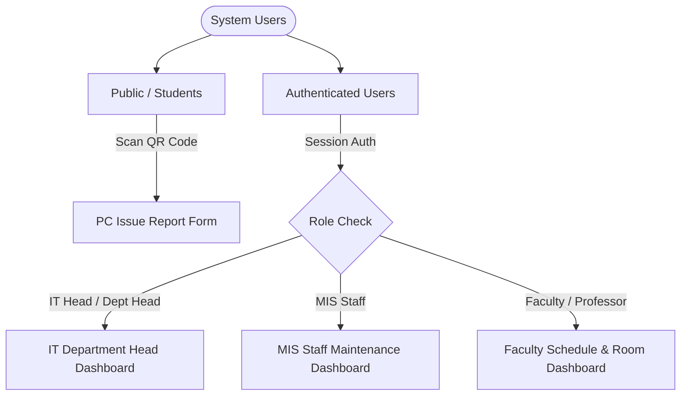
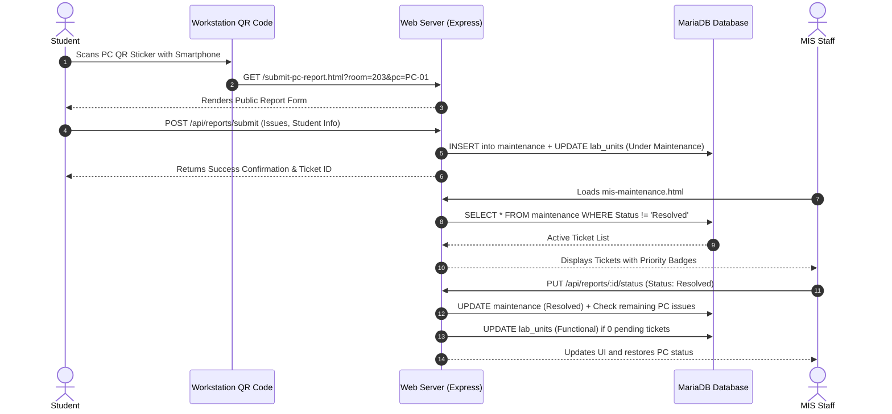
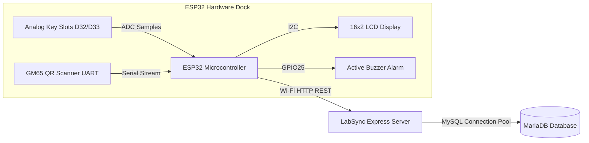
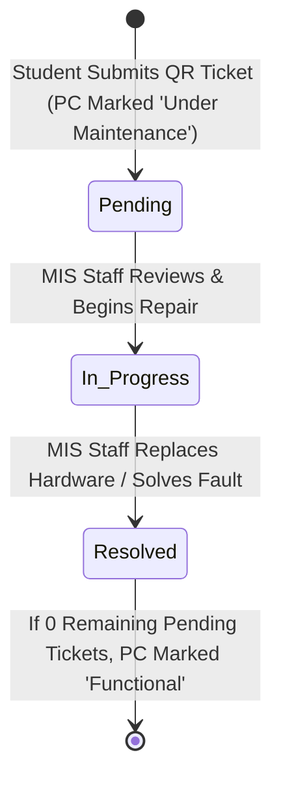
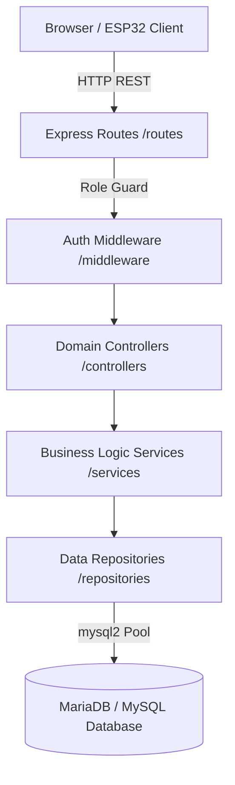
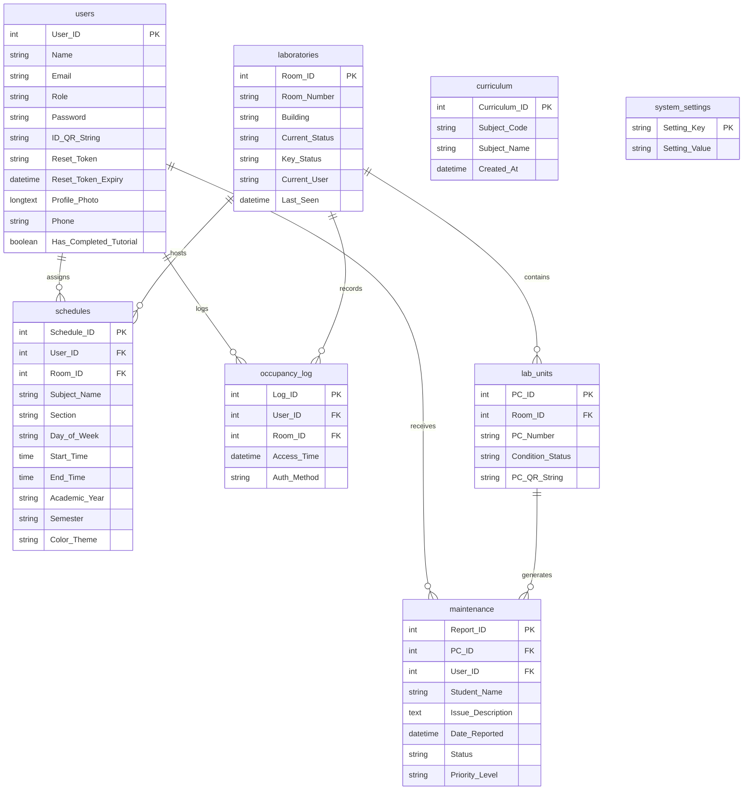

# LabSync — Capstone Manuscript Technical Reference Guide (Chapters 1–5)

> **Document Type:** Primary Technical Reference & Manuscript Alignment Guide  
> **Target Audience:** Capstone Documentation Team / Chapter 1–5 Writers  
> **System Name:** LabSync (Smart Laboratory & Schedule Management System)  
> **Official Capstone Title:** An IoT-Based IT Laboratory Availability and Equipment Monitoring System Using QR Codes  
> **Institution:** Bulacan State University — Sarmiento Campus  
> **Department / Target Environment:** Department of Information Technology / IT Laboratories (e.g., Rooms 203, 204)  
> **Current Version:** 1.0.0 (Baseline Architecture)  
> **Last Codebase Audit:** August 2026  

---

## 📌 How to Use This Reference Guide

This document is compiled directly from the active **LabSync codebase** as the **absolute source of truth**. It is designed specifically for group members writing **Chapters 1 through 5** of the capstone manuscript who may not have written every line of code.

### Evidence Classification Standard

Throughout this guide, all technical details and concepts are explicitly marked with one of four evidence classifications:

- `[CODE-CONFIRMED]`: Directly verified against active JavaScript, HTML, CSS, SQL, or Arduino C++ source code in the repository.
- `[CONFIRMED-BY-DOCS]`: Sourced from baseline architectural documentation and handover artifacts.
- `[TEAM-INPUT-REQUIRED]`: Institutional, academic, statistical, or organizational information that cannot be derived from source code and must be supplied by the researchers.
- `[EXTERNAL-RESEARCH-REQUIRED]`: Theoretical concepts, legal frameworks, and academic literature that must be gathered from external scholarly databases (no fake citations are provided).

---

## 📋 Table of Contents

1. [Section 1 — System Identity](#section-1--system-identity)
2. [Section 2 — System Overview](#section-2--system-overview)
3. [Section 3 — Problem Domain](#section-3--problem-domain)
4. [Section 4 — System Objectives](#section-4--system-objectives)
5. [Section 5 — System Scope & Delimitations](#section-5--system-scope--delimitations)
6. [Section 6 — System Users & Roles](#section-6--system-users--roles)
7. [Section 7 — Complete Feature Inventory](#section-7--complete-feature-inventory)
8. [Section 8 — Detailed User Workflows](#section-8--detailed-user-workflows)
9. [Section 9 — IoT Hardware Architecture](#section-9--iot-hardware-architecture)
10. [Section 10 — QR Code Ecosystem](#section-10--qr-code-ecosystem)
11. [Section 11 — Workstation Fault Reporting & Ticket Pipeline](#section-11--workstation-fault-reporting--ticket-pipeline)
12. [Section 12 — Maintenance Management Workflow](#section-12--maintenance-management-workflow)
13. [Section 13 — Timetable & Scheduling System](#section-13--timetable--scheduling-system)
14. [Section 14 — Real-Time Updates & Polling Architecture](#section-14--real-time-updates--polling-architecture)
15. [Section 15 — Frontend Architecture & Directory Layout](#section-15--frontend-architecture--directory-layout)
16. [Section 16 — Backend Architecture & Service Layer](#section-16--backend-architecture--service-layer)
17. [Section 17 — Database Design & Data Dictionary](#section-17--database-design--data-dictionary)
18. [Section 18 — Authentication, Authorization & Security](#section-18--authentication-authorization--security)
19. [Section 19 — Responsive & Mobile Design System](#section-19--responsive--mobile-design-system)
20. [Section 20 — UI Design System & Accessibility](#section-20--ui-design-system--accessibility)
21. [Section 21 — Non-Functional Characteristics](#section-21--non-functional-characteristics)
22. [Section 22 — Error Handling & Process Resilience](#section-22--error-handling--process-resilience)
23. [Section 23 — Security Considerations & Vulnerability Boundaries](#section-23--security-considerations--vulnerability-boundaries)
24. [Section 24 — System Limitations](#section-24--system-limitations)
25. [Section 25 — Chapter 1 Writing Reference (Introduction)](#section-25--chapter-1-writing-reference-introduction)
26. [Section 26 — Chapter 2 Writing Reference (Literature Review)](#section-26--chapter-2-writing-reference-literature-review)
27. [Section 27 — Chapter 3 Writing Reference (Methodology)](#section-27--chapter-3-writing-reference-methodology)
28. [Section 28 — Chapter 4 Writing Reference (Results & Implementation)](#section-28--chapter-4-writing-reference-results--implementation)
29. [Section 29 — Chapter 5 Writing Reference (Summary, Conclusions & Recommendations)](#section-29--chapter-5-writing-reference-summary-conclusions--recommendations)
30. [Section 30 — Manuscript Screenshot Checklist](#section-30--manuscript-screenshot-checklist)
31. [Section 31 — Manuscript Diagram Checklist](#section-31--manuscript-diagram-checklist)
32. [Section 32 — Manuscript Tables & Matrices](#section-32--manuscript-tables--matrices)
33. [Section 33 — Domain Glossary](#section-33--domain-glossary)
34. [Section 34 — Documentation Gaps (Information Needed From Team)](#section-34--documentation-gaps-information-needed-from-team)
35. [Section 35 — Manuscript Author Writing Notes & Guardrails](#section-35--manuscript-author-writing-notes--guardrails)
36. [Section 36 — Master Technical Reference Matrix](#section-36--master-technical-reference-matrix)
37. [Section 37 — Source Code File Directory Reference](#section-37--source-code-file-directory-reference)

---

## Section 1 — System Identity

- **Full System Title `[CODE-CONFIRMED]`:** *An IoT-Based IT Laboratory Availability and Equipment Monitoring System Using QR Codes*
- **Short Name `[CODE-CONFIRMED]`:** **LabSync**
- **Academic Institution `[CODE-CONFIRMED]`:** Bulacan State University — Sarmiento Campus (BulSU-SC)
- **Target Department `[CODE-CONFIRMED]`:** Department of Information Technology / Laboratory Management & MIS Office
- **Current Software Version `[CODE-CONFIRMED]`:** 1.0.0
- **Underlying Technology Stack `[CODE-CONFIRMED]`:** Node.js (v18+), Express v5, MySQL / MariaDB, ESP32 Microcontroller (C++/Arduino), Vanilla HTML5/CSS3/JavaScript (ES6 Modules).

---

## Section 2 — System Overview

**LabSync** is a unified, full-stack web and IoT platform designed to digitize, automate, and synchronize physical computer laboratory operations.

### How It Works in Plain Language:

1. **Room & Key Monitoring:** An ESP32 microcontroller dock equipped with electronic key slots is installed in the department. When an authorized instructor claims a laboratory key, the system records who holds the key. The web dashboard dynamically computes whether each laboratory is **Available**, **In Session** (instructor teaching scheduled class), or **Borrowed** (special usage or unscheduled access).
2. **Workstation Issue Reporting:** Each desktop computer in the laboratory has a durable QR code sticker affixed to it. When a computer encounters hardware or software failures (e.g., broken mouse, failing monitor, OS crash), any student scans the QR code with their smartphone. This instantly opens a web ticket form pre-filled with the exact Room Number and PC Number. No student login or registration is required.
3. **Maintenance Tracking:** When a student submits a report, the workstation status updates to `Under Maintenance`, and an electronic ticket appears in the **MIS Staff Maintenance Tracker** with color-coded priority (`High`, `Medium`, `Low`). MIS technicians update the progress (`Pending` → `In Progress` → `Resolved`). Once resolved, the PC automatically returns to `Functional` status.
4. **Drag-and-Drop Timetable Studio:** The IT Department Head uses an interactive grid builder to assign courses, sections, and instructors to laboratory rooms. The system automatically detects scheduling clashes in real-time (preventing double-booked rooms or double-booked professors).

---

## Section 3 — Problem Domain

| Traditional Laboratory Problem | Codebase Evidence / Validation Status | How LabSync Solves It |
|---|---|---|
| **Physical Key Blindness** | `[CODE-CONFIRMED]` (ESP32 ADC key slots & `occupancy_log` table) | Hardware key dock tracks whether physical keys are present or taken, linking key release to instructor identity. |
| **Unknown Room Availability** | `[CODE-CONFIRMED]` (`services/laboratoryService.js`) | Dynamic 3-state algorithm computes `Available`, `In Session`, or `Borrowed` using live clock, schedule records, and key status. |
| **Paper-Based PC Fault Logging** | `[CODE-CONFIRMED]` (`submit-pc-report.html` & `maintenance` table) | Direct QR scan allows immediate, mobile-first ticket submission with structured component checklists. |
| **Maintenance Pipeline Invisibility** | `[CODE-CONFIRMED]` (`mis-maintenance.html` & `maintenanceService.js`) | Centralized Kanban-style queue with filtering, priority sorting, and auto-restoration of PC condition. |
| **Timetable Conflicts & Double Bookings** | `[CODE-CONFIRMED]` (`js/scheduling/` & `scheduleService.js`) | Schedule Studio with real-time overlap collision checks and ghost professor overlays. |
| **Administrative Signatory Overhead** | `[CODE-CONFIRMED]` (`print-schedule.html`, `print-all-schedules.html`) | Automated timetable generation formatted with Dean and Chair signatories from `system_settings`. |

> [!NOTE]
> *Specific institutional loss statistics, survey percentages on delayed repairs, or historical clash rates must be supplied by the researchers via capstone survey instruments `[TEAM-INPUT-REQUIRED]`.*

---

## Section 4 — System Objectives

### General Objective
To design, develop, and implement **LabSync: An IoT-Based IT Laboratory Availability and Equipment Monitoring System Using QR Codes** for Bulacan State University – Sarmiento Campus that integrates physical key tracking, dynamic room availability calculation, QR-based workstation fault ticketing, maintenance progress tracking, and conflict-free course schedule management.

### Specific Objectives `[CODE-CONFIRMED]`
1. **IoT Hardware Integration:** Develop an ESP32-based key monitoring dock utilizing resistor-divider ADC sensing, an I2C 16x2 LCD, an optical GM65 barcode scanner, an active buzzer, and 5-second HTTP heartbeat telemetry.
2. **Dynamic Laboratory State Calculation:** Implement a backend engine that evaluates real-time key dock state, timetable slots, and instructor identities to derive laboratory availability (`Available`, `In Session`, `Borrowed`).
3. **QR-Based Workstation Issue Reporting:** Deploy a mobile-optimized public web reporting interface accessible via QR code scans without student authentication barriers.
4. **Maintenance Lifecycle Workflow:** Create a centralized technical maintenance portal for MIS staff with priority escalation, multi-criteria filtering, and automated workstation health status transitions.
5. **Interactive Schedule Studio:** Construct a drag-and-drop timetable management module featuring client and server conflict validation, curriculum code auto-completion, and signatory export templates.
6. **Role-Based Access Control & Auditing:** Establish secure session-based authentication with strict role permissions across three authenticated roles (IT Head, MIS Staff, Faculty) and public student reporting.

---

## Section 5 — System Scope & Delimitations

### In-Scope Items `[CODE-CONFIRMED]`
- **Target Facilities:** IT Building Computer Laboratories (specifically Rooms 203 and 204 configured in hardware firmware, scalable to all campus rooms via database).
- **Physical Key Monitoring:** Electronic detection of key insertion, key removal, wrong-slot insertion alarms, and periodic device heartbeat.
- **Workstation Equipment Tracking:** Individual PC unit tracking, batch QR code generation, condition status monitoring (`Functional`, `Under Maintenance`).
- **Course Scheduling:** Academic year, semester, day of week, time interval, subject code, section, and instructor timetable mapping.
- **Administrative Utilities:** Faculty CRUD, leadership transfer, curriculum CSV/batch import, custom signatory settings, dark mode, high contrast accessibility themes, and transactional email dispatch.

### Delimitations & Out-of-Scope Items `[CODE-CONFIRMED]`
- **True Physical Occupancy Detection:** The system monitors **physical key presence**, **not human body count or motion sensors (PIR/cameras)**. "Occupied" is inferred from key withdrawal and active schedule slots.
- **Student Dashboard / Accounts:** There is **no student portal, login, or student profile**. Students interact strictly via the public workstation QR scan URL.
- **Automated Hardware Diagnostics:** The system does not run agent software inside PC operating systems (e.g., RAM/CPU daemon). All reports originate from human user input.
- **Automated Inventory Procurement:** The system tracks maintenance repair status, not spare-parts purchase orders or accounting budgets.

---

## Section 6 — System Users & Roles



### 1. Public / Student `[CODE-CONFIRMED]`
- **Authentication:** None required (Public access via URL parameter).
- **Accessible Page:** [`submit-pc-report.html`](file:///c:/Users/andre/Downloads/LabSync/submit-pc-report.html).
- **Function:** Scans PC QR sticker, selects failing hardware/software components, enters student name and section, submits repair ticket.

### 2. Faculty / Professor `[CODE-CONFIRMED]`
- **Authentication:** Email and password login via [`login.html`](file:///c:/Users/andre/Downloads/LabSync/login.html).
- **Accessible Pages:** [`index.html`](file:///c:/Users/andre/Downloads/LabSync/index.html) (Dashboard), [`room-status.html`](file:///c:/Users/andre/Downloads/LabSync/room-status.html), [`my-schedule.html`](file:///c:/Users/andre/Downloads/LabSync/my-schedule.html), [`faculty-pc-reports.html`](file:///c:/Users/andre/Downloads/LabSync/faculty-pc-reports.html).
- **Function:** Checks live lab availability, views personal teaching timetable, monitors workstation health in assigned teaching rooms, updates profile/password.

### 3. IT Department Head `[CODE-CONFIRMED]`
- **Authentication:** High-privilege role (`IT Dept. Head`, `IT Head`, `Department Head`).
- **Accessible Pages:** [`it-head-dashboard.html`](file:///c:/Users/andre/Downloads/LabSync/it-head-dashboard.html), [`it-head-room-status.html`](file:///c:/Users/andre/Downloads/LabSync/it-head-room-status.html), [`it-head-pc-reports.html`](file:///c:/Users/andre/Downloads/LabSync/it-head-pc-reports.html), [`it-head-my-schedule.html`](file:///c:/Users/andre/Downloads/LabSync/it-head-my-schedule.html), [`master-schedule.html`](file:///c:/Users/andre/Downloads/LabSync/master-schedule.html), [`room-schedule-editor.html`](file:///c:/Users/andre/Downloads/LabSync/room-schedule-editor.html), [`faculty-management.html`](file:///c:/Users/andre/Downloads/LabSync/faculty-management.html), [`print-schedule.html`](file:///c:/Users/andre/Downloads/LabSync/print-schedule.html), [`print-all-schedules.html`](file:///c:/Users/andre/Downloads/LabSync/print-all-schedules.html).
- **Function:** Master schedule builder, curriculum management, faculty user CRUD, role modification, leadership delegation, signatory configuration.

### 4. MIS Staff `[CODE-CONFIRMED]`
- **Authentication:** Maintenance role (`MIS Staff`).
- **Accessible Pages:** [`mis-staff-dashboard.html`](file:///c:/Users/andre/Downloads/LabSync/mis-staff-dashboard.html), [`mis-maintenance.html`](file:///c:/Users/andre/Downloads/LabSync/mis-maintenance.html), [`mis-qr-generator.html`](file:///c:/Users/andre/Downloads/LabSync/mis-qr-generator.html), [`master-schedule.html`](file:///c:/Users/andre/Downloads/LabSync/master-schedule.html).
- **Function:** Triage repair tickets, update maintenance status (`In Progress`, `Resolved`), delete resolved tickets, generate and print PC QR labels, view master room timetables.

---

## Section 7 — Complete Feature Inventory

| Module / Feature | Canonical Page(s) | Primary Role | Implementation Summary & Evidence |
|---|---|---|---|
| **Authentication & Anti-Flash** | [`login.html`](file:///c:/Users/andre/Downloads/LabSync/login.html), [`reset-password.html`](file:///c:/Users/andre/Downloads/LabSync/reset-password.html) | All Users | Express-session cookies, token-based password reset via Nodemailer, synchronous client anti-flash script in [`js/auth-check.js`](file:///c:/Users/andre/Downloads/LabSync/js/auth-check.js). |
| **Real-Time Room Status** | [`room-status.html`](file:///c:/Users/andre/Downloads/LabSync/room-status.html), [`it-head-room-status.html`](file:///c:/Users/andre/Downloads/LabSync/it-head-room-status.html) | Faculty, IT Head | Dynamic status calculation (`Available`, `In Session`, `Borrowed`), hardware online pill, PC issue count, 3s auto-poll. |
| **Schedule Studio** | [`room-schedule-editor.html`](file:///c:/Users/andre/Downloads/LabSync/room-schedule-editor.html) | IT Head | Drag-and-drop timetable grid, resize handles, same-room collision checks, cross-room instructor conflict detection. |
| **Master Schedule Grid** | [`master-schedule.html`](file:///c:/Users/andre/Downloads/LabSync/master-schedule.html) | IT Head, MIS Staff | Global matrix view across all laboratory rooms, term filtering (AY/Semester), curriculum subject autocomplete. |
| **Workstation QR Reporting** | [`submit-pc-report.html`](file:///c:/Users/andre/Downloads/LabSync/submit-pc-report.html) | Student / Public | Mobile-first public issue form, multi-component checkbox selector, automated priority calculation. |
| **Maintenance Tracker** | [`mis-maintenance.html`](file:///c:/Users/andre/Downloads/LabSync/mis-maintenance.html) | MIS Staff | Kanban-style ticket triage, status transitions, modal issue inspector, automated PC condition synchronization. |
| **PC & QR Label Studio** | [`mis-qr-generator.html`](file:///c:/Users/andre/Downloads/LabSync/mis-qr-generator.html) | MIS Staff, IT Head | Batch PC generator, dynamic QR canvas rendering (Node QRCode library), printable sheet generation. |
| **Faculty Management** | [`faculty-management.html`](file:///c:/Users/andre/Downloads/LabSync/faculty-management.html) | IT Head | Faculty directory CRUD, role editor, transfer leadership workflow, onboarding welcome emails. |
| **Signatory Print Exports** | [`print-schedule.html`](file:///c:/Users/andre/Downloads/LabSync/print-schedule.html), [`print-all-schedules.html`](file:///c:/Users/andre/Downloads/LabSync/print-all-schedules.html) | IT Head | Clean print stylesheets, official BulSU header, configurable Campus Dean and Program Chair signatories. |
| **IoT Key Dock & Telemetry** | ESP32 Hardware + [`routes/iot.routes.js`](file:///c:/Users/andre/Downloads/LabSync/routes/iot.routes.js) | Hardware / System | Resistor-divider ADC key sensing, GM65 optical scanning, wrong-slot alarm, 5-second heartbeat telemetry. |

---

## Section 8 — Detailed User Workflows



---

## Section 9 — IoT Hardware Architecture

### Hardware Component Inventory `[CODE-CONFIRMED]`

- **Microcontroller:** ESP32 Dev Module (WROOM-32).
- **Key Sensing Mechanism:** Dual-slot analog voltage divider with unique resistor values.
  - **Slot 203 (Pin D32):** Configured with a **10kΩ resistor key** (Target ADC range: `1000 - 2600`).
  - **Slot 204 (Pin D33):** Configured with a **0Ω direct wire key** (Target ADC range: `0 - 500`).
  - **Empty Slot State:** Pull-up reading `> 3000` ADC counts.
- **Wrong Slot Alarm:** If Key 204 is placed into Slot 203, the ESP32 activates an 80ms pulsing buzzer loop and displays `WRONG KEY SLOT!` on the LCD until rectified.
- **Optical Scanner:** GM65 1D/2D Barcode/QR Reader connected via Hardware UART (`Serial2` on GPIO16 TX, GPIO17 RX, 9600 baud).
- **Display:** 16x2 HD44780 Character LCD with I2C PCF8574 backpack (Auto-scans address `0x27` or `0x3F` on SDA GPIO21, SCL GPIO22).
- **Audio Feedback:** Active Buzzer on GPIO25 (Low-level trigger).
- **Telemetry Heartbeat:** Sends JSON payload `{"deviceId":"ESP32-KeyBox","rooms":["203","204"]}` every 5000ms (`HEARTBEAT_INTERVAL`) to `/api/occupancy/heartbeat`.



---

## Section 10 — QR Code Ecosystem

The system operates **two distinct QR code pipelines**:

### 1. Workstation Diagnostic QR Codes `[CODE-CONFIRMED]`
- **Generated By:** MIS Staff in [`mis-qr-generator.html`](file:///c:/Users/andre/Downloads/LabSync/mis-qr-generator.html).
- **Payload Format:** Direct HTTPS/HTTP URL:
  `http://<SERVER_HOST>:<PORT>/submit-pc-report.html?room=203&pc=01`
- **Physical Placement:** Printed on durable vinyl/paper label sticker and affixed to each PC unit.
- **Consumer:** Any student or faculty smartphone camera scanner.

### 2. User Faculty ID Badges `[CODE-CONFIRMED]`
- **Generated By:** Backend user onboarding / profile service.
- **Payload Format:** Unique alphanumeric token: `LABSYNC-USER-<TIMESTAMP>-<RANDOM>`
- **Consumer:** Scanned by the GM65 optical scanner on the ESP32 hardware box to claim keys.

---

## Section 11 — Workstation Fault Reporting & Ticket Pipeline

### Report Submission Structure `[CODE-CONFIRMED]`
- **Endpoint:** `POST /api/reports/submit`
- **Request Payload:**
  ```json
  {
    "roomNumber": "203",
    "pcNumber": "01",
    "studentName": "Juan Dela Cruz",
    "studentSection": "BSIT 3-A",
    "components": {
      "Monitor": "issue",
      "Keyboard": "good",
      "Mouse": "issue",
      "System Unit": "good",
      "Internet/LAN": "good"
    },
    "remarks": "Mouse left click broken, monitor flickering."
  }
  ```

### Automated Priority Calculation Rule `[CODE-CONFIRMED]`
- **High Priority (`High`):** If `PC/Laptop` or `System Unit` is flagged as an issue.
- **Medium Priority (`Medium`):** If `Monitor` is flagged as an issue.
- **Low Priority (`Low`):** Peripherals (Keyboard, Mouse, Cables, Headset, LAN) or remarks only.
- **Auto-Resolved:** If 0 issues and no remarks are entered, the system marks the ticket `Resolved` and keeps PC `Functional`.

---

## Section 12 — Maintenance Management Workflow



1. **Pending:** Ticket appears in red/amber badge in `mis-maintenance.html`. Workstation card reflects `Under Maintenance`.
2. **In Progress:** MIS technician takes ownership of the physical workstation.
3. **Resolved:** Ticket is marked complete. Database executes a transaction:
   - Sets ticket `Status = 'Resolved'`.
   - Executes `countPendingReportsByPCId(PC_ID)`.
   - If pending count is 0, restores `lab_units.Condition_Status = 'Functional'`.

---

## Section 13 — Timetable & Scheduling System

### Data Entities & Granularity `[CODE-CONFIRMED]`
- **Academic Term:** Academic Year (e.g., `2025-2026`) and Semester (e.g., `1st Semester`, `2nd Semester`, `Summer`).
- **Time Slots:** 7:00 AM to 9:00 PM in 30-minute intervals.
- **Conflict Engine (`checkProfessorConflict`):**
  - Evaluates same-day, same-time overlapping intervals: `max(start1, start2) < min(end1, end2)`.
  - Blocks cross-room double booking for the same faculty member across all laboratories.
  - Visualizes ghost schedule overlays in the Schedule Studio grid.

---

## Section 14 — Real-Time Updates & Polling Architecture

> [!IMPORTANT]
> **Manuscript Clarification:** LabSync implements **Short Polling with SWR (Stale-While-Revalidate)** and **Heartbeat Telemetry**, **not WebSocket or Server-Sent Events (SSE)**. Do not state in the manuscript that WebSockets were implemented.

- **Room Availability Polling:** 3000ms active interval via `setInterval()` in [`js/services/laboratory.service.js`](file:///c:/Users/andre/Downloads/LabSync/js/services/laboratory.service.js).
- **IoT Hardware Heartbeat:** 5000ms interval from ESP32 to `/api/occupancy/heartbeat`. If no heartbeat is received within 15 seconds, the UI room card displays an **Offline** badge.
- **Activity & Notification Polling:** 5000ms to 10000ms interval for recent PC issue notifications.

---

## Section 15 — Frontend Architecture & Directory Layout

The frontend follows a **Vanilla Modular MVC Architecture** using browser-native ES6 modules without heavy JavaScript framework overhead.

```
js/
├── auth-check.js                   # Synchronous head anti-flash & role guard
├── components/                     # Reusable UI component modules
│   ├── activity-feed.js            # Live notification drawer
│   ├── custom-select.js            # Accessible dropdown replacement
│   ├── faculty-card.js             # Faculty directory cards
│   ├── notifications.js            # Toast and banner dispatchers
│   ├── profile-menu.js             # User account avatar dropdown
│   └── sidebar-nav.js              # Responsive sidebar & mobile navigation
├── pages/                          # Page-level controller scripts
│   ├── dashboard.js                # Faculty dashboard controller
│   ├── it-head-dashboard.js        # IT Head summary metrics
│   ├── mis-maintenance.js          # Maintenance ticket queue controller
│   ├── mis-qr-generator.js         # PC QR batch generator
│   └── submit-pc-report.js         # Mobile public fault report controller
├── scheduling/                     # Schedule Studio drag-and-drop engine
│   ├── controller/                 # Editor interaction controllers
│   ├── persistence/                # Timetable save/load adapters
│   └── validation/                 # Timetable collision validators
└── services/                       # Client API fetch services
    ├── laboratory.service.js       # Laboratory status API client
    ├── report.service.js           # PC report API client
    └── schedule.service.js         # Schedule API client
```

---

## Section 16 — Backend Architecture & Service Layer

LabSync implements a **Layered Architecture (Routes → Controllers → Services → Repositories → Database)**:



- **Routes (`routes/`):** Define URL endpoints and attach authorization middleware (`requireAuth`, `requireRole(ADMIN_ROLES)`).
- **Controllers (`controllers/`):** Extract HTTP request parameters, call services, format JSON response envelopes.
- **Services (`services/`):** Encapsulate all business logic, conflict validation, priority calculations, and email formatting.
- **Repositories (`repositories/`):** Execute parameterized SQL queries against MySQL connection pool with transaction support (`withTransaction`).

---

## Section 17 — Database Design & Data Dictionary

### Relational Schema Summary `[CODE-CONFIRMED]`



---

## Section 18 — Authentication, Authorization & Security

- **Session Authentication:** Server-side sessions managed via `express-session` with 24-hour cookie expiration (`SESSION_MAX_AGE = 86400000`).
- **Role Authorization:** Protected endpoints enforce `requireRole(['IT Dept. Head', 'MIS Staff'])`.
- **Client-Side Anti-Flash:** [`js/auth-check.js`](file:///c:/Users/andre/Downloads/LabSync/js/auth-check.js) runs synchronously in `<head>` hiding `<html>` (`visibility: hidden`) until session validity and page authorization are verified.
- **Transactional Password Recovery:** Secure random 32-byte crypto token (`crypto.randomBytes(32).toString('hex')`) with 1-hour expiration delivered via Nodemailer SMTP.

---

## Section 19 — Responsive & Mobile Design System

- **Desktop (>= 1024px):** Full multi-pane layouts, persistent sidebar navigation, multi-column schedule studio.
- **Tablet (768px - 1023px):** Collapsible navigation drawer, 2-column card grid, scrollable timetable canvas.
- **Mobile (< 768px):** Hamburger drawer, single-column room and maintenance lists, mobile-first QR fault report form.
- **CSS Media Queries:** Structured in [`css/responsive.css`](file:///c:/Users/andre/Downloads/LabSync/css/responsive.css) and component stylesheets.

---

## Section 20 — UI Design System & Accessibility

- **Design System Tokens (`css/variables.css`):**
  - Primary Cyan: `#1EBBD7`
  - Deep Slate / Background: `#0E1726` / `#F8FAFC`
  - Success / In-Session: `#10B981` / `#6366F1`
  - Warning / Borrowed: `#F59E0B`
  - Danger / Under Maintenance: `#EF4444`
- **Typography:** Inter (`sans-serif`) imported via Google Fonts.
- **Accessibility Themes:** High Contrast mode toggle (`.high-contrast`) stored in `localStorage` for visual accessibility compliance.

---

## Section 21 — Non-Functional Characteristics

- **Usability:** Zero-login mobile public reporting interface reduces student submission time to under 30 seconds.
- **Maintainability:** Modular separation of concerns (Repositories isolated from Express HTTP objects).
- **Data Integrity:** Database mutations (e.g., schedule batch saving, ticket resolution) use SQL transactions (`START TRANSACTION ... COMMIT / ROLLBACK`).
- **Reliability:** Process safety listeners (`unhandledRejection`, `uncaughtException`) in [`server.js`](file:///c:/Users/andre/Downloads/LabSync/server.js) prevent Node process death on unexpected runtime errors.

---

## Section 22 — Error Handling & Process Resilience

- **Centralized Error Middleware:** [`middleware/errorHandler.js`](file:///c:/Users/andre/Downloads/LabSync/middleware/errorHandler.js) intercepts unhandled controller exceptions and returns structured JSON `{ error: 'Internal Server Error' }` with 500 status.
- **Client Toast Notification System:** [`js/components/toast.js`](file:///c:/Users/andre/Downloads/LabSync/js/components/toast.js) renders non-blocking UI alert banners for network failures, validation errors, and success confirmations.

---

## Section 23 — Security Considerations & Vulnerability Boundaries

- **SQL Injection Defense:** 100% of database queries in `repositories/` use parameterized prepared statements (`?` placeholders via `mysql2`).
- **Credential Storage:** *Note for Chapter 5 Recommendations: In the current baseline version, plain-text passwords exist in development seeds; production deployment must incorporate bcrypt password hashing.*
- **CORS & Proxy Safety:** Configured CORS origins with credentials enabled and `app.set('trust proxy', 1)` for SSL termination behind reverse proxies.

---

## Section 24 — System Limitations

1. **Physical Key Proxy Limitation:** The system detects **physical key withdrawal**, not human bodily presence. If a key is taken but the room is left empty, the system displays `Borrowed` or `In Session`.
2. **Network Dependency:** If the ESP32 loses Wi-Fi connection, the web dashboard falls back to displaying the room as **Offline** while retaining database schedule records.
3. **No Native Mobile App:** The system is an adaptive responsive Web App; it does not require installation from Google Play Store or Apple App Store.

---

## Section 25 — Chapter 1 Writing Reference (Introduction)

### Subsections & Content Guidelines

1. **Background of the Study:** Discuss the transition from paper logbooks to smart campus IoT systems. Highlight BulSU Sarmiento Campus IT laboratories.
2. **Statement of the Problem:** Present the dual challenge of physical key tracking and workstation issue reporting lag.
3. **General & Specific Objectives:** Mirror the exact 6 specific objectives documented in [Section 4](#section-4--system-objectives).
4. **Significance of the Study:** Explain benefits to:
   - *IT Department Head:* Automated clash-free scheduling and faculty workload visibility.
   - *MIS Staff:* Centralized maintenance ticket triage.
   - *Faculty:* Real-time visibility into lab availability and room key holder.
   - *Students:* Seamless, frictionless PC repair reporting.
5. **Scope and Delimitations:** Mirror [Section 5](#section-5--system-scope--delimitations).
6. **Definition of Terms:** Use the confirmed definitions from [Section 33](#section-33--domain-glossary).

---

## Section 26 — Chapter 2 Writing Reference (Literature Review)

### Key Thematic Literature Areas to Research `[EXTERNAL-RESEARCH-REQUIRED]`

1. **Smart Campus & Laboratory Management Systems:** Prior studies on computerized facility scheduling and room utilization tracking.
2. **Internet of Things (IoT) in Educational Facilities:** Applications of ESP32 microcontrollers, sensor docks, and electronic asset monitoring.
3. **Quick Response (QR) Code Workflows in Asset Tracking:** Studies comparing manual paper ticketing vs. mobile QR code triage.
4. **Preventive and Corrective Maintenance Systems:** Best practices in IT equipment maintenance lifecycle management.
5. **Heuristic Collision Detection in Academic Timetabling:** Algorithms for preventing room and faculty scheduling clashes.

> [!CAUTION]
> *Do not fabricate authors or publication years. The documentation writer must search Google Scholar, IEEE Xplore, ScienceDirect, or the BulSU University Library for peer-reviewed citations.*

---

## Section 27 — Chapter 3 Writing Reference (Methodology)

### Recommended Methodology Structure

1. **Software Development Life Cycle (SDLC):** Modified Agile / Prototyping Model (iterative sprint cycles across IoT hardware prototyping, backend REST API development, and frontend UI refactoring).
2. **System Architecture Design:** Multi-tier architectural breakdown (see [Section 16](#section-16--backend-architecture--service-layer)).
3. **Hardware Development Workflow:** ESP32 circuit breadboarding, ADC calibration, I2C bus integration, GM65 UART communication testing.
4. **Database Design & Normalization:** Relational schema design up to 3rd Normal Form (3NF).

---

## Section 28 — Chapter 4 Writing Reference (Results & Implementation)

### Implementation Artifacts to Showcase

1. **System Entry & Authentication:** Login interface, password recovery workflow, anti-flash role authorization.
2. **Role-Specific Dashboards:** IT Head summary widgets, MIS technician maintenance queue, Faculty weekly timetable.
3. **Schedule Studio Module:** Drag-and-drop grid interaction, conflict toast popups, signatory export layouts.
4. **Public QR Report Submission:** Mobile smartphone view of the 5-component hardware checklist.
5. **IoT Hardware Rig:** Photos of the ESP32 key dock, 16x2 LCD key return messages, optical scanner in operation.

---

## Section 29 — Chapter 5 Writing Reference (Summary, Conclusions & Recommendations)

### Summary of Achievements
The project successfully developed and deployed a fully functional, integrated software-hardware solution addressing physical key tracking, dynamic room availability, QR-based workstation ticketing, and conflict-free academic scheduling.

### Concrete Conclusions
- The integration of resistor-divider ADC key sensing provides an economical, robust method for physical key state verification.
- Decoupling student reporting into a public, zero-login QR interface eliminates user friction and accelerates equipment repair cycles.
- Real-time client/server collision detection prevents academic scheduling overlaps.

### Future Recommendations `[CODE-CONFIRMED GAPS]`
- Implementation of bcrypt password hashing for production cryptographic hardening.
- Migration from 3s/5s polling to WebSockets or SSE for instant real-time event streaming at scale.
- Integration of PIR motion sensors or AI computer vision for true physical headcount validation.

---

## Section 30 — Manuscript Screenshot Checklist

| Screen / Interface | File / Route | Purpose in Manuscript | Target Chapter |
|---|---|---|---|
| **Login Portal** | [`login.html`](file:///c:/Users/andre/Downloads/LabSync/login.html) | Demonstrates secure session authentication | Chapter 4 |
| **Faculty Dashboard** | [`index.html`](file:///c:/Users/andre/Downloads/LabSync/index.html) | Shows instructor schedule overview & room status | Chapter 4 |
| **IT Head Dashboard** | [`it-head-dashboard.html`](file:///c:/Users/andre/Downloads/LabSync/it-head-dashboard.html) | Highlights administrative metric cards & quick actions | Chapter 4 |
| **MIS Staff Dashboard** | [`mis-staff-dashboard.html`](file:///c:/Users/andre/Downloads/LabSync/mis-staff-dashboard.html) | Displays maintenance summaries and active lab rooms | Chapter 4 |
| **Room Status Live View** | [`room-status.html`](file:///c:/Users/andre/Downloads/LabSync/room-status.html) | Shows dynamic color-coded room availability cards | Chapter 4 |
| **Schedule Studio Editor** | [`room-schedule-editor.html`](file:///c:/Users/andre/Downloads/LabSync/room-schedule-editor.html) | Illustrates interactive drag-and-drop timetable grid | Chapter 4 |
| **Master Schedule Grid** | [`master-schedule.html`](file:///c:/Users/andre/Downloads/LabSync/master-schedule.html) | Demonstrates cross-room term timetable view | Chapter 4 |
| **Faculty Management** | [`faculty-management.html`](file:///c:/Users/andre/Downloads/LabSync/faculty-management.html) | Shows faculty CRUD, role editing, and leadership modal | Chapter 4 |
| **Maintenance Tracker** | [`mis-maintenance.html`](file:///c:/Users/andre/Downloads/LabSync/mis-maintenance.html) | Illustrates ticket queue with priority badges | Chapter 4 |
| **PC & QR Generator** | [`mis-qr-generator.html`](file:///c:/Users/andre/Downloads/LabSync/mis-qr-generator.html) | Demonstrates batch QR code generation & print preview | Chapter 4 |
| **Student Mobile Report** | [`submit-pc-report.html`](file:///c:/Users/andre/Downloads/LabSync/submit-pc-report.html) | Mobile smartphone view of public issue submission form | Chapter 4 |
| **Signatory Print Preview** | [`print-schedule.html`](file:///c:/Users/andre/Downloads/LabSync/print-schedule.html) | Shows official timetable PDF layout with signatories | Chapter 4 |

---

## Section 31 — Manuscript Diagram Checklist

1. **System Architecture Diagram:** Multi-tier presentation, application, repository, and database flow.
2. **Context Diagram (Level 0 DFD):** External entities (Student, Faculty, IT Head, MIS Staff, ESP32) interacting with LabSync.
3. **Use Case Diagram:** Actors and functional use cases (Manage Schedules, Submit Report, Update Ticket, Log Key).
4. **Data Flow Diagram (Level 1 DFD):** Processes for Report Submission, Schedule Conflict Checking, Key Logging.
5. **Entity Relationship Diagram (ERD):** 8 relational database tables with primary/foreign keys (see [Section 17](#section-17--database-design--data-dictionary)).
6. **IoT Hardware Schematic / Flowchart:** ESP32 pinout, ADC voltage divider circuit, LCD, and GM65 UART wiring.

---

## Section 32 — Manuscript Tables & Matrices

### Role Permissions Matrix `[CODE-CONFIRMED]`

| System Module | Public Student | Faculty / Professor | MIS Staff | IT Department Head |
|---|:---:|:---:|:---:|:---:|
| **Submit PC QR Report** | ✅ | ✅ | ✅ | ✅ |
| **View Room Availability** | ❌ | ✅ | ✅ | ✅ |
| **View Personal Timetable** | ❌ | ✅ | ❌ | ✅ |
| **View Master Schedules** | ❌ | ❌ | ✅ | ✅ |
| **Create/Edit Room Schedules** | ❌ | ❌ | ❌ | ✅ |
| **Manage Faculty Accounts** | ❌ | ❌ | ❌ | ✅ |
| **Triage Maintenance Tickets** | ❌ | ❌ | ✅ | ❌ |
| **Generate Workstation QRs** | ❌ | ❌ | ✅ | ✅ |
| **Configure Signatories** | ❌ | ❌ | ❌ | ✅ |

---

## Section 33 — Domain Glossary

- **Available:** Room state indicating the physical key is in the dock and no class is currently in session.
- **In Session:** Room state indicating the scheduled instructor has withdrawn the key during their designated class hours.
- **Borrowed:** Room state indicating the key has been taken outside of a scheduled class or by another faculty member.
- **Schedule Studio:** The proprietary drag-and-drop interactive timetable editor in LabSync.
- **Key Sensor Dock:** The physical ESP32 electronic housing that senses physical room keys via resistor-divider analog pins.
- **PC QR String:** A unique alphanumeric identifier encoded into a QR label affixed to a laboratory computer.
- **Ghost Schedule:** A visual overlay in the Schedule Studio displaying a professor's classes in other rooms to prevent double-booking.

---

## Section 34 — Documentation Gaps (Information Needed From Team)

The following items **cannot be obtained from the source code** and must be provided by the capstone research team:

1. `[TEAM-INPUT-REQUIRED]` **Survey & Evaluation Data:** ISO 25010 / SUS questionnaire scores, user evaluation numbers, and statistical tables.
2. `[TEAM-INPUT-REQUIRED]` **Institutional Background:** Official history and laboratory inventory counts of BulSU Sarmiento Campus.
3. `[TEAM-INPUT-REQUIRED]` **Hardware Bill of Materials (BOM):** Exact financial costs of the ESP32, GM65 scanner, acrylic housing, and wiring components.
4. `[TEAM-INPUT-REQUIRED]` **Research Design & Sampling Method:** Purposive sampling details, number of faculty/student respondents.

---

## Section 35 — Manuscript Author Writing Notes & Guardrails

> [!WARNING]
> **Strict Capstone Writing Rules:**
> 1. **Do Not Claim Student Dashboards:** Never write that students log in or have student accounts. Students interact strictly through the public QR scan URL.
> 2. **Do Not Claim Human Body Occupancy:** Explicitly state that room occupancy is **inferred from key status and schedule data**, not direct body/camera counting.
> 3. **Do Not Claim WebSocket Real-Time:** State that real-time behavior is achieved through **optimized HTTP polling (3s - 5s)**.
> 4. **Maintain Terminology Consistency:** Always use `Available`, `In Session`, and `Borrowed` when referring to laboratory states.

---

## Section 36 — Master Technical Reference Matrix

| Feature Area | Key Implementation File(s) | Main Role(s) | Primary Capstone Use |
|---|---|---|---|
| **IoT Key Dock** | [`LabSync_ESP32.ino`](file:///c:/Users/andre/Downloads/LabSync/LabSync_ESP32.ino), [`services/iot/occupancy.service.js`](file:///c:/Users/andre/Downloads/LabSync/services/iot/occupancy.service.js) | Hardware | Chapter 3 (Design), Chapter 4 (IoT) |
| **Room Availability** | [`services/laboratoryService.js`](file:///c:/Users/andre/Downloads/LabSync/services/laboratoryService.js), [`room-status.html`](file:///c:/Users/andre/Downloads/LabSync/room-status.html) | Faculty, IT Head | Chapter 1 (Objectives), Chapter 4 (UI) |
| **Schedule Studio** | [`js/scheduling/`](file:///c:/Users/andre/Downloads/LabSync/js/scheduling), [`room-schedule-editor.html`](file:///c:/Users/andre/Downloads/LabSync/room-schedule-editor.html) | IT Head | Chapter 3 (Algorithms), Chapter 4 (UI) |
| **PC QR Ticketing** | [`submit-pc-report.html`](file:///c:/Users/andre/Downloads/LabSync/submit-pc-report.html), [`services/maintenanceService.js`](file:///c:/Users/andre/Downloads/LabSync/services/maintenanceService.js) | Student | Chapter 1 (Problem), Chapter 4 (Flow) |
| **Maintenance Queue** | [`mis-maintenance.html`](file:///c:/Users/andre/Downloads/LabSync/mis-maintenance.html), [`js/pages/mis-maintenance.js`](file:///c:/Users/andre/Downloads/LabSync/js/pages/mis-maintenance.js) | MIS Staff | Chapter 4 (Maintenance Implementation) |

---

## Section 37 — Source Code File Directory Reference

- **Server Entry:** [`server.js`](file:///c:/Users/andre/Downloads/LabSync/server.js) — Express server initialization, middleware, error handling, process safety.
- **Central Router:** [`routes/index.js`](file:///c:/Users/andre/Downloads/LabSync/routes/index.js) — Aggregates all domain routes and legacy route bridges.
- **Database Migrations:** [`database/migrations/`](file:///c:/Users/andre/Downloads/LabSync/database/migrations/) — Incremental SQL schema definitions.
- **Client Auth Guard:** [`js/auth-check.js`](file:///c:/Users/andre/Downloads/LabSync/js/auth-check.js) — Anti-flash theme applicator and client-side route guard.
- **Firmware:** [`LabSync_ESP32.ino`](file:///c:/Users/andre/Downloads/LabSync/LabSync_ESP32.ino) — Complete C++ firmware for ESP32 microcontroller dock.

---
*End of LabSync Technical Reference Guide (Chapters 1–5)*
