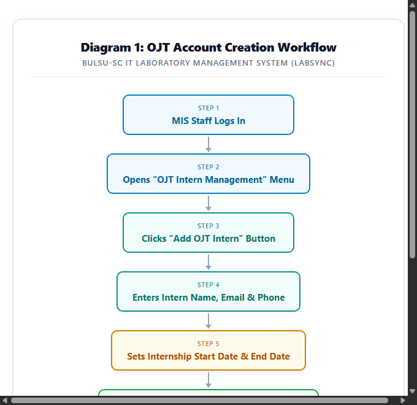
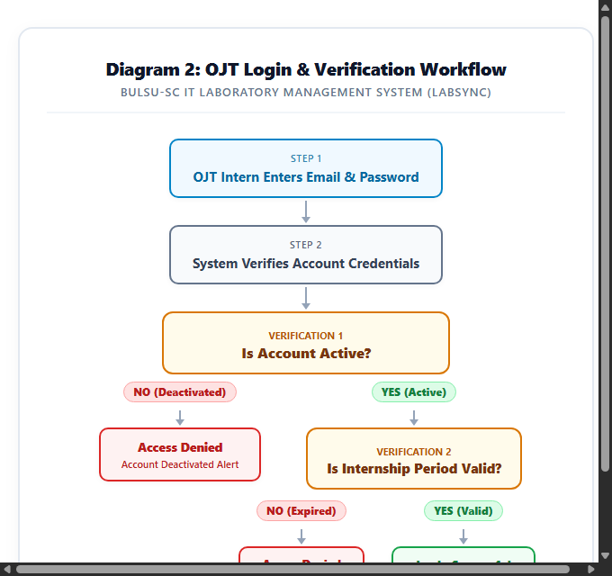
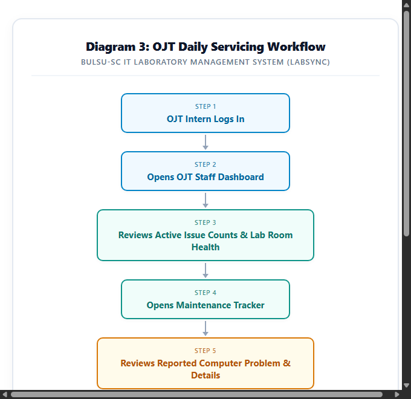
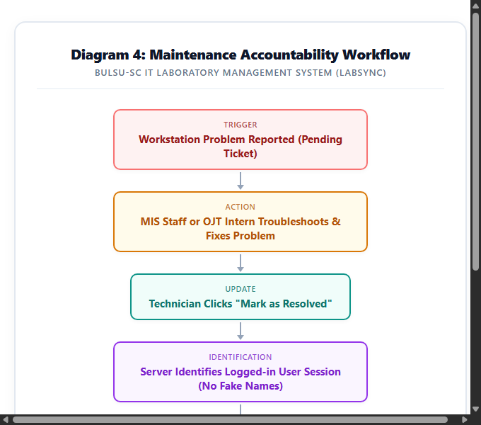
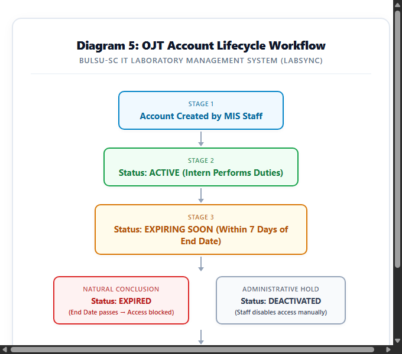
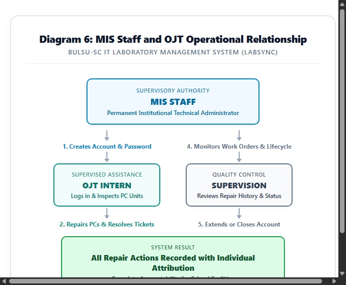
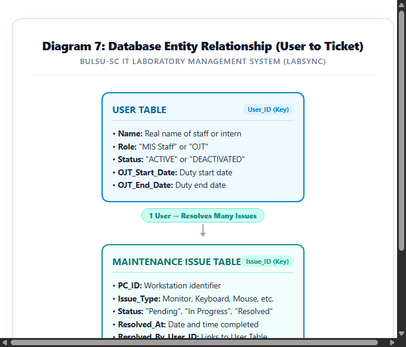
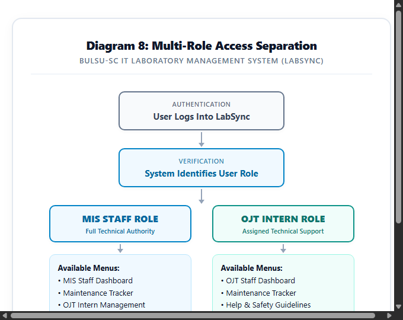

# LabSync MIS Staff and OJT Features
## Visual System Workflows and Technical Reference

---

> **Document Type:** System Architecture & Capstone Process Guide  
> **Target Audience:** Capstone Documentation Team, Student Researchers, Academic Advisers, Defense Panelists  
> **System Name:** LabSync (Smart Laboratory Management & Equipment Monitoring System)  
> **Institution:** Bulacan State University — Sarmiento Campus (BulSU-SC)  
> **Department:** Department of Information Technology  
> **Release:** LabSync Multi-Role System  
> **Date:** September 2026  

---

## 1. Purpose

In computer laboratories, the Management Information System (MIS) Staff is responsible for keeping all computers and laboratory equipment working properly. Student interns (OJT interns) assist the staff by inspecting computers, checking reported hardware issues, and performing repairs.

Previously, technical staff often shared a single office account. This made it difficult to determine which person resolved an issue or when an intern's service concluded.

LabSync introduces individual accounts for permanent MIS Staff and temporary accounts for student interns. When a maintenance issue is resolved, the system records the real name and role of the person who completed the work. This makes responsibilities clear, improves laboratory security, and provides a complete record of every repair.

---

## 2. MIS Staff Role

The **MIS Staff** represents the permanent institutional technical administrator.

* **Who is it?** A permanent university employee responsible for the technical operation of IT computer laboratories.
* **What do they do?** They supervise laboratory facilities, register student interns, monitor active repair work orders, manage laboratory keys, and generate equipment QR labels.
* **What happens next?** The staff member assigns repair tasks to student interns or resolves complex technical issues directly.
* **What is the result?** Laboratory equipment remains operational, and all technical activities are tracked under the staff member's real name.

```text
┌──────────────────────────────────────────────┐
│ MIS Staff logs in with individual account    │
└──────────────────────┬───────────────────────┘
                       ↓
┌──────────────────────────────────────────────┐
│ Opens the MIS Staff Dashboard                │
└──────────────────────┬───────────────────────┘
                       ↓
┌──────────────────────────────────────────────┐
│ Supervises OJT interns and assigns repairs   │
└──────────────────────┬───────────────────────┘
                       ↓
┌──────────────────────────────────────────────┐
│ System tracks all actions under staff member │
└──────────────────────────────────────────────┘
```

---

## 3. OJT Role

The **OJT Intern** represents an enrolled college student rendering required internship hours in the MIS office.

* **Who is it?** A temporary student assistant undergoing practical training under MIS supervision.
* **What do they do?** They conduct daily room inspections, review computer problems reported by teachers and students, and perform hardware or software troubleshooting.
* **What happens next?** When an intern repairs a workstation, they mark the issue as resolved in the system.
* **What is the result?** The computer returns to working condition, and the system records the intern's name, role, and time of completion.

```text
┌──────────────────────────────────────────────┐
│ OJT Intern logs in with temporary account    │
└──────────────────────┬───────────────────────┘
                       ↓
┌──────────────────────────────────────────────┐
│ Opens the OJT Staff Dashboard                │
└──────────────────────┬───────────────────────┘
                       ↓
┌──────────────────────────────────────────────┐
│ Inspects broken computers in laboratory rooms│
└──────────────────────┬───────────────────────┘
                       ↓
┌──────────────────────────────────────────────┐
│ Repairs the equipment and resolves tickets   │
└──────────────────────────────────────────────┘
```

---

## 4. OJT Account Management

MIS Staff creates and manages student intern accounts through the **OJT Intern Management** menu.

### Diagram 1: OJT Account Creation



```text
┌──────────────────────────────────────────────┐
│ 1. MIS Staff Logs In                         │
└──────────────────────┬───────────────────────┘
                       ↓
┌──────────────────────────────────────────────┐
│ 2. Opens "OJT Intern Management" Menu        │
└──────────────────────┬───────────────────────┘
                       ↓
┌──────────────────────────────────────────────┐
│ 3. Clicks "Add OJT Intern" Button            │
└──────────────────────┬───────────────────────┘
                       ↓
┌──────────────────────────────────────────────┐
│ 4. Enters Intern Name, Email & Phone Number  │
└──────────────────────┬───────────────────────┘
                       ↓
┌──────────────────────────────────────────────┐
│ 5. Sets Internship Start Date & End Date     │
└──────────────────────┬───────────────────────┘
                       ↓
┌──────────────────────────────────────────────┐
│ 6. System Creates Account & Generates Temp PW│
└──────────────────────┬───────────────────────┘
                       ↓
┌──────────────────────────────────────────────┐
│ 7. Staff Copies Credentials & Gives to Intern│
└──────────────────────┬───────────────────────┘
                       ↓
┌──────────────────────────────────────────────┐
│ Result: OJT Intern Can Now Log In            │
└──────────────────────────────────────────────┘
```

**Explanation:**  
The MIS Staff creates an individual account for each student intern by entering their name, email, phone number, and approved internship start and end dates. When the staff member submits the form, the system creates the account and generates a secure temporary password. The staff member provides these login credentials to the intern so they can access the system.

---

## 5. OJT Login

The system verifies an intern's credentials, account status, and internship dates before granting access.

### Diagram 2: OJT Login & Verification



```text
┌──────────────────────────────────────────────┐
│ OJT Intern Enters Email & Password           │
└──────────────────────┬───────────────────────┘
                       ↓
┌──────────────────────────────────────────────┐
│ System Verifies Credentials                  │
└──────────────────────┬───────────────────────┘
                       ↓
            Is Account Active?
           ├── NO  ──→ [ Access Denied: Account Deactivated ]
           └── YES
                ↓
       Is Internship Period Valid?
      (Today <= Scheduled End Date)
           ├── NO  ──→ [ Access Denied: Internship Concluded ]
           └── YES
                ↓
┌──────────────────────────────────────────────┐
│ Login Successful: Opens OJT Dashboard        │
└──────────────────────────────────────────────┘
```

**Explanation:**  
When an OJT intern enters their login details, the system first verifies that the account is active. Next, the system checks whether the current date is still within the intern's scheduled internship period. If the account is deactivated or the internship end date has passed, the system denies access; otherwise, the intern is taken directly to their dashboard.

---

## 6. OJT Daily Workflow

During daily duty, the OJT intern uses the dashboard and Maintenance Tracker to service reported workstation issues.

### Diagram 3: OJT Daily Servicing Workflow



```text
┌──────────────────────────────────────────────┐
│ 1. OJT Intern Logs In                        │
└──────────────────────┬───────────────────────┘
                       ↓
┌──────────────────────────────────────────────┐
│ 2. Opens OJT Staff Dashboard                 │
└──────────────────────┬───────────────────────┘
                       ↓
┌──────────────────────────────────────────────┐
│ 3. Reviews Active Issues Across Lab Rooms    │
└──────────────────────┬───────────────────────┘
                       ↓
┌──────────────────────────────────────────────┐
│ 4. Opens Maintenance Tracker                 │
└──────────────────────┬───────────────────────┘
                       ↓
┌──────────────────────────────────────────────┐
│ 5. Reviews Reported Problem Details          │
└──────────────────────┬───────────────────────┘
                       ↓
┌──────────────────────────────────────────────┐
│ 6. Inspects PC in Lab & Sets "In Progress"   │
└──────────────────────┬───────────────────────┘
                       ↓
┌──────────────────────────────────────────────┐
│ 7. Troubleshoots & Fixes the Equipment       │
└──────────────────────┬───────────────────────┘
                       ↓
┌──────────────────────────────────────────────┐
│ 8. Marks "Resolved": System Records Attribution│
└──────────────────────────────────────────────┘
```

**Explanation:**  
The OJT intern opens the dashboard to see how many computers need attention across campus laboratories. The intern visits the designated laboratory room, changes the ticket status to "In Progress", and troubleshoots the hardware or software problem. Once the repair is complete, the intern marks the ticket as "Resolved", and the system restores the computer back to working condition.

---

## 7. Maintenance Accountability

When a maintenance ticket is resolved, LabSync identifies the actual person who performed the repair.

### Diagram 4: Maintenance Accountability Workflow



```text
┌──────────────────────────────────────────────┐
│ 1. Workstation Problem Reported              │
└──────────────────────┬───────────────────────┘
                       ↓
┌──────────────────────────────────────────────┐
│ 2. Staff or OJT Intern Troubleshoots Problem │
└──────────────────────┬───────────────────────┘
                       ↓
┌──────────────────────────────────────────────┐
│ 3. Technician Clicks "Mark as Resolved"      │
└──────────────────────┬───────────────────────┘
                       ↓
┌──────────────────────────────────────────────┐
│ 4. System Identifies Current Logged-in User  │
└──────────────────────┬───────────────────────┘
                       ↓
┌──────────────────────────────────────────────┐
│ 5. Records: Real Name + Role + Timestamp     │
└──────────────────────┬───────────────────────┘
                       ↓
┌──────────────────────────────────────────────┐
│ Result: Record Shows:                        │
│ "Resolved by: Juan Dela Cruz · Role: OJT"    │
└──────────────────────────────────────────────┘
```

**Explanation:**  
When an authorized user marks a computer ticket as resolved, the system checks who is currently logged in. The system permanently connects the technician's real name, role (MIS Staff or OJT), and the exact completion date and time to that maintenance record. This ensures that every repair in the university computer labs can be traced back to the person who did the work.

---

## 8. OJT Account Lifecycle

An OJT account passes through specific stages from the time it is created until the internship concludes.

### Diagram 5: OJT Account Lifecycle Workflow



```text
┌──────────────────────────────────────────────┐
│ Stage 1: Account Created by MIS Staff        │
└──────────────────────┬───────────────────────┘
                       ↓
┌──────────────────────────────────────────────┐
│ Stage 2: ACTIVE (Intern Performs Duties)     │
└──────────────────────┬───────────────────────┘
                       ↓
┌──────────────────────────────────────────────┐
│ Stage 3: EXPIRING SOON (Last 7 Days of Duty) │
└──────────────────────┬───────────────────────┘
                       ↓
            What happens next?
           ├── Natural End ──→ [ EXPIRED: Access Blocked Automatically ]
           └── Admin Hold  ──→ [ DEACTIVATED: Disabled Manually by Staff ]
                       ↓
┌──────────────────────────────────────────────┐
│ Staff Controls: Edit Dates · Reactivate · PW │
└──────────────────────────────────────────────┘
```

**Explanation:**  
Every OJT account begins in the **Active** status upon registration. When an intern reaches their final seven days of service, the system marks them as **Expiring Soon** to alert staff. Once the scheduled end date passes, the account automatically becomes **Expired** and access is blocked, though permanent staff can edit the end date to extend the internship if needed.

---

## 9. MIS Staff and OJT Relationship

This diagram illustrates how permanent MIS Staff supervise student interns while maintaining separate responsibilities.

### Diagram 6: MIS Staff and OJT Operational Relationship



```text
                 MIS STAFF (Supervisor)
                  │                  │
        ┌─────────┴────────┐         │
        ↓                  ↓         │
  Creates Account    Monitors Work   │
        │                  │         │
        ↓                  │         │
   OJT INTERN              │         │
        │                  │         │
        ↓                  │         │
  Repairs Computers ───────┘         │
        │                            │
        ↓                            ↓
┌──────────────────────────────────────────────┐
│ All Repair Actions Recorded with Attribution │
│ (Complete Accountability for Lab Facilities) │
└──────────────────────────────────────────────┘
```

**Explanation:**  
The permanent MIS Staff supervises the student interns by creating their accounts, assigning daily repair work, and monitoring ticket resolution progress. The OJT interns perform hands-on troubleshooting and resolve issues in the laboratories. All completed work orders are recorded under each individual's account, giving the department full operational transparency.

---

## 10. Database Changes

LabSync uses a simple connection between the user accounts and the maintenance tickets to record who resolved each issue.

### Diagram 7: Database Entity Relationship



```text
┌──────────────────────────────────────────────┐
│                  USER TABLE                  │
├──────────────────────────────────────────────┤
│ • User_ID (Unique Account Key)               │
│ • Name (Full Name of Staff or Intern)        │
│ • Role ("MIS Staff" or "OJT")                │
│ • Status ("ACTIVE" or "DEACTIVATED")         │
│ • OJT_Start_Date (Start of Internship)       │
│ • OJT_End_Date (End of Internship)           │
└──────────────────────┬───────────────────────┘
                       │
                       │ 1 User Resolves Many Issues
                       ↓
┌──────────────────────────────────────────────┐
│           MAINTENANCE ISSUE TABLE            │
├──────────────────────────────────────────────┤
│ • Issue_ID (Unique Ticket Key)               │
│ • PC_ID (Workstation Number)                 │
│ • Issue_Type (Monitor, Keyboard, Mouse, etc.)│
│ • Status ("Pending", "In Progress", Resolved)│
│ • Resolved_At (Date and Time Completed)      │
│ • Resolved_By_User_ID (Links to User Table)  │
└──────────────────────────────────────────────┘
```

### Explanation of New Database Fields

1. **`Status` in Users:** Stores whether an account is operational (`ACTIVE`) or temporarily suspended (`DEACTIVATED`).
2. **`OJT_Start_Date` in Users:** Records the calendar date when the student intern officially starts their internship duty.
3. **`OJT_End_Date` in Users:** Records the final calendar date of the internship period. The intern can use the system through the end of this date.
4. **`Resolved_By_User_ID` in Maintenance Issues:** Connects the maintenance ticket directly to the user who marked it resolved. When LabSync displays the ticket, it looks up this ID to show the technician's real name and role.

---

## 11. Role Permissions

The system separates administrative powers from daily repair tasks.

### Diagram 8: Multi-Role Access Separation



```text
                 USER LOGS IN
                      ↓
           SYSTEM IDENTIFIES ROLE
                      ↓
          ┌───────────┴───────────┐
          ↓                       ↓
      MIS STAFF                  OJT
(Full Technical Authority)  (Technical Support)
          ↓                       ↓
• MIS Dashboard             • OJT Dashboard
• Maintenance Tracker       • Maintenance Tracker
• OJT Intern Management     • Help & Safety Manual
• Laboratory Key Tracking   • Profile Settings
• PC QR Label Generator     (Admin Menus Blocked)
```

### Simple Permissions Table

| System Feature / Menu | Permanent MIS Staff | OJT Intern |
| :--- | :---: | :---: |
| **View Dashboard & Computer Health** | ✓ Available | ✓ Available |
| **Open Maintenance Tracker** | ✓ Available | ✓ Available |
| **Update Repair Status (In Progress / Resolved)** | ✓ Available | ✓ Available |
| **View Personal Profile Settings** | ✓ Available | ✓ Available |
| **Manage OJT Intern Accounts** | ✓ Available | ✗ Not Available |
| **Manage Laboratory Keys & Inserts** | ✓ Available | ✗ Not Available |
| **Add or Delete Computer Workstations** | ✓ Available | ✗ Not Available |
| **Print Computer QR Code Stickers** | ✓ Available | ✗ Not Available |
| **Delete Maintenance Records** | ✓ Available | ✗ Not Available |
| **Personal Profile Door QR Pass** | ✗ Not Available | ✗ Not Available |

> **Note on Personal Door QR:** Personal Profile QR passes are reserved strictly for academic instructors and the Department Head for classroom door scanning. Technical personnel (MIS Staff and OJT) do not receive personal door QR passes.

---

## 12. Benefits

The new MIS Staff and OJT features provide six clear benefits to the university:

* **Clear Accountability:** Every computer repair records the real name and role of the technician who completed the work.
* **Controlled Access:** Interns receive only the tools they need for daily repairs, keeping administrative functions protected.
* **Automated Expiration:** The system automatically locks intern accounts when their scheduled internship end date passes.
* **Quick Credential Handling:** Permanent staff can generate temporary passwords and reset accounts in seconds without sharing administrative passwords.
* **Accurate Repair History:** Teachers and administrators can review completed work orders and see exactly who serviced each workstation.
* **Easy Onboarding:** Simple, role-specific tutorials guide new interns immediately, reducing training time for permanent staff.

---

*This document serves as an official technical and process reference for the LabSync capstone documentation and defense panel review.*
