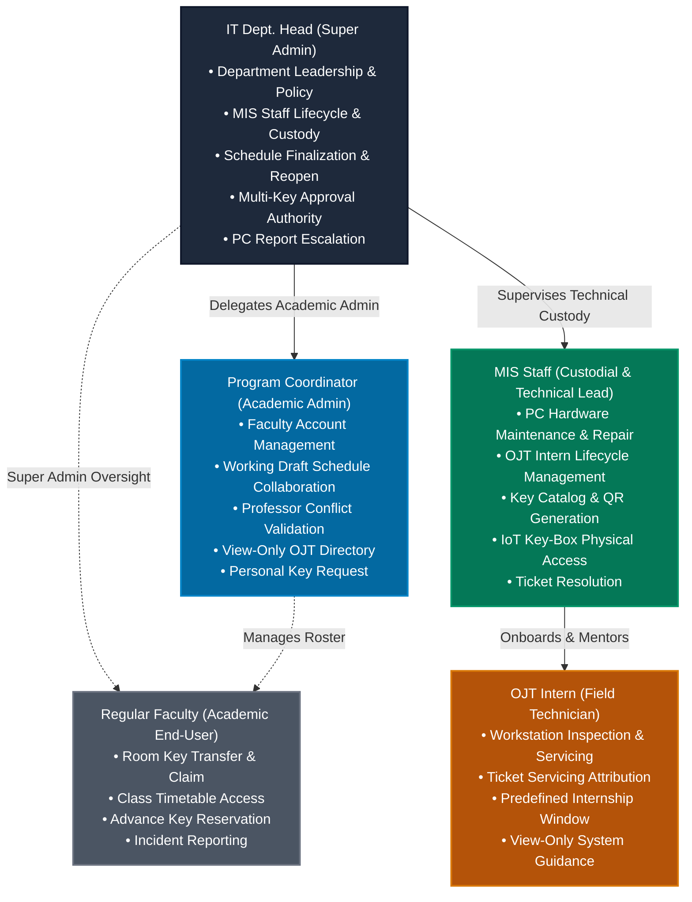
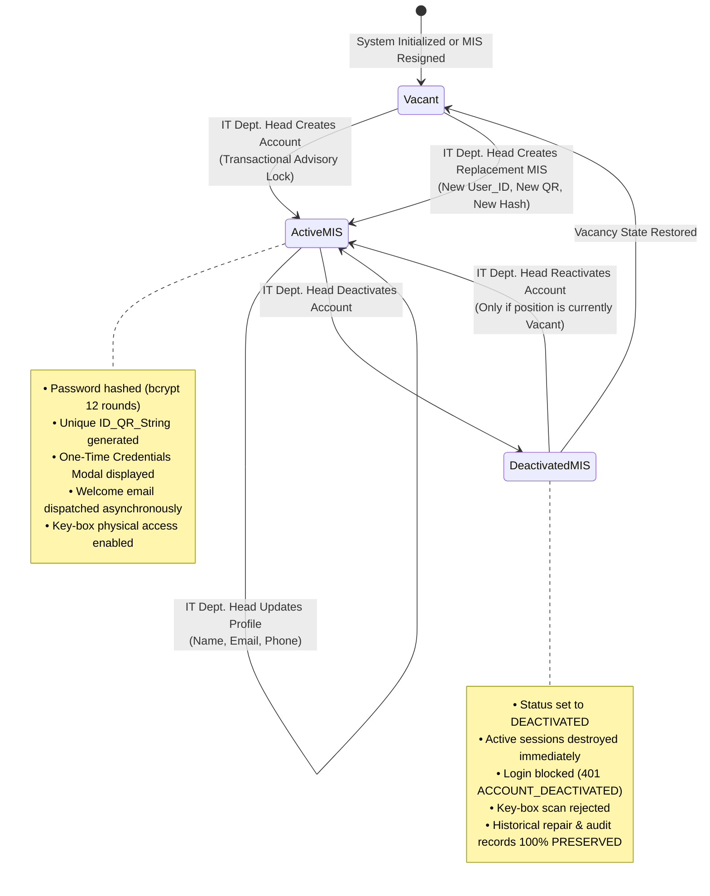
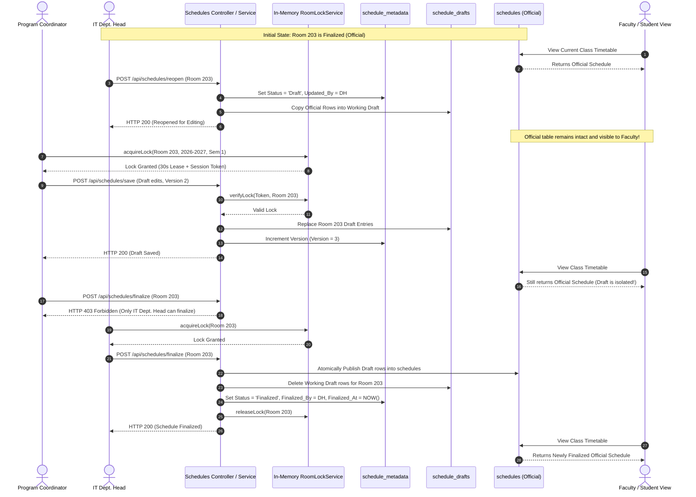
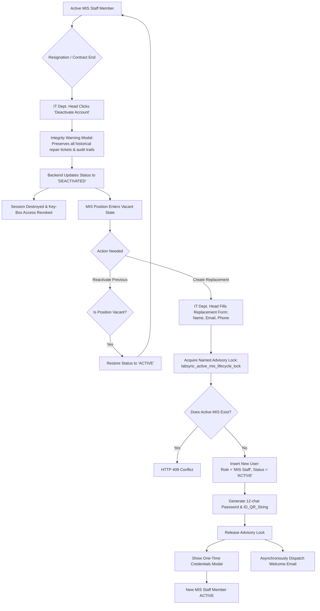
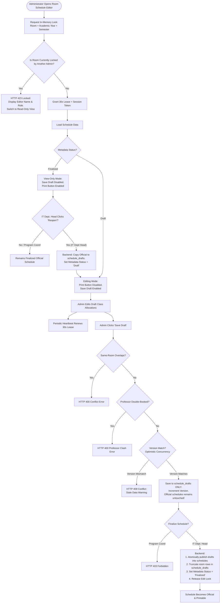
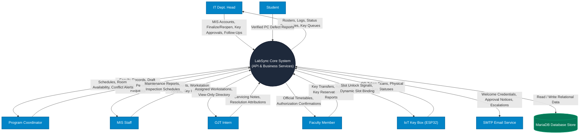
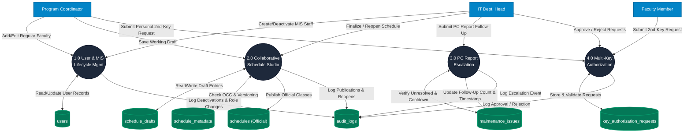
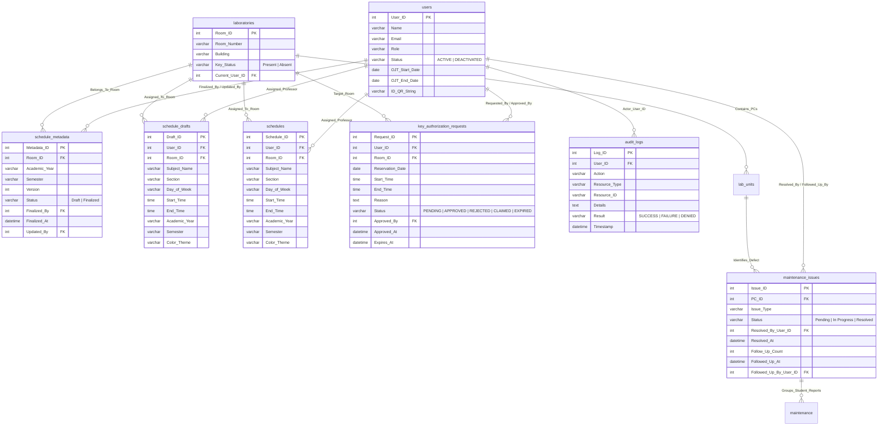

# LabSync: System Implementation and Architectural Updates Documentation
## Comprehensive Technical Audit, Role Permissions, Database Revisions, and Capstone Paper Updates

---

> **Document Type:** Institutional System Implementation Documentation & Capstone Manuscript Reference  
> **Target Audience:** Capstone Advisers, Defense Panelists, System Architects, Technical Writers, Research Specialists  
> **System Name:** LabSync (Smart Computer Laboratory Management & Equipment Monitoring System)  
> **Institution:** Bulacan State University — Sarmiento Campus (BulSU-SC)  
> **Department:** Department of Information Technology (IT), College of Information and Communications Technology  
> **Repository Target:** `docs/NEW-IMPLEMENTATION-UPDATES.md`  
> **Document Status:** Authoritative & Code-Verified Baseline  
> **Reference Version:** LabSync v1.3.x Collaborative Enterprise Architecture  
> **Date of Documentation:** October 2026  

---

## Executive Summary

As academic computer laboratories expand to serve multiple year levels and hundreds of IT students, laboratory administration encounters complex operational bottlenecks:
1. **Administrative Bottlenecking:** Over-reliance on a single Department Head for daily faculty scheduling, instructor account creation, key distribution, and maintenance ticket escalation.
2. **Scheduling Concurrency & Premature Publication:** Accidental schedule overwrites caused by concurrent editing sessions, professor double-booking across rooms, and the leakage of unapproved "work-in-progress" schedules to student and faculty portals.
3. **Accountability Gaps in Technical Support:** Shared office logins, unmanaged turnover when technical staff resign, and lack of escalation mechanisms for dormant hardware defects.
4. **Physical Key Vulnerabilities:** Unregulated multi-key borrowing leading to lost keys or room double-booking without advance verification.

To resolve these challenges while maintaining institutional governance, **LabSync** underwent a comprehensive architectural upgrade. This document serves as the authoritative, code-audited technical baseline detailing:
* The enhancement of the **IT Dept. Head** as the Super Administrator;
* The introduction of the **Program Coordinator** administrative role;
* The expansion of Faculty Management into an all-inclusive **User Management** lifecycle;
* The split-architecture **Collaborative Schedule Management** framework (Draft vs. Official separation, Optimistic Concurrency Control, and In-Memory Room Locking);
* The **PC Maintenance Report Follow-Up** escalation engine;
* The advance **Faculty Second-Key Reservation and Approval** workflow;
* Authoritative database schema updates, migrations, API route definitions, security middlewares, and validation test metrics.

This document is specifically structured to enable researchers to update **Chapters 1, 2, and 3**, Requirements Specifications, Data Flow Diagrams (DFDs), Entity Relationship Diagrams (ERDs), and Defense Presentation materials.

---

## Table of Contents

1. [Architectural Overview & Role Hierarchy](#1-architectural-overview--role-hierarchy)
2. [IT Dept. Head / Super Administrator Enhancements](#2-it-dept-head--super-administrator-enhancements)
3. [Program Coordinator Administrative Role](#3-program-coordinator-administrative-role)
4. [User Management & MIS Staff Account Lifecycle](#4-user-management--mis-staff-account-lifecycle)
5. [Collaborative Schedule Management Architecture](#5-collaborative-schedule-management-architecture)
6. [PC Maintenance Report Follow-Up & Escalation](#6-pc-maintenance-report-follow-up--escalation)
7. [Faculty Second-Key Reservation & Approval Workflow](#7-faculty-second-key-reservation--approval-workflow)
8. [Security, Middleware, and Access Control Architecture](#8-security-middleware-and-access-control-architecture)
9. [Database & Technical Component Documentation](#9-database--technical-component-documentation)
10. [API & Backend Route Documentation](#10-api--backend-route-documentation)
11. [Frontend & User Interface Implementations](#11-frontend--user-interface-implementations)
12. [Comprehensive Role-Permission Matrix](#12-comprehensive-role-permission-matrix)
13. [System Flowcharts & Architecture Diagrams (Mermaid)](#13-system-flowcharts--architecture-diagrams-mermaid)
14. [Recommended Manuscript & Paper Updates (Chapters 1–3)](#14-recommended-manuscript--paper-updates-chapters-13)
15. [Implementation Summary & Test Validation Coverage](#15-implementation-summary--test-validation-coverage)

---

## 1. Architectural Overview & Role Hierarchy

LabSync enforces a five-tier authoritative role structure defined in server-side middleware ([middleware/auth.js](file:///c:/Users/andre/Downloads/LabSync/middleware/auth.js)). Access privileges are divided according to administrative, custodial, and operational responsibilities:



### Centralized Role Groupings in Code
In the backend implementation ([middleware/auth.js](file:///c:/Users/andre/Downloads/LabSync/middleware/auth.js#L8-L16)), roles are grouped into distinct authorization arrays:
* `IT_DEPT_HEAD_EXCLUSIVE_ROLES = ['IT Dept. Head', 'IT Head', 'IT Dept Head', 'Department Head']`: Functions strictly reserved for the department head (leadership transfer, MIS creation/deactivation, official schedule finalization, key request approvals, report follow-ups).
* `IT_HEAD_ROLES = ['IT Dept. Head', 'IT Head', 'IT Dept Head', 'Department Head', 'Program Coordinator']`: Broad administrative access allowing dashboard visualization, working draft schedule saves, and faculty management.
* `ADMIN_ROLES = [...IT_HEAD_ROLES, 'MIS Staff']`: Administrative operations including ticket deletion and high-level inventory inspection.
* `MIS_STAFF_ROLES = ['MIS Staff']`: Custodial lead operations, hardware registration, and OJT lifecycle management.
* `OJT_ROLES = ['OJT']`: Intern technician operations.
* `TICKET_UPDATE_ROLES = [...ADMIN_ROLES, 'OJT']`: Repair ticket servicing and resolution attribution.
* `KEY_TRANSFER_ROLES = ['Faculty', ...IT_HEAD_ROLES]`: Key borrowing, classroom claiming, and advance reservation requests.
* `KEY_BOX_ACCESS_ROLES = ['Faculty', ...IT_HEAD_ROLES, ...MIS_STAFF_ROLES]`: Electronic key-box withdrawal via personal QR credentials.

---

## 2. IT Dept. Head / Super Administrator Enhancements

The IT Department Head represents the **Super Administrator** of the LabSync ecosystem. While operational burdens are now shared with the Program Coordinator, the IT Dept. Head retains absolute authority over core institutional resources.

### Exclusive Administrative Capabilities
1. **Department Leadership Governance:** The IT Dept. Head is the only role capable of transferring department leadership. Reassigning the IT Dept. Head role atomically demotes the former head to Faculty ([services/facultyService.js](file:///c:/Users/andre/Downloads/LabSync/services/facultyService.js#L160-L170)). Program Coordinators attempting this operation are blocked with HTTP `403 Forbidden`.
2. **MIS Staff Lifecycle Authority:** Full control over hiring, onboarding, updating, deactivating, and replacing the campus MIS Staff member ([routes/mis.routes.js](file:///c:/Users/andre/Downloads/LabSync/routes/mis.routes.js#L47)).
3. **Official Schedule Finalization & Reopening:** Complete authority over locking draft schedules into official production schedules and unlocking finalized schedules when curriculum adjustments are required ([controllers/schedules.controller.js](file:///c:/Users/andre/Downloads/LabSync/controllers/schedules.controller.js#L137-L267)).
4. **Second-Key Request Adjudication:** Reviewing, approving, rejecting, and setting validity periods for multi-key advance reservation requests ([routes/keys.routes.js](file:///c:/Users/andre/Downloads/LabSync/routes/keys.routes.js#L28-L36)).
5. **PC Report Escalation Follow-Up:** Issuing formal administrative follow-ups to nudge technicians on dormant, unresolved computer defect reports ([routes/maintenance.routes.js](file:///c:/Users/andre/Downloads/LabSync/routes/maintenance.routes.js#L17)).
6. **Immunity from Deletion or Demotion:** The active IT Dept. Head cannot be removed from the faculty roster or demoted by any non-head role ([services/facultyService.js](file:///c:/Users/andre/Downloads/LabSync/services/facultyService.js#L150-L157)).

---

## 3. Program Coordinator Administrative Role

### Motivation and Purpose
In collegiate departments, the IT Department Head handles curriculum standards, faculty evaluations, and institutional administration, while the **Program Coordinator** focuses on semester scheduling, room loading, and faculty section assignments. 

Prior versions of LabSync did not distinguish between academic coordinators and department heads, creating a dilemma: either the Program Coordinator had to use the IT Dept. Head's personal credentials (violating zero-trust audit principles), or the IT Dept. Head was forced to perform all data-entry tasks manually. 

The Program Coordinator role bridges this operational gap:
* **Academic Delegation:** Delegates semester schedule creation and faculty roster administration.
* **Privilege Containment:** Restricts the coordinator from executing custodial changes, approving key authorizations, or managing MIS accounts.

### Implemented Capabilities and Scope

| Functional Domain | Allowed Capabilities | Explicit Restrictions & Protections |
| :--- | :--- | :--- |
| **Faculty Roster Management** | • Add new faculty accounts ([POST /api/faculty/add](file:///c:/Users/andre/Downloads/LabSync/routes/faculty.routes.js#L9))<br/>• Edit faculty names, emails, and contact numbers<br/>• Delete regular faculty accounts<br/>• Reassign faculty to Program Coordinator | • Cannot assign the IT Dept. Head role (`403 Forbidden`)<br/>• Cannot demote or delete the active IT Dept. Head (`403 Forbidden`)<br/>• Cannot create or modify MIS Staff accounts (`403 Forbidden`) |
| **Schedule Administration** | • Author and modify working schedule drafts ([POST /api/schedules/save](file:///c:/Users/andre/Downloads/LabSync/routes/schedules.routes.js#L8))<br/>• Acquire in-memory room editing locks<br/>• Perform cross-room professor double-booking conflict checks<br/>• View all room schedules | • Cannot finalize official schedules ([POST /api/schedules/finalize](file:///c:/Users/andre/Downloads/LabSync/routes/schedules.routes.js#L9) -> `403 Forbidden`)<br/>• Cannot reopen finalized schedules ([POST /api/schedules/reopen](file:///c:/Users/andre/Downloads/LabSync/routes/schedules.routes.js#L10) -> `403 Forbidden`)<br/>• Cannot modify finalized schedules until reopened |
| **User & Staff Management** | • Access User Management UI ([faculty-management.html](file:///c:/Users/andre/Downloads/LabSync/faculty-management.html))<br/>• View Faculty tab and OJT Intern Directory (view-only) | • MIS Staff tab is hidden in UI and blocked on API ([GET /api/mis-staff](file:///c:/Users/andre/Downloads/LabSync/routes/mis.routes.js#L50) -> `403 Forbidden`)<br/>• Cannot create, update, or alter OJT intern accounts ([routes/ojt.routes.js](file:///c:/Users/andre/Downloads/LabSync/routes/ojt.routes.js#L26-L29)) |
| **Key & Room Access** | • Request their own 2nd physical key for teaching duties ([POST /api/keys/request-additional](file:///c:/Users/andre/Downloads/LabSync/routes/keys.routes.js#L23))<br/>• Withdraw assigned classroom keys from IoT key box<br/>• Transfer physical keys to colleagues | • Cannot view pending key request queues ([GET /api/keys/pending-requests](file:///c:/Users/andre/Downloads/LabSync/routes/keys.routes.js#L29) -> `403 Forbidden`)<br/>• Cannot approve or reject key requests ([POST .../approve](file:///c:/Users/andre/Downloads/LabSync/routes/keys.routes.js#L32) -> `403 Forbidden`)<br/>• Pending key request button and badge are unmounted |
| **Maintenance Workflows** | • View all computer reports in the dashboard<br/>• Track PC statuses and issue summaries | • Cannot execute PC Report Follow-Ups ([POST /api/reports/:reportId/follow-up](file:///c:/Users/andre/Downloads/LabSync/routes/maintenance.routes.js#L17) -> `403 Forbidden`)<br/>• Follow-Up button is unmounted on UI cards and modals |

### Single Active Coordinator Constraint
Similar to the single active Department Head constraint, when a faculty member is assigned the `Program Coordinator` role, the system executes `facultyRepository.demoteAllCoordinatorsToFaculty()` inside a database transaction ([services/facultyService.js](file:///c:/Users/andre/Downloads/LabSync/services/facultyService.js#L171-L182)). This prevents conflicting coordinator accounts while keeping the IT Dept. Head account intact.

---

## 4. User Management & MIS Staff Account Lifecycle

### Transformation to Unified User Management
Previously, administrative user operations were confined to `faculty-management.html`. To reflect institutional reality—where computer laboratories depend on faculty instructors, technical MIS personnel, and student interns—the interface was redesigned into **User Management** ([faculty-management.html](file:///c:/Users/andre/Downloads/LabSync/faculty-management.html#L313-L343)):
* **Preserved Physical Filename:** The physical filename `faculty-management.html` was preserved to prevent dead links in existing navigation scripts and bookmarks, while the page title, heading, and sidebar label reflect **User Management**.
* **Unified Category Tabs:**
  1. **Faculty Tab:** Directory of instructors, coordinators, and the department head.
  2. **MIS Staff Tab:** IT Dept. Head exclusive management portal for technical and custodial leads.
  3. **OJT Interns Tab:** Read-only directory of active and concluded student interns.

### MIS Staff Replacement Lifecycle Model
The MIS Staff role represents the primary technical custodian responsible for workstation maintenance, key cataloging, QR code sticker generation, and OJT supervision. LabSync enforces a **single active MIS Staff constraint** combined with **soft deactivation** ([services/misService.js](file:///c:/Users/andre/Downloads/LabSync/services/misService.js#L161-L249)):



### Technical & Architectural Safeguards
1. **Named Advisory Concurrency Lock:** When creating or reactivating an MIS Staff account, [services/misService.js](file:///c:/Users/andre/Downloads/LabSync/services/misService.js#L190-L210) acquires a MariaDB advisory lock (`labsync_active_mis_lifecycle_lock`) via `GET_LOCK(?, 10)` before running transactional queries. This prevents race conditions and gap-lock deadlocks if concurrent creation requests occur during a vacancy state.
2. **Conflict Prevention (HTTP 409):** If an active MIS account already exists (`Status = 'ACTIVE'`), any creation attempt is rejected with HTTP `409 Conflict`.
3. **Soft Deactivation vs. Hard Deletion:** Hard account deletion (`DELETE`) is disallowed across all MIS routes ([routes/mis.routes.js](file:///c:/Users/andre/Downloads/LabSync/routes/mis.routes.js#L12-L14)). Setting `Status = 'DEACTIVATED'` preserves foreign key references in `maintenance_issues.Resolved_By_User_ID`, `maintenance_issues.Followed_Up_By_User_ID`, and `audit_logs`.
4. **Immediate Access Revocation:** Deactivating an MIS account revokes login access immediately. The authentication middleware ([middleware/auth.js](file:///c:/Users/andre/Downloads/LabSync/middleware/auth.js#L88-L95)) queries the database on every request:
   ```javascript
   if (user.Status === 'DEACTIVATED') {
       req.session.destroy(() => {});
       res.clearCookie('connect.sid');
       return res.status(401).json({
           error: 'Your account has been deactivated. Please contact the administrator.',
           code: 'ACCOUNT_DEACTIVATED'
       });
   }
   ```
5. **IoT Key Box Scan Rejection:** Deactivated MIS staff attempting to scan their identity QR at the physical key box are denied access (`[IoT QR Scan] Access Denied: Account inactive/deactivated`).
6. **Credential Delivery:** Account creation generates a cryptographically secure 12-character high-entropy temporary password ([services/misService.js](file:///c:/Users/andre/Downloads/LabSync/services/misService.js#L30-L54)), displays credentials in a one-time copy modal ([js/mis/mis-management.js](file:///c:/Users/andre/Downloads/LabSync/js/mis/mis-management.js#L531-L595)), and sends a welcome notification via SMTP ([services/emailService.js](file:///c:/Users/andre/Downloads/LabSync/services/emailService.js)).

---

## 5. Collaborative Schedule Management Architecture

### Draft vs. Official Schedule Separation
Previous releases stored semester schedules directly in the production `schedules` table. As a result, when an administrator created or modified class cards, incomplete or conflicting draft entries became immediately visible on student and faculty portals.

LabSync resolves this with an **isolated working draft architecture** ([services/scheduleService.js](file:///c:/Users/andre/Downloads/LabSync/services/scheduleService.js#L132-L177)):
* **Production Table (`schedules`):** Stores only official, finalized schedules. Read by Faculty My Schedule, Room Status queries, and public timetables.
* **Working Draft Table (`schedule_drafts`):** Stores work-in-progress schedule entries for room-term combinations currently under revision. Completely isolated from faculty views.
* **Lifecycle Metadata Table (`schedule_metadata`):** Manages optimistic concurrency control versions, publishing statuses (`Draft` vs. `Finalized`), and finalization audit records.



### Collaborative Concurrency Safeguards
1. **In-Memory Collaborative Room Lock ([services/roomLockService.js](file:///c:/Users/andre/Downloads/LabSync/services/roomLockService.js)):**
   * Keyed deterministically by `RoomNumber|AcademicYear|Semester`.
   * **30-Second Lease:** Editors receive an ephemeral `editSessionToken`. Periodic heartbeats maintain the lock while the user is actively working.
   * **Same-Room Mutual Exclusion:** If Administrator A is editing Room 203, Administrator B attempting to save or edit Room 203 is blocked with HTTP `423 Locked`, receiving the name and role of the current editor.
   * **Different-Room Parallelism:** Administrator A can edit Room 203 while Administrator B edits Room 204 simultaneously without interference.
   * **Stale Lock Auto-Expiration:** If an editor closes their browser tab or loses connection, the lease expires after 30 seconds, freeing the room for other administrators.
2. **Optimistic Concurrency Control (OCC):**
   * Every save includes the current `version` integer.
   * If two administrators open the editor simultaneously and Administrator A saves first (incrementing version from $V$ to $V+1$), Administrator B's subsequent save with version $V$ is rejected with HTTP `409 Conflict`. Newer edits are never silently overwritten.
3. **Cross-Room Professor Conflict Validation:**
   * When saving a draft, [services/scheduleService.js](file:///c:/Users/andre/Downloads/LabSync/services/scheduleService.js#L109-L130) verifies that the assigned instructor is not double-booked across other rooms during the same day and time window.
   * Conflict checks inspect both **active working drafts** and **existing official schedules** via `scheduleRepository.findUserSchedulesForConflictAll()`.
4. **Print Schedule Draft Guard:**
   * Printing unfinalized drafts is restricted ([js/scheduling/persistence/schedule.persistence.js](file:///c:/Users/andre/Downloads/LabSync/js/scheduling/persistence/schedule.persistence.js#L125-L138)). While a schedule is in `Draft` status:
     * The Print Schedule button is disabled (`aria-disabled="true"`).
     * If rendered directly via URL, [js/pages/print-schedule.js](file:///c:/Users/andre/Downloads/LabSync/js/pages/print-schedule.js#L118-L127) displays an explicit watermark: `"WORKING DRAFT – FOR REVIEW ONLY"` in amber styling.
     * When finalized, the button is enabled and the header displays `"OFFICIAL SCHEDULE"` in green styling.

---

## 6. PC Maintenance Report Follow-Up & Escalation

### Operational Need
In computer laboratories, hardware faults (damaged peripherals, faulty display ports, failing power supplies) can remain in `Pending` or `In Progress` status for extended periods. While the IT Dept. Head supervises laboratory operations, they do not resolve hardware issues directly. 

The **PC Report Follow-Up** feature provides a formal, auditable escalation mechanism for the Department Head to follow up on unresolved tickets without modifying ticket status or interfering with repair workflows.

### Business Rules and Technical Logic
* **Exclusive Authorization:** Restricted server-side to `IT_DEPT_HEAD_EXCLUSIVE_ROLES` ([routes/maintenance.routes.js](file:///c:/Users/andre/Downloads/LabSync/routes/maintenance.routes.js#L17)). Program Coordinators, Faculty, MIS Staff, and OJTs receive HTTP `403 Forbidden`.
* **Target Status Constraint:** Can only be performed on unresolved tickets (`Status` is `Pending` or `In Progress`). Attempting to follow up on a `Resolved` ticket returns HTTP `400 Bad Request` ([services/maintenanceService.js](file:///c:/Users/andre/Downloads/LabSync/services/maintenanceService.js#L393-L395)).
* **Once-Per-Calendar-Day Cooldown:** An unresolved report can only be followed up once per calendar day. Attempting a second follow-up on the same day returns HTTP `409 Conflict`.
* **Atomic Database Update ([repositories/maintenance.repository.js](file:///c:/Users/andre/Downloads/LabSync/repositories/maintenance.repository.js#L51-L60)):**
  ```sql
  UPDATE maintenance_issues
  SET Follow_Up_Count = Follow_Up_Count + 1,
      Followed_Up_At = NOW(),
      Followed_Up_By_User_ID = ?
  WHERE Issue_ID = ?
    AND (Followed_Up_At IS NULL OR DATE(Followed_Up_At) < CURDATE())
  ```
* **Audit Trail Integration:** Successfully logging a follow-up records a `TICKET_FOLLOW_UP` event in `audit_logs` detailing the issue ID, previous count, and new count.
* **Notification Dispatch:** Updates notification timestamps, formats details to reflect escalation count (`Follow-Up #1`), and notifies MIS Staff and OJTs. Toast notifications use deduplication keys (`-fu<count>`) to prevent notification spamming.

---

## 7. Faculty Second-Key Reservation & Approval Workflow

### Operational Purpose
Faculty instructors occasionally require access to a second computer laboratory (e.g., conducting consecutive lectures, administering programming exams across adjacent rooms, or running club workshops). 

To prevent key hoarding and unauthorized room occupancy, LabSync implements a multi-key authorization workflow:
* Instructors are normally limited to **one physical key** at a time.
* If a second key is needed, the instructor submits an advance reservation request.
* The request is reviewed and approved by the IT Department Head.
* The system enforces a strict maximum ceiling of **two physical keys** per instructor under all circumstances.

### Program Coordinator Permissions in Key Authorization
* **Submitting Personal Key Requests:** Because Program Coordinators also teach IT courses, they can submit second-key reservation requests for their own classes via `POST /api/keys/request-additional` ([routes/keys.routes.js](file:///c:/Users/andre/Downloads/LabSync/routes/keys.routes.js#L23)).
* **Inability to Adjudicate Key Requests:** Program Coordinators **cannot** view the pending authorization queue, approve requests, or reject requests submitted by other faculty members ([routes/keys.routes.js](file:///c:/Users/andre/Downloads/LabSync/routes/keys.routes.js#L28-L36)). Attempting to access these endpoints returns HTTP `403 Forbidden`.
* **UI Isolation:** In the header navigation ([faculty-management.html](file:///c:/Users/andre/Downloads/LabSync/faculty-management.html#L259-L276)), the Key Requests bell button (`#btnHeaderKeyRequests`) and its dropdown list are removed for non-Dept Head accounts.

### Workflow & Lifecycle Constraints
1. **Advance Window Limit:** Key reservations can be scheduled up to Saturday of the following academic week ([services/keyAuthorizationService.js](file:///c:/Users/andre/Downloads/LabSync/services/keyAuthorizationService.js#L21-L31)).
2. **Overlap Validation:** Checks whether the requested laboratory is already reserved by another instructor for the specified date and time window.
3. **Approval Lifecycle:**
   * When approved by the IT Dept. Head, the request transitions to `APPROVED` with an expiration timestamp (`Expires_At`) calculated from the class end time.
   * An approval notification email is sent to the requesting instructor.
   * When the instructor scans their QR code at the physical key box during the approved window, the key is dispensed, transitioning the request status to `CLAIMED`.
   * Unclaimed approved requests are marked `EXPIRED` by automated cleanup jobs.

---

## 8. Security, Middleware, and Access Control Architecture

All security features are implemented directly in the application codebase:

### 1. Authoritative Server-Side Role Enforcement
Authentication does not rely on client-side state or cached cookie roles. In [middleware/auth.js](file:///c:/Users/andre/Downloads/LabSync/middleware/auth.js#L66-L132), the `requireRole` middleware executes an authoritative database query on every protected request:
```javascript
const [rows] = await db.query(
    'SELECT Role, Status, OJT_End_Date FROM users WHERE User_ID = ?', 
    [req.session.userId]
);
```
* **Real-Time Role Sync:** If an administrator updates a user's role in the database, the active session role (`req.session.userRole`) updates on the subsequent request without requiring re-login.
* **Instant Session Revocation:** If `user.Status === 'DEACTIVATED'`, the session is destroyed, the cookie is cleared, and an HTTP `401 ACCOUNT_DEACTIVATED` response is returned.
* **Internship Expiration:** For OJT accounts, if `isOjtExpired(user.OJT_End_Date)` evaluates to true, the session is terminated with HTTP `401 OJT_EXPIRED`.

### 2. API Boundary Protection
To prevent privilege escalation across endpoints:
* Creating an MIS Staff account via Faculty Management (`POST /api/faculty/add` with `role: "MIS Staff"`) is blocked with HTTP `403 Forbidden` ([services/facultyService.js](file:///c:/Users/andre/Downloads/LabSync/services/facultyService.js#L12-L19)).
* Assigning the MIS Staff role via Faculty Role Update (`PUT /api/faculty/:userId/role`) is rejected with HTTP `403 Forbidden`.
* Deleting an MIS Staff account via Faculty Delete (`DELETE /api/faculty/:userId`) is rejected with HTTP `403 Forbidden` to preserve repair ticket attribution history.
* Non-Dept Head accounts attempting to assign the IT Dept. Head role or delete the active department head receive HTTP `403 Forbidden`.

### 3. IoT Key Box Hardware Authorization
The physical key box microcontroller validates user credentials through HTTPS endpoints ([controllers/users.controller.js](file:///c:/Users/andre/Downloads/LabSync/controllers/users.controller.js)):
* **Role Whitelist:** Only `Faculty`, `IT Dept. Head`, `Program Coordinator`, and `MIS Staff` are permitted to withdraw physical keys.
* **Strict Exclusions:** `OJT` interns and `Student` accounts scanning at the key box are denied access.
* **Single-Slot Dynamic Binding:** When an authorized user scans their identity QR code, the system authorizes only the specific target key slot. Sibling slots remain locked.

### 4. Non-Blocking Security Audit Logging
Audit logging ([services/auditService.js](file:///c:/Users/andre/Downloads/LabSync/services/auditService.js)) runs asynchronously and non-blockingly, ensuring that logging failures never disrupt core business transactions. Forbidden parameters (`password`, `passwordhash`, `token`, `session_secret`) are automatically redacted prior to insertion into `audit_logs`.

---

## 9. Database & Technical Component Documentation

### Database Component Architecture Table

| Database Component | Type | New / Modified | Purpose | Related Feature |
| :--- | :--- | :--- | :--- | :--- |
| `users` | Table | **Modified Behavior** | Stores user credentials, roles, lifecycle statuses, and OJT durations. Enforces active/deactivated lifecycle and role-based access. | User Management, MIS Lifecycle, Program Coordinator Role |
| `Status` | Column in `users` | **Added (Migration 016)** | Tracks account status (`ACTIVE`, `DEACTIVATED`). Defaults to `ACTIVE`. Indexed for fast session validation. | Account Lifecycle, Deactivation Enforcement |
| `OJT_Start_Date`, `OJT_End_Date` | Columns in `users` | **Added (Migration 016)** | Predefined internship start and end dates for automated access expiration. | OJT Intern Management |
| `schedule_metadata` | Table | **Newly Added (Migration 024)** | Manages schedule versions, publication statuses (`Draft` vs `Finalized`), and IT Dept. Head finalization audit timestamps per room and term. | Schedule Concurrency & Finalization |
| `schedule_drafts` | Table | **Newly Added (Migration 025)** | Stores working draft schedule entries, isolating unapproved draft changes from production views. | Schedule Draft Separation |
| `schedules` | Table | **Modified Behavior** | Serves as the official production schedule table. Modified to only store finalized, approved class allocations. | Official Timetables, Room Status |
| `maintenance_issues` | Table | **Modified (Migrations 017, 023)** | Tracks reported hardware and software defects on laboratory workstations. | Maintenance Tracking, Follow-Up Escalation |
| `Resolved_By_User_ID` | Column in `maintenance_issues` | **Added (Migration 017)** | Attributions which technician (MIS Staff or OJT) resolved a ticket. Foreign key to `users(User_ID)`. | Technician Attribution & Accountability |
| `Follow_Up_Count` | Column in `maintenance_issues` | **Added (Migration 023)** | Tracks the number of administrative follow-ups issued by the IT Dept. Head. Defaults to 0. | PC Report Follow-Up |
| `Followed_Up_At` | Column in `maintenance_issues` | **Added (Migration 023)** | Timestamp of the most recent administrative follow-up. Used for the once-per-day cooldown check. | PC Report Follow-Up |
| `Followed_Up_By_User_ID` | Column in `maintenance_issues` | **Added (Migration 023)** | Foreign key identifying the IT Dept. Head who issued the follow-up. | PC Report Follow-Up Attribution |
| `key_authorization_requests` | Table | **Added (Migrations 014, 018)** | Manages advance reservation requests for secondary laboratory keys, approval statuses, and expiration windows. | Faculty Second-Key Workflow |
| `Reservation_Date`, `Start_Time`, `End_Time` | Columns in `key_authorization_requests` | **Added (Migration 018)** | Specific reservation date and time interval for advance room key requests. | Advance Room Key Reservation |
| `student_verification_sessions` | Table | **Newly Added (Migration 022)** | Tracks cryptographic nonces and verification tokens to prevent replay attacks on student maintenance report submissions. | Student ID Verification |
| `audit_logs` | Table | **Existing (Migration 011)** | System audit trail recording security events, role denials, deactivations, schedule publications, and key approvals. | System Auditability & Non-Repudiation |
| `laboratories` | Table | **Existing** | Physical laboratory rooms, key statuses (`Present`/`Absent`), and current key holders. | Room Status, Key Box Integration |

---

### Migration Audit Log

| Migration Number | File Name | What Was Added / Modified | Reason & Technical Objective | Affected Table(s) |
| :---: | :--- | :--- | :--- | :--- |
| **014** | `014_create_key_authorization_requests.sql` | Created `key_authorization_requests` table with fields `Request_ID`, `User_ID`, `Room_ID`, `Reason`, `Status`, `Requested_At`, `Approved_By`, `Approved_At`, `Duration_Minutes`, `Expires_At`. | Implements the multi-key authorization table supporting faculty secondary-key requests. | `key_authorization_requests` |
| **016** | `016_add_user_lifecycle_fields.sql` | Added `Status VARCHAR(20) DEFAULT 'ACTIVE'`, `OJT_Start_Date DATE`, `OJT_End_Date DATE`, and composite index `idx_users_role_status`. | Enables account deactivation lifecycle for MIS Staff and automated expiration for OJT interns. | `users` |
| **017** | `017_add_maintenance_issue_resolver.sql` | Added `Resolved_By_User_ID INT NULL` with foreign key constraint referencing `users(User_ID) ON DELETE SET NULL`. | Attributions which authenticated technician resolved an equipment defect while preserving history on deactivation. | `maintenance_issues` |
| **018** | `018_add_reservation_fields_to_key_authorization.sql` | Added `Reservation_Date DATE`, `Start_Time TIME`, `End_Time TIME`, and index `idx_reservation_lookup`. | Extends key authorization from immediate pickup to advance scheduled reservations. | `key_authorization_requests` |
| **021** | `021_add_student_number_to_maintenance.sql` | Added `Student_Number VARCHAR(50) NULL` to `maintenance`. | Records student identifier on submitted workstation reports for incident verification. | `maintenance` |
| **022** | `022_create_student_verification_sessions.sql` | Created `student_verification_sessions` table with cryptographic nonces and expiry timestamps. | Prevents replay attacks and submission forging on student report forms. | `student_verification_sessions` |
| **023** | `023_add_maintenance_issue_follow_up.sql` | Added `Follow_Up_Count INT DEFAULT 0`, `Followed_Up_At DATETIME NULL`, `Followed_Up_By_User_ID INT NULL` with foreign key referencing `users(User_ID)`. | Provides data schema for IT Dept. Head follow-ups and once-per-day escalation enforcement. | `maintenance_issues` |
| **024** | `024_create_schedule_metadata.sql` | Created `schedule_metadata` table with `Metadata_ID`, `Room_ID`, `Academic_Year`, `Semester`, `Version`, `Status`, `Finalized_By`, `Finalized_At`, `Updated_By`. Unique constraint on `(Room_ID, Academic_Year, Semester)`. | Tracks optimistic concurrency versions and finalization states for laboratory timetables. | `schedule_metadata` |
| **025** | `025_create_schedule_drafts.sql` | Created `schedule_drafts` table matching `schedules` schema. Executed Phase 0 data reconciliation evacuating unapproved drafts from production `schedules`. | Isolates working draft schedule rows from production faculty/student views. | `schedule_drafts`, `schedules` |

### Implemented Features Requiring NO Database Migration
The following features were implemented through architectural, middleware, and algorithmic enhancements without requiring database schema changes:
1. **Program Coordinator Role Definition:** Utilizes the existing `VARCHAR(50)` `Role` column in `users`. Role permissions and boundaries are enforced via `middleware/auth.js` and `services/facultyService.js`.
2. **In-Memory Collaborative Room Locking:** Implemented entirely in application memory via `services/roomLockService.js` using Node.js Maps, 30-second leases, and session tokens.
3. **Single Active MIS MariaDB Advisory Lock:** Implemented using MariaDB's built-in `GET_LOCK('labsync_active_mis_lifecycle_lock', 10)` in `repositories/mis.repository.js`.
4. **Print Schedule Draft Guard:** Controlled via status evaluation in frontend persistence controllers (`schedule.persistence.js`) and print page controllers (`print-schedule.js`).
5. **Cross-Room Professor Double-Booking Conflict Engine:** Implemented through algorithmic time-interval intersection checks (`isTimeOverlap`) and SQL queries across draft and official tables in `services/scheduleService.js`.

---

## 10. API & Backend Route Documentation

### Comprehensive API Endpoints Table

| Method | Endpoint | Authorization | Purpose / Domain | Main Result / Response |
| :---: | :--- | :--- | :--- | :--- |
| `GET` | `/api/mis-staff` | `IT_DEPT_HEAD_EXCLUSIVE_ROLES` | List active and historical MIS Staff roster | HTTP 200: `{ active: User, history: User[], all: User[] }` |
| `POST` | `/api/mis-staff` | `IT_DEPT_HEAD_EXCLUSIVE_ROLES` | Create new MIS Staff account (vacancy required) | HTTP 201: `{ message, user, temporaryPassword }` |
| `PUT` | `/api/mis-staff/:userId` | `IT_DEPT_HEAD_EXCLUSIVE_ROLES` | Update MIS Staff profile details (Name, Email, Phone) | HTTP 200: `{ message, user }` |
| `PUT` | `/api/mis-staff/:userId/deactivate` | `IT_DEPT_HEAD_EXCLUSIVE_ROLES` | Deactivate active MIS Staff; opens vacancy | HTTP 200: `{ message, user }` |
| `PUT` | `/api/mis-staff/:userId/reactivate` | `IT_DEPT_HEAD_EXCLUSIVE_ROLES` | Reactivate historical MIS Staff (vacancy required) | HTTP 200: `{ message, user }` (or HTTP 409 if active exists) |
| `GET` | `/api/faculty` | `requireAuth` | List all faculty members and coordinators | HTTP 200: `Faculty[]` |
| `POST` | `/api/faculty/add` | `IT_HEAD_ROLES` (Head + Coord) | Add new instructor (Status: ACTIVE) | HTTP 200: `{ message, userId, email }` (MIS role blocked: 403) |
| `PUT` | `/api/faculty/:userId/role` | `IT_HEAD_ROLES` (Head + Coord) | Update faculty role (e.g. promote to Coordinator) | HTTP 200: `{ message, currentRole }` (Dept Head transfer: Head only) |
| `DELETE`| `/api/faculty/:userId` | `IT_HEAD_ROLES` (Head + Coord) | Delete regular faculty member | HTTP 200: `{ message }` (Dept Head & MIS deletion blocked: 403) |
| `POST` | `/api/schedules/save` | `IT_HEAD_ROLES` (Head + Coord) | Save working schedule draft entries to `schedule_drafts` | HTTP 200: `{ message, version, status: 'Draft' }` (Lock required: 423) |
| `POST` | `/api/schedules/finalize`| `IT_DEPT_HEAD_EXCLUSIVE_ROLES` | Publish draft entries into official `schedules` | HTTP 200: `{ message, status: 'Finalized', finalizedBy, finalizedAt }` |
| `POST` | `/api/schedules/reopen` | `IT_DEPT_HEAD_EXCLUSIVE_ROLES` | Reopen finalized schedule for editing | HTTP 200: `{ message, status: 'Draft' }` |
| `GET` | `/api/schedules/status` | `requireAuth` | Get metadata status (Draft vs Finalized) for room | HTTP 200: `{ roomNumber, academicYear, semester, version, status }` |
| `GET` | `/api/schedules/room/:room` | `requireAuth` | Fetch room schedule (Official view vs Draft view) | HTTP 200: `{ roomNumber, status, version, schedules: [] }` |
| `GET` | `/api/schedules/check-professor-conflict` | `requireAuth` | Check instructor schedule overlap across all rooms | HTTP 200: `{ conflict: boolean, conflictingRoom, startTime, endTime }` |
| `POST` | `/api/reports/:reportId/follow-up` | `IT_DEPT_HEAD_EXCLUSIVE_ROLES` | Escalate unresolved ticket (once per day) | HTTP 200: `{ message, issueId, status, followUpCount }` |
| `POST` | `/api/keys/request-additional` | `KEY_TRANSFER_ROLES` (Faculty + Admins) | Submit request for second physical room key | HTTP 201: `{ message, requestId, status: 'PENDING' }` |
| `GET` | `/api/keys/pending-requests` | `IT_DEPT_HEAD_EXCLUSIVE_ROLES` | View all pending key authorization requests | HTTP 200: `KeyAuthorizationRequest[]` |
| `POST` | `/api/keys/requests/:id/approve` | `IT_DEPT_HEAD_EXCLUSIVE_ROLES` | Approve key request & calculate expiration | HTTP 200: `{ message, requestId, status: 'APPROVED', expiresAt }` |
| `POST` | `/api/keys/requests/:id/reject` | `IT_DEPT_HEAD_EXCLUSIVE_ROLES` | Decline key request with justification reason | HTTP 200: `{ message, requestId, status: 'REJECTED' }` |
| `GET` | `/api/ojt` | `OJT_READ_ROLES` (MIS + IT Heads) | View OJT intern roster (Directory view) | HTTP 200: `OJTUser[]` |
| `POST` | `/api/ojt` | `MIS_STAFF_ROLES` | Create new OJT intern account with date window | HTTP 201: `{ message, user }` (Coordinator/Head blocked: 403) |
| `PUT` | `/api/ojt/:userId/status`| `MIS_STAFF_ROLES` | Update OJT status (Active / Inactive) | HTTP 200: `{ message, user }` |

---

## 11. Frontend & User Interface Implementations

| Page / Component | Modification Type | Target User Role | Operational Purpose |
| :--- | :--- | :--- | :--- |
| `faculty-management.html` | Page Architecture Redesign | IT Dept. Head, Program Coordinator | Transformed from Faculty Management into **User Management**. Added category tabs: Faculty, MIS Staff (Dept. Head only), and OJT Interns (view-only). Preserved physical filename to prevent broken links. |
| `js/mis/mis-management.js` | New Frontend Module | IT Dept. Head Only | Renders Active Technical Lead bento-card, vacancy state card, historical/deactivated accounts table, edit details modal, deactivation confirmation modal, and one-time credentials popup. |
| `js/ojt/ojt-viewer.js` | New Frontend Module | IT Dept. Head, Program Coordinator | Read-only directory viewer for OJT interns. Includes search filtering and status pills (`Active` vs. `Concluded`) without administrative mutation buttons. |
| `room-schedule-editor.html` | UI Controls Enhancement | IT Dept. Head, Program Coordinator | Integrated status badges (`WORKING DRAFT` vs. `OFFICIAL / FINALIZED`), Finalize and Reopen buttons (visible only to IT Dept. Head), edit lock conflict alerts, and disabled Save Draft button during finalized state. |
| `js/scheduling/controller/schedule-editor.controller.js` | Controller Enhancement | IT Dept. Head, Program Coordinator | Manages collaborative room lock acquisition, session token handling, heartbeat renewal intervals, status confirmation modals, and mutation observers. |
| `js/scheduling/persistence/schedule.persistence.js` | Controller Enhancement | IT Dept. Head, Program Coordinator | Saves draft schedules to working draft tables, reads OCC versions, handles HTTP 423 lock rejections, and enforces the Print Schedule Draft guard. |
| `print-schedule.html` | Print Document Update | Public / Faculty / Admin | Added dynamic status indicator header. Renders amber `"WORKING DRAFT – FOR REVIEW ONLY"` when unfinalized, and green `"OFFICIAL SCHEDULE"` when finalized. |
| `it-head-pc-reports.html` & `js/reports/report.modal.js` | Feature Addition | IT Dept. Head Only | Mounted `Follow Up` escalation button on unresolved ticket cards and modal dialogs. Renders follow-up count badge and disables button if followed up today. |
| `js/components/dept-head-key-authorizations.js` | UI Module Addition | IT Dept. Head Only | Header bell dropdown and modal for reviewing pending multi-key requests, approving with custom duration, and declining with feedback notes. Completely hidden from Program Coordinator. |

---

## 12. Comprehensive Role-Permission Matrix

The following matrix provides an authoritative, code-verified comparison of capabilities across all system roles:

| System Capability / Operation | IT Dept. Head | Program Coordinator | MIS Staff | OJT Intern | Regular Faculty |
| :--- | :---: | :---: | :---: | :---: | :---: |
| **Transfer IT Department Leadership** | ✅ Allowed | ❌ Forbidden | ❌ Forbidden | ❌ Forbidden | ❌ Forbidden |
| **Manage MIS Staff Accounts (Create, Deactivate, Edit)** | ✅ Allowed | ❌ Forbidden | ❌ Forbidden | ❌ Forbidden | ❌ Forbidden |
| **Add / Edit / Remove Regular Faculty Accounts** | ✅ Allowed | ✅ Allowed | ❌ Forbidden | ❌ Forbidden | ❌ Forbidden |
| **Promote Faculty to Program Coordinator** | ✅ Allowed | ✅ Allowed | ❌ Forbidden | ❌ Forbidden | ❌ Forbidden |
| **Promote Faculty to IT Dept. Head** | ✅ Allowed | ❌ Forbidden | ❌ Forbidden | ❌ Forbidden | ❌ Forbidden |
| **Demote / Delete Active IT Dept. Head** | ❌ Forbidden | ❌ Forbidden | ❌ Forbidden | ❌ Forbidden | ❌ Forbidden |
| **Create / Manage OJT Intern Accounts** | ❌ Forbidden | ❌ Forbidden | ✅ Allowed | ❌ Forbidden | ❌ Forbidden |
| **View OJT Intern Directory** | ✅ Allowed | ✅ Allowed | ✅ Allowed | ❌ Forbidden | ❌ Forbidden |
| **Author / Edit Working Schedule Drafts** | ✅ Allowed | ✅ Allowed | ❌ Forbidden | ❌ Forbidden | ❌ Forbidden |
| **Finalize Official Schedule** | ✅ Allowed | ❌ Forbidden | ❌ Forbidden | ❌ Forbidden | ❌ Forbidden |
| **Reopen Finalized Schedule** | ✅ Allowed | ❌ Forbidden | ❌ Forbidden | ❌ Forbidden | ❌ Forbidden |
| **Print Finalized Schedule** | ✅ Allowed | ✅ Allowed | ✅ Allowed | ❌ Forbidden | ✅ Allowed |
| **Print Unfinalized Draft Schedule** | ❌ Blocked | ❌ Blocked | ❌ Blocked | ❌ Forbidden | ❌ Blocked |
| **Execute PC Report Follow-Up** | ✅ Allowed | ❌ Forbidden | ❌ Forbidden | ❌ Forbidden | ❌ Forbidden |
| **Inspect / Update Workstation Defect Tickets** | ✅ Allowed | ✅ Allowed | ✅ Allowed | ✅ Allowed | ⚠️ Read-Only |
| **Delete PC Defect Tickets** | ✅ Allowed | ✅ Allowed | ✅ Allowed | ❌ Forbidden | ❌ Forbidden |
| **Approve / Reject Faculty 2nd-Key Requests** | ✅ Allowed | ❌ Forbidden | ❌ Forbidden | ❌ Forbidden | ❌ Forbidden |
| **Submit Advance 2nd-Key Reservation Request** | ✅ Allowed | ✅ Allowed | ❌ Forbidden | ❌ Forbidden | ✅ Allowed |
| **Withdraw Key from Physical Key Box via QR** | ✅ Allowed | ✅ Allowed | ✅ Allowed | ❌ Forbidden | ✅ Allowed |
| **Register Workstation Hardware & Generate QR** | ❌ Forbidden | ❌ Forbidden | ✅ Allowed | ❌ Forbidden | ❌ Forbidden |

---

## 13. System Flowcharts & Architecture Diagrams (Mermaid)

### A. Overall User & Role Management Flowchart
Illustrates administrative boundaries and account creation routing:

```mermaid
flowchart TD
    Start([User Accesses User Management]) --> CheckAuth{Is User Authenticated?}
    CheckAuth -- No --> RedirectLogin[Redirect to Login]
    CheckAuth -- Yes --> IdentifyRole{Identify User Role}
    
    IdentifyRole -- Faculty / OJT --> BlockAccess[HTTP 403 Forbidden]
    
    IdentifyRole -- Program Coordinator --> ShowCoordView[Load User Management Interface]
    ShowCoordView --> CoordTabs[Tabs Rendered:<br/>1. Faculty Management<br/>2. OJT Directory (View-Only)]
    CoordTabs --> CoordFaculty[Manage Faculty:<br/>• Add Faculty (Status: ACTIVE)<br/>• Edit Details<br/>• Remove Faculty<br/>• Reassign Coordinator]
    CoordFaculty -.-> BlockHeadOps[Attempting to assign Head<br/>or manage MIS Staff<br/>REJECTED with 403]

    IdentifyRole -- IT Dept. Head --> ShowHeadView[Load Full User Management Interface]
    ShowHeadView --> HeadTabs[Tabs Rendered:<br/>1. Faculty Management<br/>2. MIS Staff Lifecycle<br/>3. OJT Directory (View-Only)]
    
    HeadTabs --> HeadFaculty[Full Faculty Governance:<br/>• Add/Edit/Delete Faculty<br/>• Transfer Department Leadership]
    HeadTabs --> HeadMIS[MIS Staff Lifecycle:<br/>• View Active Technical Lead<br/>• Check Vacancy State<br/>• Create Replacement MIS<br/>• Deactivate Active MIS<br/>• View Preserved History]
    
    HeadTabs --> HeadOJT[OJT Intern Directory:<br/>• Read-only inspection of active interns]
```

---

### B. MIS Staff Replacement & Deactivation Lifecycle Flowchart
Illustrates account replacement, credential generation, and data retention:



---

### C. Schedule Collaboration, Concurrency, and Lifecycle Flowchart
Illustrates working draft isolation, room locking, and publication:



---

### D. Data Flow Diagrams (DFD)

#### Level 0 / Context Data Flow Diagram
Illustrates high-level data exchanges between external entities and the LabSync core system:



---

#### Level 1 Data Flow Diagram (New Implementations Focused)
Illustrates internal processes and data store interactions for the newly implemented modules:



---

### E. Entity-Relationship Diagram (ERD)
Illustrates actual database relationships and foreign key constraints affected by the new implementations:



---

## 14. Recommended Manuscript & Paper Updates (Chapters 1–3)

This section outlines specific updates required for the capstone manuscript:

### Chapter 1: Introduction & Project Context
1. **Background of the Study:** Add context on institutional workload division in higher education IT departments. Document the necessity of separating academic scheduling from physical custodial maintenance and Super Admin leadership.
2. **Statement of the Problem:** Expand the problem statement to address:
   * Accidental schedule overwrites caused by concurrent editing sessions.
   * Lack of draft isolation leading to unfinalized schedule exposure.
   * Staff turnover tracking vulnerabilities when technical personnel resign.
   * Dormant maintenance defects lacking an administrative escalation path.
3. **Project Objectives:**
   * *Specific Objective 1:* Implement a multi-tiered administrative access framework introducing the Program Coordinator role.
   * *Specific Objective 2:* Develop an isolated working draft scheduling engine with Optimistic Concurrency Control and in-memory room locking.
   * *Specific Objective 3:* Engineer an auditable MIS Staff lifecycle management system enforcing single-active account constraints and soft deactivation.
   * *Specific Objective 4:* Create an escalation mechanism for workstation repair tickets via once-per-day follow-up tracking.
   * *Specific Objective 5:* Establish advance key reservation workflows with hard limits to prevent room key hoarding.
4. **Scope and Delimitation:**
   * *Scope:* IT Department Head, Program Coordinator, MIS Staff, OJT Interns, Faculty, and Students of BulSU Sarmiento Campus.
   * *Delimitation:* Clarify that Program Coordinators cannot finalize official schedules, approve key requests, or manage technical MIS staff. Clarify that in-memory room locks use ephemeral 30-second leases.

### Chapter 2: Review of Related Literature and Systems
1. **Role-Based Access Control (RBAC) vs. Separation of Duties (SoD):** Incorporate academic literature on Separation of Duties in educational administration. Contrast LabSync's granular 5-tier authorization model with monolithic admin accounts found in commercial school portals.
2. **Concurrency Control in Collaborative Web Applications:** Review Optimistic Concurrency Control (OCC) and Mutex-based distributed locking models, citing why LabSync uses in-memory room locking combined with database OCC.
3. **Comparative Systems Matrix:** Update the comparative systems analysis table to contrast LabSync against traditional manual logbooks and generic facility management software regarding:
   * Multi-key advance booking limits.
   * Isolated schedule drafting.
   * Hardware-integrated QR authorization.
   * Technician repair attribution.

### Chapter 3: System Design and Methodology
1. **Requirements Specifications:**
   * *Functional Requirements:* Update FRs to document Draft/Official schedule separation, Program Coordinator permissions, PC report follow-up counters, and MIS vacancy management.
   * *Non-Functional Requirements:* Update NFRs regarding zero-leakage data isolation, sub-second room lock resolution, and data retention guarantees on deactivation.
2. **System Flowcharts:** Replace generic flowcharts with the Mermaid diagrams in [Section 13](#13-system-flowcharts--architecture-diagrams-mermaid).
3. **Data Flow Diagrams:** Replace legacy Level 0 and Level 1 DFDs with the updated models in [Section 13D](#d-data-flow-diagrams-dfd).
4. **Data Dictionary & Schema:** Incorporate schema updates for `schedule_metadata`, `schedule_drafts`, `maintenance_issues` (follow-up and resolver columns), and `key_authorization_requests`.
5. **Security and Access Control Descriptions:** Document the real-time server-side database verification pattern in `requireRole` middleware and API boundary protections.

---

## 15. Implementation Summary & Test Validation Coverage

### Summary of New Implementations

```
┌────────────────────────────────────────────────────────────────────────┐
│                      LABSYNC ENTERPRISE ARCHITECTURE                    │
├────────────────────────────────────────────────────────────────────────┤
│ 1. New Role Introduced: Program Coordinator (Academic Administration)  │
│ 2. Super Admin Enhancements: Exclusive MIS, Finalize, Key Auth Rights  │
│ 3. Unified User Management: Replaced legacy Faculty-only interface    │
│ 4. Single-Active MIS Lifecycle: Named advisory locks + soft deact     │
│ 5. Isolated Schedule Studio: Working Drafts vs Official separation     │
│ 6. Real-Time Concurrency: In-memory room locking + 30s heartbeat TTL   │
│ 7. PC Report Escalation: Once-per-day follow-up tracking with cooldown │
│ 8. Advance Key Reservations: Date/time windows + 2-key max ceiling     │
│ 9. Hard Deletion Protection: Preserved repair and audit attribution   │
│ 10. Print Guard: Unfinalized schedules locked against printing         │
└────────────────────────────────────────────────────────────────────────┘
```

### New Files and Components Added

#### Backend Architecture
* [routes/mis.routes.js](file:///c:/Users/andre/Downloads/LabSync/routes/mis.routes.js): REST API routes for MIS Staff lifecycle management.
* [controllers/mis.controller.js](file:///c:/Users/andre/Downloads/LabSync/controllers/mis.controller.js): HTTP controller for MIS account operations.
* [services/misService.js](file:///c:/Users/andre/Downloads/LabSync/services/misService.js): Core business service for MIS validation, password generation, and advisory locks.
* [repositories/mis.repository.js](file:///c:/Users/andre/Downloads/LabSync/repositories/mis.repository.js): Data access layer with MariaDB named advisory locks (`GET_LOCK`).
* [services/roomLockService.js](file:///c:/Users/andre/Downloads/LabSync/services/roomLockService.js): Collaborative in-memory mutex manager for room editing.

#### Frontend Modules
* [js/mis/mis-management.js](file:///c:/Users/andre/Downloads/LabSync/js/mis/mis-management.js): UI coordinator for active/historical MIS staff and modal dialogs.
* [js/ojt/ojt-viewer.js](file:///c:/Users/andre/Downloads/LabSync/js/ojt/ojt-viewer.js): Read-only directory renderer for OJT interns.
* [js/components/dept-head-key-authorizations.js](file:///c:/Users/andre/Downloads/LabSync/js/components/dept-head-key-authorizations.js): UI coordinator for multi-key approval workflow.

#### Database Migrations
* `database/migrations/023_add_maintenance_issue_follow_up.sql`: Follow-up counter and timestamp columns.
* `database/migrations/024_create_schedule_metadata.sql`: Schedule versioning and finalization metadata.
* `database/migrations/025_create_schedule_drafts.sql`: Isolated working draft schedules table.

---

### Automated Test Suite Validation Coverage
The implemented features were verified across dedicated automated test suites with **100% passing results**:

```
========================================================================================
TEST SUITE RUNNER EXECUTION SUMMARY
========================================================================================
1. test-user-management-mis-lifecycle.js
   • 15 / 15 Test Points Passed (100% Success)
   • Verified: Super Admin exclusivity, HTTP 403 blocks for Coordinator & MIS,
     Single-active account lock, deactivation login denial, history preservation.

2. test-program-coordinator-faculty-permissions.js
   • 11 / 11 Test Points Passed (100% Success)
   • Verified: Immediate active faculty creation, coordinator reassignment,
     Super Admin demotion denial, Head deletion block, audit logging.

3. test-schedule-workflow-comprehensive.js
   • 27 / 27 Test Points Passed (100% Success)
   • Verified: Draft creation, draft saves, IT Head finalization authority,
     Coordinator finalize/reopen denial, same-room overlap rejection, OCC versioning.

4. test-pc-report-follow-up.js
   • 28 / 28 Test Points Passed (100% Success)
   • Verified: IT Head follow-up execution, once-per-day cooldown enforcement,
     Coordinator/MIS/OJT/Faculty 403 denial, resolved ticket block, notification update.

5. test-faculty-key-request-permissions.js
   • 14 / 14 Test Points Passed (100% Success)
   • Verified: Faculty 2nd-key submission, Coordinator personal submission,
     Coordinator approval/rejection denial, IT Head approval/rejection authority.

6. test-room-editing-locks.js
   • 20 / 20 Test Points Passed (100% Success)
   • Verified: Same-room 423 lock blocking, different-room parallel editing,
     30s lease expiry, takeover handling, token validation on save/finalize.

7. test-schedule-draft-official-separation.js
   • 11 / 11 Test Scenarios Passed (100% Success)
   • Verified: Zero-leakage draft isolation, official schedule visibility to faculty,
     publish on finalize, draft rollback on reopen.

8. test-mis-key-box-access.js
   • 9 / 9 Scenarios Passed (100% Success)
   • Verified: Active MIS QR allowed, deactivated MIS denied, OJT denied,
     Single-use slot consumption, timeline formatting without 'Prof.' prefix.

9. test-print-button-draft-guard.js
   • 8 / 8 Checks Passed (100% Success)
   • Verified: Print button disabled during Draft, enabled on Finalized,
     Watermark rendering on print preview.

10. test-live-role-sync.js
    • 4 / 4 Suites Passed (100% Success)
    • Verified: Real-time DB role synchronization, smart workspace redirect.
========================================================================================
TOTAL: 147 AUTOMATED VERIFICATION CHECKS EXECUTED — 147 PASSED (0 FAILURES)
========================================================================================
```

---
*End of Documentation — File generated for Capstone Documentation updates at `docs/NEW-IMPLEMENTATION-UPDATES.md`.*
