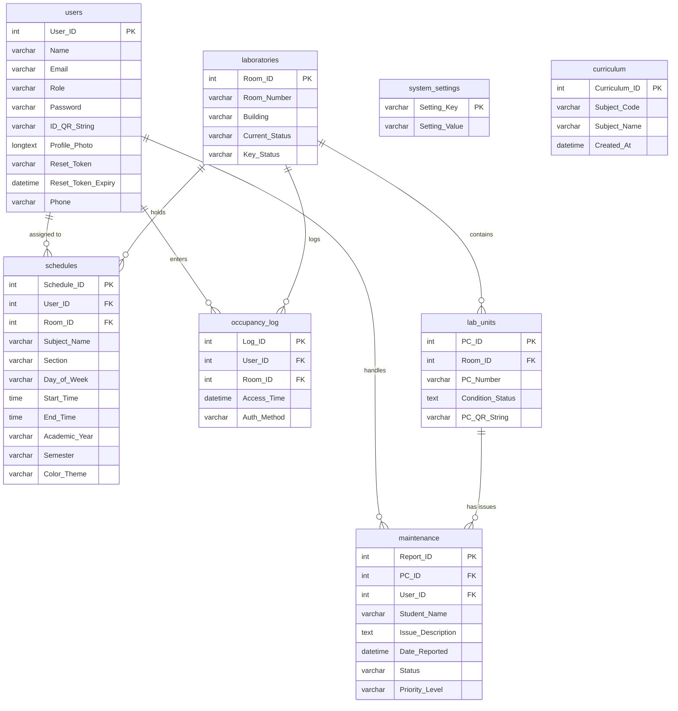

# LabSync Version 1.0.0 – Feature & Function Summary

LabSync is a web-based computer laboratory monitoring and management system designed to streamline PC ticket reporting, master schedules, faculty management, and lab maintenance tracking for **Bulacan State University – Sarmiento Campus**.

Below is the complete feature map, database schema, and access control overview for **LabSync V1.0.0**.

---

## 1. Core Platform Architecture

- **Backend Stack**: Node.js, Express v5, MySQL / MariaDB (relational database), Express Sessions (cookie-based session authentication), Nodemailer (transactional emails), and QRCode (cryptographic QR generation).
- **Frontend Stack**: Vanilla HTML5, CSS3 layout design (using modular custom variables and component styles), Lucide Icons, and client-side JavaScript architecture.
- **Access Control & Routing**: Enforced on the client-side via `auth-check.js` (with an anti-flash guard hiding body contents during check) and on the backend via Express route middleware (`requireAuth` and `requireRole`).

---

## 2. User Roles & Dedicated Features

### 🔑 User Authentication & Security (Global)
- **Safe Session Entry**: Email and password-based login. Accessing the login page while already logged in automatically redirects forward to the user's role dashboard.
- **Password Recovery**: Nodemailer-powered recovery. Enter your email in the modal; an email containing a link with a secure token is dispatched. Verification is handled in `reset-password.html` to update credentials.
- **Anti-Back Loop**: Prevents browser history piling up via `replace()` redirection. Hitting back from a logged-in dashboard will not trap the user.

---

### 🎓 1. Faculty / Professors
Faculty are general staff members responsible for their classroom slots.
- **Faculty Dashboard (`index.html`)**: Overview of active lab rooms, total pending PC reports, classes today, and role-specific quick start guides.
- **Laboratory Status (`room-status.html`)**: View real-time statuses of lab rooms:
  - `Available` (Green)
  - `Borrowed` (Orange)
  - `In Session` (Red)
- **PC Reports List (`faculty-pc-reports.html`)**: View student-reported computer faults (broken mice, monitors, system units, etc.) for laboratories.
- **My Schedule (`my-schedule.html`)**: Interactive weekly timetable filterable by Academic Year (e.g., `2025-2026`) and Semester (`1st Semester`, `2nd Semester`, `Summer`).
- **Profile Menu Controls**: Profile dropdown features including:
  - **Account Settings**: Edit profile details, credentials, and QR code access.
  - **Dark Mode Direct Toggle**: Switch active theme to dark high-contrast mode with optimized readability, persisting in `localStorage`.

---

### 👑 2. IT Department Head
The IT Department Head has overall administrative capabilities.
- **IT Head Dashboard (`it-head-dashboard.html`)**: Main department dashboard linking to all management grids.
- **Master Schedule Panel (`master-schedule.html`)**: View and load schedules for all laboratory rooms, import curriculum catalogs, configure signatories, and bulk print timetables.
- **Room Schedule Editor (`room-schedule-editor.html`)**:
  - Drag-and-drop course scheduler. Create custom blocks (Subject, Professor, Section) and drop them onto weekly slots.
  - Automatically checks time overlaps and schedules clashes.
  - Cross-room professor ghost schedule visualizer.
  - Mobile touch drag-and-drop support.
- **Faculty Management Directory (`faculty-management.html`)**:
  - Create, view, update roles, transfer leadership, and delete faculty members.
  - Generates secure temporary passwords for new accounts and automatically dispatches a welcome email via Nodemailer.
  - Enforces searching and role filtering (*All, IT Head, Faculty, MIS Staff*).
  - Profile Photo Reflection: Allows adding profile photos, displaying them on cards (falling back to name initials if empty).
- **A4 / Legal Print previews (`print-schedule.html`, `print-all-schedules.html`)**: Custom layouts to download individual room schedules or bulk print all schedules with official Dean and Chair signatories.

---

### 🔧 3. MIS Staff (Technical & Maintenance)
MIS Staff are responsible for hardware maintenance and lab setups.
- **MIS Staff Dashboard (`mis-staff-dashboard.html`)**: Visual indicator cards for system connectivity stats, reported tickets, and active maintenance.
- **Maintenance Tracker (`mis-maintenance.html`)**: Core queue system to move tickets through steps:
  - `Pending` (Reported)
  - `In Progress` (Process button moves ticket to evaluation/repair stage)
  - `Resolved` (Resolve button closes the ticket)
  - Filterable by ticket ID, room number, priority, and date range.
- **QR Generator (`mis-qr-generator.html`)**: Automates QR printing. Select a room, building, and PC count, and generate individual QR labels containing links to the PC reporting form for students.

---

### 📱 4. Students (Public Workstation Interaction)
- **PC Issue Reporting Form (`submit-pc-report.html`)**:
  - Publicly accessible page designed to load instantly on mobile devices when scanning a PC's physical QR code label.
  - Allows selecting specific faults (Mouse, Keyboard, Monitor, System Unit, Internet, OS, Others) and inputting student remarks and program section.
  - Student page inherits text size scaling and high contrast theme preferences.

---

## 3. Database Schema Overview (`labsync`)

The system utilizes 8 interconnected relational tables:

